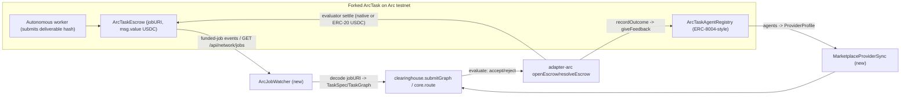

# Trapeza x Arc marketplace integration (ArcTask evaluation + Trapeza-as-evaluator)

## Decision recap
- Deliverable: evaluation doc **plus** a staged build plan.
- Target (updated after reading the ArcTask source): **fork + self-host ArcTask** as the marketplace/worker layer, with **Trapeza as the evaluator/clearing brain**. Use **ArcKit canonical contracts** as the deterministic control harness. Integrate via ArcTask's **committed ABIs** and its `/api/network/jobs` REST route + `ArcTaskEscrow` events — not the generic canonical registries.

## Key findings (from the real repo: https://github.com/VadymManiuk/ArcTask)
- ArcTask ships **its own minimal contracts**, not the canonical `0x8004...` registries: `contracts/ArcTaskEscrow.sol` (ERC-8183-style) and `contracts/ArcTaskAgentRegistry.sol` (ERC-8004-style), with committed ABIs (`lib/contracts/abis/ERC8183Escrow.json`, `ERC8004AgentRegistry.json`, `USDC.json`) and a deploy script (`scripts/deploy-arc-testnet.mjs`). **We can fork and redeploy our own instance.**
- **Live testnet deployment:** registry `0x4ab5791a689b15126fcc7a549f8e4c7e16c5e0b8`, escrow `0x58ca473df727301bce771d6087f883364c83a3b6`, USDC mode `native`. Chain 5042002, RPC `https://rpc.testnet.arc.network`, explorer `testnet.arcscan.app`. Smoke tx hashes in README prove the full loop works.
- **It DOES have an HTTP API** (Next.js App Router): `GET /api/network/jobs`, `GET/POST /api/deliverables/[jobId]` (signed one-time-nonce access), `GET /api/worker/status`. Corrects the earlier "no API" assumption.
- **Money-rail mismatch (biggest friction):** ArcTaskEscrow uses **native testnet USDC via `msg.value`** (USDC mode `native`), while Trapeza's Gateway/x402 settlement assumes **ERC-20 USDC `0x3600...`** ([packages/adapter-arc/src/constants.ts](packages/adapter-arc/src/constants.ts), [packages/adapter-gateway/src/settlement.ts](packages/adapter-gateway/src/settlement.ts)). Must be resolved first (Stage 0).
- **Lifecycle & seam:** register agent -> `createJob` (stores `jobURI` on-chain) -> fund escrow (`msg.value`) -> autonomous worker scans funded jobs, submits deliverable hash -> **evaluator** accepts/rejects/refunds -> reputation update. The **evaluator seat is exactly Trapeza's role** (route/verify/settle + calibrated reputation).
- **The escrow gap is still the seam.** `ChainAdapter.openEscrow`/`resolveEscrow` in [packages/adapter-arc/src/chain.ts](packages/adapter-arc/src/chain.ts) currently throw (P3); implementing them against ArcTaskEscrow closes the gap.
- **ArcKit** (https://github.com/Ridwannurudeen/arckit): canonical ERC-8183 `0x0747EEf0...` + ERC-8004 `0x8004...` + ERC-20 USDC `0x3600...` typed SDK — matches Trapeza's existing constants exactly, so it is the ideal **control harness**.

## Recommendation (answering "what's better")
1. **Primary: ArcTask (fork/self-host).** Only option that is real end-to-end on Arc testnet, fully forkable (in-repo contracts + ABIs + deploy script), and has a natural Trapeza seam (evaluator + reputation). Fork it, redeploy, plug Trapeza in as evaluator.
2. **Control: ArcKit canonical scaffold.** Matches Trapeza's ERC-20 USDC + `0x8004` constants exactly; use for CI-safe deterministic tests and to validate the generic path.
3. **Secondary: ArcHive.** Closest to Trapeza's metered x402 spend model; keep as interop target pending confirmation of public contracts/API.

## Architecture

## Deliverable 1 - Evaluation doc
Create `docs/ARCTASK-INTEGRATION-EVAL.md` with:
1. **ArcTask viability** - Pros (real in-repo contracts + committed ABIs + deploy script; live testnet deployment with proof tx; HTTP API `/api/network/jobs`; on-chain `jobURI`; autonomous worker; forkable; evaluator seat fits Trapeza). Cons (native-USDC `msg.value` escrow diverges from Trapeza's ERC-20/Gateway rails; minimal non-canonical contracts; single-author hackathon repo, 0 stars -> maintenance/stability risk; deliverables gated behind signed API access). Workarounds (fork + redeploy own instance; optionally redeploy escrow with ERC-20 USDC; read jobs via events or `/api/network/jobs`; act as evaluator).
2. **Step-by-step on-chain intercept/settle logic** (below).
3. **Target comparison** ArcTask vs ArcKit vs ArcHive (recommendation above).
4. Contract/RPC/env reference tables (ArcTask live addresses + Trapeza constants + rail options).

### Step-by-step: how Trapeza intercepts + settles an ArcTask job
1. **Discover jobs**: `GET /api/network/jobs` and/or subscribe to `ArcTaskEscrow` funded-job logs via `viem` on `rpc.testnet.arc.network`.
2. **Ingest**: read on-chain `jobURI` payload -> build `TaskSpec` (single) or `TaskGraph` node(s); budget from escrowed amount.
3. **Discover providers**: read `ArcTaskAgentRegistry` -> `ProviderProfile`/`SolverProvider` (capabilities, owner wallet, reputation); attach calibration ledger.
4. **Clear**: `createClearinghouse().submitGraph()` (or `core.route`) -> pick provider(s)/price/preflight/shadow prices. (Trapeza can also *rank/route* which registered worker should win.)
5. **Escrow**: as job creator variant -> `openEscrow` -> ArcTaskEscrow `createJob(jobURI,...)` + fund (`msg.value` or ERC-20 depending on Stage 0). As evaluator variant -> attach to existing funded job.
6. **Execute**: ArcTask worker (or a Trapeza-driven worker) submits the deliverable hash on-chain; fetch report via signed `POST /api/deliverables/[jobId]`.
7. **Verify**: `SchemaOracle.verify` ([packages/oracle/src/schema-oracle.ts](packages/oracle/src/schema-oracle.ts)) -> `Outcome`.
8. **Settle**: `resolveEscrow(taskId, release|slash)` -> ArcTaskEscrow evaluator `accept`/`reject`/`refund` releasing/refunding USDC.
9. **Reputation**: `recordOutcome` -> `chain.giveFeedback` on ArcTaskAgentRegistry; update calibration ledger.

## Deliverable 2 - Staged build plan (for later implementation)
- **Stage 0 - rail decision**: pick native-USDC vs ERC-20 USDC (default: redeploy forked escrow with ERC-20 `0x3600...` to reuse Trapeza's Gateway/x402 + constants; document native-USDC as the "integrate with their live deployment" variant requiring a `msg.value` settlement path).
- **Stage A - fork + redeploy**: `gh repo fork VadymManiuk/ArcTask --clone` into a sibling dir (e.g. `../ArcTask`); redeploy `ArcTaskEscrow.sol` + `ArcTaskAgentRegistry.sol` via `scripts/deploy-arc-testnet.mjs`; record deployed addresses in Trapeza config.
- **Stage A1 - provider-agnostic LLM worker (in the fork)**: the worker `scripts/agent-worker.mjs` already reads `OPENAI_BASE_URL` (L850) but calls the OpenAI **Responses API** `/responses` (L408) with a `web_search` tool - not portable to Groq/NIM/Ollama, which only speak OpenAI-compatible `/chat/completions`. Refactor to a single OpenAI-compatible client where **base URL + key + model fully select the provider** (the standard `openai` SDK `baseURL`/`apiKey` pattern the user described):
  - Env (generic, no hardcoded provider): `LLM_BASE_URL` (any provider endpoint, e.g. `https://api.groq.com/openai/v1`, `https://integrate.api.nvidia.com/v1`, `http://localhost:11434/v1`, `https://api.openai.com/v1`), `LLM_API_KEY` (whatever the user has), `LLM_MODEL`. Back-compat: fall back to `OPENAI_BASE_URL`/`OPENAI_API_KEY`/`OPENAI_MODEL` when `LLM_*` unset. Default `LLM_BASE_URL` = OpenAI so current behavior is preserved.
  - **Default call path = `/chat/completions`** (works across OpenAI, Groq, NVIDIA NIM, Ollama). Add `extractChatText` for the chat-completions response shape.
  - `LLM_API_KEY` **optional** (empty allowed) so local Ollama works keyless; only send `Authorization` when a key is present.
  - `/responses` + `web_search` retained as an opt-in path (`LLM_ENDPOINT=responses` or `ARC_AGENT_ENABLE_WEB_SEARCH=true`), since those are OpenAI-only features.
  - Update `.env.example` and README worker env table with the generic `LLM_*` keys and per-provider base-URL examples.
- **Stage B - typed ArcTask client**: add `packages/adapter-arc/src/arctask.ts` using committed ABIs (`ERC8183Escrow.json`, `ERC8004AgentRegistry.json`); add escrow/registry addresses to [packages/adapter-arc/src/constants.ts](packages/adapter-arc/src/constants.ts).
- **Stage C - close escrow gap**: implement `openEscrow`/`resolveEscrow` in [packages/adapter-arc/src/chain.ts](packages/adapter-arc/src/chain.ts) against ArcTaskEscrow (evaluator accept/reject/refund); satisfy `ChainAdapter` in [packages/core/src/interfaces.ts](packages/core/src/interfaces.ts); keep MockChainAdapter parity.
- **Stage D - ArcJobWatcher**: new `packages/adapter-arc/src/watcher.ts` - funded-job events and/or `/api/network/jobs`; decode `jobURI` -> `TaskSpec`/`TaskGraph`.
- **Stage E - provider sync + quotes**: `MarketplaceProviderSync` (registry agents -> `ProviderProfile`) + first real `QuoteSource` (the production `QuoteSource` slot is empty today).
- **Stage F - settlement wiring**: bridge cleared allocations to evaluator settle via the `NanoSettlementProvider` seam in [demo/onchain.ts](demo/onchain.ts); `recordOutcome -> giveFeedback`.
- **Stage G - testnet harness**: `scripts/arc-integration-harness.ts` (npm script) - full loop on the forked deployment (register agent -> create+fund job -> worker submit -> Trapeza clears+evaluates -> settle -> reputation); simulated-job fallback; plus an **ArcKit canonical control run**. Reuse `.env.example` keys (`ARC_RPC_URL`, `BUYER_PRIVATE_KEY`, `OWNER_PRIVATE_KEY`, `VALIDATOR_PRIVATE_KEY`) + new ArcTask worker/evaluator keys.

## Alternatives (in doc)
1. **ArcKit canonical scaffold** (`npx create-arckit-app`) - client+provider+evaluator ERC-8183 triad; ERC-20 USDC + `0x8004` registries match Trapeza exactly; the deterministic control harness.
2. **ArcHive** (https://archivearc.xyz) - x402 nanopayments + ERC-8004 + ERC-8183; closest to Trapeza's metered-tool spend; secondary interop target.
3. **Trapeza self-hosted simulated harness** (Stage G) - deterministic workflows against the forked ArcTask/canonical contracts; optional bridge to off-chain frameworks (LangChain/AutoGPT/Fetch.ai) as worker agents behind endpoints.

## Risks / gotchas (in doc)
- **Native-USDC vs ERC-20 USDC** is the decisive divergence; resolve in Stage 0 before wiring settlement.
- **LLM endpoint shape:** OpenAI's `/responses` (+ `web_search`) is not portable; Groq/NIM/Ollama only speak `/chat/completions`. Default to `/chat/completions` so one `base_url`+`key`+`model` config serves any provider; keep `/responses` as an opt-in OpenAI-only path. Ollama key must be optional. All LLM changes live in the ArcTask fork, not in `@trapeza/core`.
- ArcTask contracts are minimal/non-canonical and single-author (0 stars) - prefer forking a pinned commit over depending on their live deployment.
- Deliverables require a signed one-time-nonce `POST /api/deliverables/[jobId]` from the creator wallet - the harness must sign as creator.
- USDC is gas + escrow on Arc; need funded, distinct wallets (client, worker/provider, evaluator).
- Keep chain/UI/network out of `@trapeza/core` - all new I/O lives in `adapter-arc`.

## Verify
- Doc renders and links resolve; contract/env tables match [packages/adapter-arc/src/constants.ts](packages/adapter-arc/src/constants.ts) and ArcTask live addresses.
- Stage B/C typecheck; MockChainAdapter parity keeps existing tests green (`npm run typecheck`, `npm test`).
- Harness dry-run (simulated emitter) clears + settles without a live marketplace; live run against the forked deployment produces Arcscan-verifiable accept/reject + reputation tx.