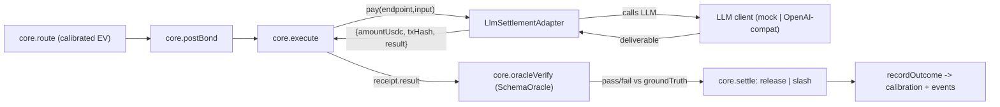

## LLM providers + MCP HTTP transport + one-command showcase

Three deliverables: (1) HTTP/SSE MCP transport, (2) a simple OpenAI-compatible LLM provider template (mock by default) wired through a minimally-extended engine, (3) a one-command visual demo. All confirmed: extend the engine minimally, visual dashboard demo, mock LLM default.

### The core finding this fixes (my main criticism)

`execute()` calls `settlement.pay(endpoint, task.input)` and returns only `{amountUsdc, txHash}` — the provider's work product is discarded ([packages/core/src/pipeline.ts](packages/core/src/pipeline.ts) L213-222). The oracle then verifies a result with no deliverable; in mock mode `MockOracle` returns scripted pass/fail by task id ([packages/core/src/testing/adapters.ts](packages/core/src/testing/adapters.ts) L166). So the engine has only ever judged *staged* outcomes. Real LLM output flowing to `SchemaOracle` is the first genuine test of the loop.

### New execution flow

## Part 1 - Core extension (minimal, additive)

- [packages/core/src/interfaces.ts](packages/core/src/interfaces.ts) L88-94: `SettlementAdapter.pay` return gains optional `result?: unknown` (the x402 response body = deliverable). Backward-compatible; existing mock/gateway adapters simply omit it.
- [packages/runtime/src/execute-clearing.ts](packages/runtime/src/execute-clearing.ts) and [apps/mcp/src/tools.ts](apps/mcp/src/tools.ts) `submitTask`: verify `receipt.result ?? result` — only switches to the deliverable when present, so existing mock-mode behavior is byte-identical (zero regression) and executor still overrides `providerId`/cost/latency post-verify.

## Part 2 - `@trapeza/provider-llm` (new package)

Chain-agnostic; imports only `@trapeza/core` types. Uses global `fetch` (Node >=20.6). No tools/function-calling — plain chat completions.

- `src/client.ts` - `LlmClient` interface + `createLlmClient()` factory: returns `MockLlmClient` unless `LLM_BASE_URL` is set.
- `src/openai-compat.ts` - `OpenAiCompatClient`: POST `${LLM_BASE_URL}/chat/completions` with `{model, messages, response_format:{type:"json_object"}}`, `Authorization: Bearer ${LLM_API_KEY}`. Works with OpenAI, NVIDIA NIM, Groq, Ollama (all expose `/v1/chat/completions`). Env: `LLM_BASE_URL`, `LLM_API_KEY`, `LLM_MODEL`.
- `src/mock-llm.ts` - `MockLlmClient`: deterministic canned Q&A keyed by prompt; a provider "quality" gate decides whether it returns the correct answer or a wrong one (drives the good-vs-lemon divergence with zero setup).
- `src/worker.ts` - `runLlmTask(client, task)`: builds a prompt from `task.input`, requests JSON, returns a deliverable `{ answer: string }` shaped to satisfy `task.oracleSpec.schema`.
- `src/settlement.ts` - `LlmSettlementAdapter implements SettlementAdapter`: constructor takes an endpoint->provider-config registry (model, quality, price); `pay(endpoint, body)` runs the LLM worker and returns `{ amountUsdc, txHash, result: deliverable }`.
- `src/roster.ts` - seed specs: `accurate` (correct, pricier), `lemon` (cheap, usually wrong), `mid`; plus a demo Q&A generator with known `groundTruth` (e.g. capital/arithmetic facts) so `SchemaOracle` can score deterministically.
- Tests: mock client determinism, worker schema coercion, settlement returns `result`, good-vs-lemon correctness divergence.

## Part 3 - `assemble()` gains `"llm"` mode

[packages/runtime/src/assemble.ts](packages/runtime/src/assemble.ts): add `mode: "mock" | "live" | "llm"`. `llm` = `SqliteStore` + `MockChainAdapter` (escrow/identity mocked, no keys) + **`SchemaOracle`** (real verification) + `LlmSettlementAdapter` + an LLM-backed `QuoteSource`. This is the "make decisioning + verification real, keep settlement/chain simulated" sweet spot. Keeps the rule that only `assemble()` imports concrete adapters.

## Part 4 - MCP HTTP/SSE transport

Verified via Context7 (SDK v1.29): use `StreamableHTTPServerTransport` in **stateless** mode (`sessionIdGenerator: undefined`).

- `apps/mcp/src/http.ts` - `startHttpServer(port, rt?)`: Node `http` server routing `/mcp` (POST + GET SSE + DELETE) to a `StreamableHTTPServerTransport`, `server.connect(transport)`. Reuses `createMcpServer(rt)` from [apps/mcp/src/server.ts](apps/mcp/src/server.ts) unchanged.
- `apps/mcp/src/http-cli.ts` - bin; `package.json` script `mcp:http`; README stanza for HTTP clients.
- Confirm exact import path (`@modelcontextprotocol/sdk/server/streamableHttp.js`) and `handleRequest(req,res,body)` signature at implement time.
- Test: boot server, issue an `initialize` + `tools/list` over HTTP, assert the 7 tools are listed.

## Part 5 - One-command visual showcase

- `apps/showcase` (`@trapeza/showcase`), `src/cli.ts`:
  1. `assemble({ mode: "llm", dbPath: shared default })`.
  2. Seed the good/lemon/mid LLM roster; register providers.
  3. Continuously submit real Q&A tasks (interval), running the full pipeline; narrate each beat to the console (quote -> route -> LLM answer -> pay -> verify -> release/slash -> calibration update) for screen-share.
  4. Spawn the dashboard (`next dev -w @trapeza/app`) as a child process and print `http://localhost:3000`.
- `npm run showcase` runs it. Mock LLM by default (zero keys); set `LLM_BASE_URL` (+ `LLM_API_KEY`, `LLM_MODEL`) to use NIM/Groq/Ollama/OpenAI.
- [apps/dashboard/src/app/page.tsx](apps/dashboard/src/app/page.tsx): add a `setInterval` re-fetch (~2s) so panels update live while the viewer watches. Add a headline "result-per-USDC" and lemon-share readout so the calibration win is obvious to a non-technical viewer.

## Part 6 - Docs, env, criticisms

- [README.md](README.md): add `npm run showcase` as the flagship demo + LLM env vars; keep mock-mode quickstart.
- [.env.example](.env.example): add `LLM_BASE_URL`, `LLM_API_KEY`, `LLM_MODEL` with NIM/Groq/Ollama examples.
- `apps/showcase/README.md`: document honest limitations - settlement/escrow are simulated in `llm` mode (no real USDC without `live`); `SchemaOracle` scores exact ground-truth (great for deterministic Q&A, not open-ended generation - an LLM-judge oracle is the documented follow-up); mock LLM is canned, real quality signal needs a real endpoint.

## Verification

- `npm run typecheck` (add `provider-llm`, `showcase` to the tsc list) - exit 0.
- `npm test` + `npm run test:coverage` - new lib code >=85% lines/branches; existing 83 tests stay green (pass-through change is a no-op in mock mode).
- `npm run build -w @trapeza/app` - exit 0.
- `npm run demo` - unchanged, green.
- Manual: `npm run showcase` with no keys -> dashboard fills with LLM market, lemon share collapses under calibration; with `LLM_BASE_URL=http://localhost:11434/v1` (Ollama) -> real completions judged by the oracle.
- MCP HTTP: `npm run mcp:http` then a `tools/list` over HTTP returns 7 tools.
- Append [ACTIVITY-LOG.md](ACTIVITY-LOG.md).

## Non-goals

- No real on-chain settlement in `llm` mode (that stays `live`/Phase E, manual).
- No tool-calling/function-calling in the LLM template (plain completions, by request).
- No LLM-judge oracle yet (documented follow-up).