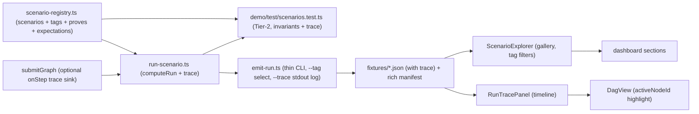

# Enlarge demo scenarios + add a scenario test harness

## Goal

Make scenarios data (a registry); emit a step-by-step execution trace (real backend logging + a frontend timeline that drives the task graph); make scenarios browsable as an explorable gallery ("what does this scenario handle / prove"); fill engine-feature coverage gaps with new scenarios; and add a deterministic (TS Tier-2) vitest harness that runs every scenario and asserts its invariants + output shape.

- Selection = tag-filterable registry shared by emitter, tests, and a frontend explorer.
- Execution = the harness + `demo:emit`, both surfacing a per-step trace.
- Explorability = a Scenario Explorer gallery + a Run trace panel wired to the task graph.

## Current state (for reference)

- 3 scenarios defined imperatively in the `SCENARIOS` array of [demo/emit-run.ts](demo/emit-run.ts) (L499+), with graphs/providers in [demo/data.ts](demo/data.ts) and [demo/scenarios.ts](demo/scenarios.ts).
- `computeRun` (in [demo/emit-run.ts](demo/emit-run.ts)) produces a `DemoRun` ([apps/dashboard/src/types/contract.ts](apps/dashboard/src/types/contract.ts)); fixtures land in `apps/dashboard/src/fixtures/*.json`, registered by hand in [apps/dashboard/src/fixtures/index.ts](apps/dashboard/src/fixtures/index.ts).
- No test exercises the scenario/emitter layer; `DemoRun` has no runtime schema.
- Frontend: `DagView` ([apps/dashboard/src/components/DagView.tsx](apps/dashboard/src/components/DagView.tsx)) renders a static graph (chosen provider per node) with no step highlighting; `LiveRunPanel` shows only a final result; scenario selection is a dropdown + a card grid in Overview. There is **no execution log / trace anywhere (backend or frontend), and no dedicated explorer** describing what each scenario handles. These are the two gaps this plan now closes.
- `manifest.json` is emitted with only `{runId,label,description}` per run ([demo/emit-run.ts](demo/emit-run.ts) L550-571) — too thin to drive an explorer.

## Design



## Step-by-step trace (backend + frontend)

The core new concept. A `TraceStep` is one ordered log line of the clearing run:

```ts
interface TraceStep {
  seq: number;
  phase: "validate-dag" | "score-candidates" | "assign" | "schedule"
       | "deadline-check" | "preflight" | "shadow-prices" | "bake-off"
       | "calibration" | "twin" | "settlement";
  nodeId?: string;              // present for per-node phases
  level: "info" | "warn" | "error";
  message: string;              // human-readable ("node deposit: chose acme @ p̂=0.94, score 0.71")
  data?: Record<string, unknown>; // e.g. ranked candidates, prices, why-loser
}
```

- **Backend logging is real, not narrated:** `submitGraph` takes an optional `onStep?: (s: TraceStep) => void` (in `ClearinghouseOptions`), emitting at each phase boundary as it actually executes. It is fully behavior-preserving when the sink is absent (no perf/allocation cost on the hot path beyond a guarded call). Per-node "why this provider won" detail (ranked candidates) is enriched in `run-scenario.ts` by recomputing `scoreProviderForNode` over eligible providers — so we get an explainable ranking without deep surgery in greedy/LNS.
- The `emit-run` CLI prints the trace step-by-step to stdout under `--trace` (this is the visible backend log), and always embeds it in the fixture as `DemoRun.trace`.
- The harness asserts trace shape (monotonic `seq`, first phase `validate-dag`, an `assign` step per node, terminal `settlement`).

## Steps

1. **Registry** — new `demo/scenario-registry.ts`: move the `Scenario` interface + `SCENARIOS` here; add `tags: string[]` (what it handles: `budget`, `calibration`, `quality-floor`, `scheduling`, `risk`, `cold-start`, `degrade`, `preflight`), a human `proves: string` one-liner, `emitFixture: boolean` (dashboard fixture vs test-only), `tier: "tier2" | "tier1"`, and a declarative `expect` block (e.g. `greedyBusts`, `minSuccessLift`, `preflightFails`, `expectDegraded`, `qualityFloorBinds`). Re-export the existing 3 unchanged.

2. **Trace (backend)** — add the `TraceStep` type to [apps/dashboard/src/types/contract.ts](apps/dashboard/src/types/contract.ts) and an optional `trace?: TraceStep[]` field on `DemoRun`. Add an optional `onStep` sink to `submitGraph` in [packages/clearinghouse/src/clearinghouse.ts](packages/clearinghouse/src/clearinghouse.ts), emitting at phase boundaries (validate → solve/assign → schedule → deadline → preflight → shadow → twin → settlement). In `run-scenario.ts`, collect the steps, enrich per-node `score-candidates` with recomputed rankings via `scoreProviderForNode`, and attach as `run.trace`. Guarded no-op when `onStep` is absent (no fixture drift for callers that don't pass it — but `computeRun` always passes it, so the 3 existing fixtures gain a `trace` field; acceptable and intended).

3. **Extract `computeRun`** — new `demo/run-scenario.ts` exporting `computeRun(scenario, { preferCpSat, trace })` (lift from [demo/emit-run.ts](demo/emit-run.ts) with its helpers: `computeBakeOff`, `computeCalibration`, `computeTwin`, `toProviderViews`, `toGraphView`, etc.). Thread `preferCpSat`/`useCalibration` into the internal `createClearinghouse`/`solvePrimary` calls so the harness can force Tier-2. [demo/emit-run.ts](demo/emit-run.ts) becomes a thin CLI: read registry, optional `--tag`/`--only` selection and `--trace` (print steps to stdout), call `computeRun`, write JSON + manifest.

4. **New scenarios:**
   - `cold-start-calibration` (tier2, explorable) — brand-new providers (`nObservations=0`), braggart vs honest per capability. Showcases the just-fixed policy: ON scores claim-free (0.5 prior → price/risk decides), OFF buys the braggart. `expect: divergentNodes>0, successLift>=0`.
   - `quality-floor` (tier2, explorable) — set `globalQualityFloor` + a per-node `qualityFloor` so a low-p provider is excluded and the floor binds. `expect: all chosen p̂ >= floor`.
   - `scale-stress` (tier2, explorable) — 12–16 node DAG, several providers per capability, ample budget. `expect: allocations == nodes, makespan <= deadline`.
   - `deadline-tight` (tier2, explorable) — makespan pressed to the global deadline. `expect: makespan <= deadline` (and a looser twin variant for the MC deadline-breach panel).
   - **Explorable failure scenarios** (previously test-only, now surfaced): `preflight-underfunded` and `solver-degrade`. To make them browsable, capture them as `DemoRun`s with an optional `status: "cleared" | "rejected" | "degraded"` + `error?: {code,message}` field and a **partial trace up to the failure** — so the explorer/trace panel can show "what rejection looks like" and "what graceful degrade looks like," not only successes. The harness still asserts the throw/degrade at the engine level.
   - Reuse builders `makeProvider` / `makeUncalibratedProvider` from [demo/data.ts](demo/data.ts) (export any not yet exported).
   - Note: `concurrency` and `bond-capacity` are CP-SAT-only; add them as `tier: "tier1"` registry entries (emitted as fixtures only when the solver is healthy, skipped by the Tier-2 harness) rather than deterministic Tier-2 tests.

5. **Rich manifest** — extend the `manifest.json` writer in the CLI (currently [demo/emit-run.ts](demo/emit-run.ts) L550-571) to emit per run: `tags`, `proves`, `headline` (the money-shot number), `nodeCount`, `providerCount`, `capabilities`, `tier`, `status`. This is the data source for the explorer.

6. **Register dashboard fixtures** — for the new `emitFixture: true` scenarios (including the two failure ones), add imports + `RUNS` entries in [apps/dashboard/src/fixtures/index.ts](apps/dashboard/src/fixtures/index.ts) and regenerate via `npm run demo:emit`.

7. **Frontend — Run trace panel (step-by-step + task graph):**
   - New `apps/dashboard/src/components/RunTracePanel.tsx`: a timeline/log viewer rendering `DemoRun.trace` — phase badges, per-node grouping, expandable `data` (ranked candidates, "why loser"), and a play/step control (prev/next/auto-advance) tracking a `currentSeq`.
   - Extend [apps/dashboard/src/components/DagView.tsx](apps/dashboard/src/components/DagView.tsx) with an optional `activeNodeId` prop that highlights the node for the current trace step (new `.active` class), plus per-node candidate scores on hover/click.
   - Wire a new "Run trace" section in [apps/dashboard/src/App.tsx](apps/dashboard/src/App.tsx) that binds the panel's `currentSeq` to `DagView.activeNodeId`, so stepping the log walks the graph.

8. **Frontend — Scenario Explorer (explorable scenarios):**
   - New `apps/dashboard/src/components/ScenarioExplorer.tsx`: a gallery of cards driven by the rich manifest — title, `proves` line, tag chips (what it handles), headline number, node/provider counts, and a `status` badge (cleared/rejected/degraded). Tag filter chips at the top; a short "how the app works" intro.
   - Clicking a card selects that scenario (drives the existing sections) and deep-links (URL slug already `runId`). Present it as the landing entry point for "someone who just wants to see how the app works and what scenarios handle."
   - Read the enriched manifest via [apps/dashboard/src/fixtures/index.ts](apps/dashboard/src/fixtures/index.ts) (extend the exported registry with the new manifest fields).

9. **Harness** — new `demo/test/scenarios.test.ts`: import the registry, `describe` per tag, run each Tier-2 scenario via `computeRun(scenario, { preferCpSat: false, trace: true })`, and assert:
   - the scenario's declared `expect` invariants;
   - contract-shape checks: `schemaVersion` matches, `allocations.length === graph.nodes.length`, every `providerId` resolves, all scores/probabilities finite, `preflight.fundedPassed`, `makespanMs <= globalDeadlineMs`;
   - trace checks: non-empty, monotonic `seq`, first `validate-dag`, one `assign` per node, terminal `settlement`;
   - failure scenarios (`preflight-underfunded`) assert the `ClearingError` code and a `status: "rejected"` run with a partial trace.
   - Extend `test.include` in [vitest.config.ts](vitest.config.ts) with `demo/test/**/*.test.ts`.

10. **Docs** — add walkthrough entries in [apps/dashboard/DEMO-SCENARIOS.md](apps/dashboard/DEMO-SCENARIOS.md) for the new demo-eligible scenarios (cold-start, quality-floor, scale, deadline-tight, and the two failure stories), and a short section on reading the Run trace panel.

11. **Verify** — `npm run typecheck`; `npm test` (existing 56 + new harness green); `npm run demo:emit` then `git diff apps/dashboard/src/fixtures` shows the intended new fixtures + the added `trace` field on the existing 3 (expected) + timestamps — no *unexplained* drift in allocations/objectives. `npm run demo:emit -- --trace` prints a readable step log.

## Recommendations

- **Trace as a real engine sink, not narration.** Emit `TraceStep`s from the actual `submitGraph` execution paths via `onStep`; only per-node candidate *rankings* are recomputed in the driver for display. This is the honest version and is reusable later by the live/MCP paths.
- **Make the Scenario Explorer the landing entry point** for first-time viewers, with the Run trace panel bound to the graph as the "watch it think" view. Keep the current Overview as a secondary/detail view rather than the front door.
- **Surface failures as explorable stories**, not just test asserts — `preflight-underfunded` (rejected) and `solver-degrade` (degraded) as `DemoRun`s with `status`/`error` + partial trace, so viewers see rejection and graceful degrade too.
- **Ship trace + explorer as purely additive UI/data.** The only intended change to the existing 3 fixtures is the new `trace` field; allocations/objectives stay byte-identical, guarded by the verify step.
- **Drive the explorer from the enriched manifest** (single source of truth) rather than duplicating scenario metadata in the frontend.

## Notes / decisions

- Contract validation is lightweight structural assertions in the harness (no new AJV schema for `DemoRun`); authoring a full JSON schema is a possible follow-up, not in scope.
- The Tier-2 harness is Python-independent and CI-safe; Tier-1 (`concurrency`, `bond-capacity`) fixtures remain gated on `solverHealthy()`.
- Keeping `computeRun` in a shared module is the key refactor; the only intended change to existing fixtures is the new `trace` field (allocations/objectives stay identical).
- Trace design keeps the engine honest: `onStep` fires from real execution paths in `submitGraph`; per-node candidate rankings are recomputed in the driver for display only (never alters the solve).
- The explorer + trace panel are additive UI; no change to the engine's clearing behavior.