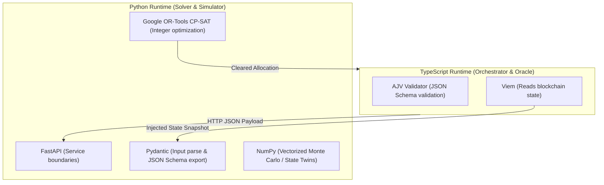
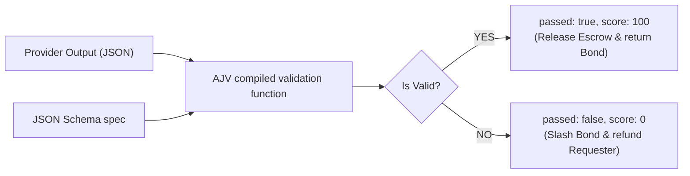
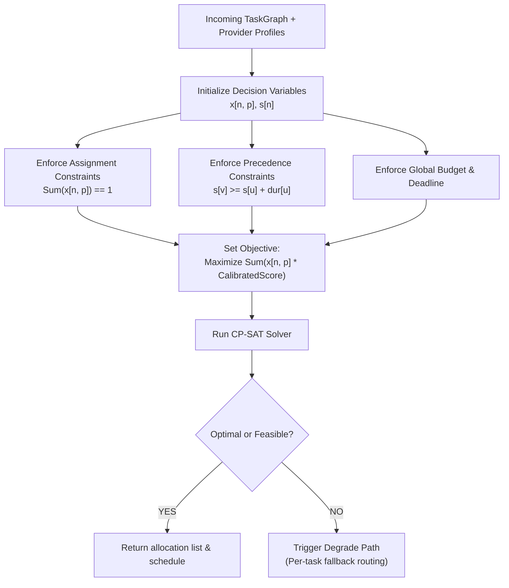
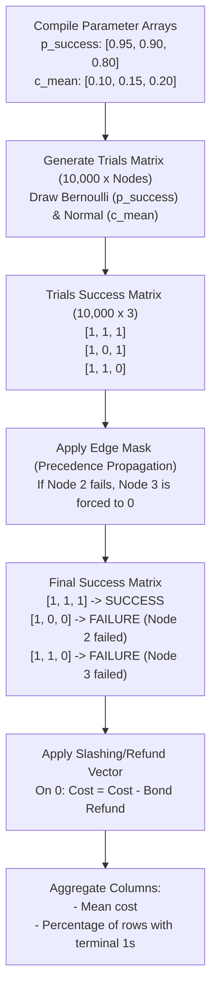

# Algorithmic & Deterministic Engine Specification

This specification details the library stack, execution flows, code implementations, and Mermaid visual models for the deterministic verification and optimization engine components of **Trapeza**.

---

## 1. Library Selection & Architecture

The architecture uses a polyglot split to maximize execution speed and maintain clean module boundaries:



---

## 2. Deterministic Verification Oracle (TypeScript & AJV)

The Oracle verifies task deliverables by validating output objects against predefined JSON Schemas. This operation is fully deterministic, preventing subjective disputes and ensuring credible bond slashing.

### Library Selection
*   **ajv** (Another JSON Schema Validator): Standard Node.js JSON Schema validator compiled to high-performance JavaScript functions.

### Code Implementation
```typescript
import Ajv, { JSONSchemaType } from "ajv";

const ajv = new Ajv({ allErrors: true, useDefaults: true });

// 1. Define the interface for the task output
interface InvoiceExtractionOutput {
  invoiceNumber: string;
  totalAmountUsdc: number;
  currency: string;
}

// 2. Define the JSON Schema matching the interface
const invoiceSchema: JSONSchemaType<InvoiceExtractionOutput> = {
  type: "object",
  properties: {
    invoiceNumber: { type: "string" },
    totalAmountUsdc: { type: "number", minimum: 0 },
    currency: { type: "string", default: "USD" }
  },
  required: ["invoiceNumber", "totalAmountUsdc", "currency"],
  additionalProperties: false
};

// 3. Compile the schema (optimizes performance for repeated runs)
const validateInvoice = ajv.compile(invoiceSchema);

export interface VerificationResult {
  passed: boolean;
  score: number;
  errorDetails?: string;
}

export function verifyTaskOutput(output: unknown): VerificationResult {
  const valid = validateInvoice(output);
  if (valid) {
    return { passed: true, score: 100 };
  } else {
    return {
      passed: false,
      score: 0,
      errorDetails: ajv.errorsText(validateInvoice.errors)
    };
  }
}
```

### Flow Diagram


---

## 3. Input Validation & Schema Bridging (Python & Pydantic)

Pydantic guarantees types at the boundary of the Python solver and automatically exports target schemas back to the TypeScript environment.

### Code Implementation
```python
from pydantic import BaseModel, Field, conlist
from typing import List, Dict, Any

class TaskSpec(BaseModel):
    id: str
    capability: str
    input: Dict[str, Any]
    oracleSpec: Dict[str, Any]  # JSON Schema definition
    budgetUsdc: float = Field(..., gt=0)
    deadlineMs: int = Field(..., gt=0)
    preference: Dict[str, float]  # weights: price, latency, quality, risk

class TaskGraphNode(BaseModel):
    nodeId: str
    task: TaskSpec

class TaskGraphEdge(BaseModel):
    from_node: str = Field(..., alias="from")
    to_node: str = Field(..., alias="to")

class TaskGraph(BaseModel):
    id: str
    nodes: List[TaskGraphNode]
    edges: List[TaskGraphEdge]
    globalBudgetUsdc: float
    globalDeadlineMs: int
```

---

## 4. Constraint Optimization Solver (Python & OR-Tools)

The clearinghouse models task-DAG routing as a Resource-Constrained Project Scheduling Problem (RCPSP) overlaid with a Generalized Assignment Problem, solved to optimality using the Google OR-Tools **CP-SAT** engine.

### Code Implementation
```python
from ortools.sat.python import cp_model

def solve_graph_clearing(graph: TaskGraph, providers: List[Dict]) -> Dict:
    model = cp_model.CpModel()
    
    # 1. Decision Variables
    # x[n, p] = 1 if provider p is assigned to node n
    x = {}
    for n in graph.nodes:
        for p in providers:
            if n.task.capability in p["capabilities"]:
                x[(n.nodeId, p["id"])] = model.NewBoolVar(f"x_{n.nodeId}_{p['id']}")
                
    # s[n] = start time of node n (scaled to integer ms)
    s = {}
    for n in graph.nodes:
        s[n.nodeId] = model.NewIntVar(0, graph.globalDeadlineMs, f"s_{n.nodeId}")
        
    # 2. Assignment Constraint (Exactly one provider per node)
    for n in graph.nodes:
        node_vars = [x[(n.nodeId, p["id"])] for p in providers if (n.nodeId, p["id"]) in x]
        model.Add(sum(node_vars) == 1)
        
    # 3. Precedence & Latency Constraints
    # duration[n] = sum_p x[n,p] * latency_p
    durations = {}
    for n in graph.nodes:
        durations[n.nodeId] = model.NewIntVar(0, graph.globalDeadlineMs, f"dur_{n.nodeId}")
        active_latencies = []
        for p in providers:
            if (n.nodeId, p["id"]) in x:
                active_latencies.append(x[(n.nodeId, p["id"])] * p["calibrated_latency_ms"])
        model.Add(durations[n.nodeId] == sum(active_latencies))
        
    # For every edge (u, v): s[v] >= s[u] + duration[u]
    for edge in graph.edges:
        model.Add(s[edge.to_node] >= s[edge.from_node] + durations[edge.from_node])
        
    # 4. Global Deadline Constraint (makespan <= globalDeadlineMs)
    for n in graph.nodes:
        # Check if node has no outgoing edges (sink)
        is_sink = not any(edge.from_node == n.nodeId for edge in graph.edges)
        if is_sink:
            model.Add(s[n.nodeId] + durations[n.nodeId] <= graph.globalDeadlineMs)
            
    # 5. Global Budget Constraint (sum of costs <= globalBudgetUsdc)
    total_cost_scaled = []
    for n in graph.nodes:
        for p in providers:
            if (n.nodeId, p["id"]) in x:
                # Scaled by 1000 to convert float USDC to integer micro-cents
                cost_scaled = int(p["calibrated_cost_usdc"] * 1000)
                total_cost_scaled.append(x[(n.nodeId, p["id"])] * cost_scaled)
    model.Add(sum(total_cost_scaled) <= int(graph.globalBudgetUsdc * 1000))
    
    # 6. Objective: Maximize expected net utility
    utilities = []
    for n in graph.nodes:
        for p in providers:
            if (n.nodeId, p["id"]) in x:
                # utility = expected_success * value - expected_cost - risk_premium
                score_scaled = int(p["calibrated_score"] * 1000)
                utilities.append(x[(n.nodeId, p["id"])] * score_scaled)
    model.Maximize(sum(utilities))
    
    # 7. Solve
    solver = cp_model.CpSolver()
    status = solver.Solve(model)
    
    if status == cp_model.OPTIMAL or status == cp_model.FEASIBLE:
        assignments = {}
        for (node_id, prov_id), var in x.items():
            if solver.Value(var) == 1:
                assignments[node_id] = prov_id
        return {"status": "success", "allocations": assignments}
    else:
        return {"status": "infeasible"}
```

### Flow Diagram


---

## 5. Monte Carlo Simulator / State Twin (Python & NumPy)

The simulator evaluates the safety and expected utility of selected assignments by running parallelized matrix trials, mimicking the on-chain RefundProtocol contract.

### Code Implementation
```python
import numpy as np

def run_state_twin_simulation(
    allocations: Dict[str, str], # node_id -> provider_id
    graph: TaskGraph,
    provider_records: Dict[str, Dict], # provider_id -> calibration stats
    iterations: int = 10000
) -> Dict[str, float]:
    
    num_nodes = len(graph.nodes)
    node_list = [n.nodeId for n in graph.nodes]
    
    # 1. Fetch probability arrays from historical posteriors (Alpha, Beta)
    p_success = np.array([
        provider_records[allocations[nid]]["success_alpha"] / 
        (provider_records[allocations[nid]]["success_alpha"] + 
         provider_records[allocations[nid]]["success_beta"])
        for nid in node_list
    ])
    
    # Fetch mean cost arrays
    c_means = np.array([provider_records[allocations[nid]]["cost_mean"] for nid in node_list])
    c_stds = np.array([np.sqrt(provider_records[allocations[nid]]["cost_var"]) for nid in node_list])
    
    # 2. Vectorized Generation of Trials (Shape: iterations x num_nodes)
    # Success/Failure matrix (1 = Success, 0 = Failure)
    success_matrix = np.random.binomial(1, p_success, size=(iterations, num_nodes))
    
    # Cost matrix (Normally distributed)
    cost_matrix = np.random.normal(c_means, c_stds, size=(iterations, num_nodes))
    
    # 3. Simulate Failure Propagation
    # If an upstream node fails, downstream dependent nodes are poisoned (fail)
    # Map edges to node indexes
    node_idx = {nid: idx for idx, nid in enumerate(node_list)}
    for edge in graph.edges:
        from_idx = node_idx[edge.from_node]
        to_idx = node_idx[edge.to_node]
        # Downstream node fails if upstream node fails
        success_matrix[:, to_idx] = success_matrix[:, to_idx] * success_matrix[:, from_idx]
        
    # 4. Evaluate Outcomes across all simulated parallel futures
    # Global success is achieved only if terminal (sink) nodes succeed
    sinks = [node_idx[n.nodeId] for n in graph.nodes if not any(e.from_node == n.nodeId for e in graph.edges)]
    global_success = np.all(success_matrix[:, sinks] == 1, axis=1)
    
    # Calculate real costs: succeeded steps charge fees; failed steps slash bonds (zero cost or refund)
    # Refund logic matches the RefundProtocol contract rules
    refund_matrix = np.zeros_like(cost_matrix)
    for idx, nid in enumerate(node_list):
        bond_amt = provider_records[allocations[nid]]["active_bond"]
        # If node fails, the requester is refunded the bond
        refund_matrix[:, idx] = (1 - success_matrix[:, idx]) * bond_amt
        
    total_realized_costs = np.sum(cost_matrix * success_matrix, axis=1) - np.sum(refund_matrix, axis=1)
    
    # 5. Compute Risk Metrics
    failure_probability = 1.0 - np.mean(global_success)
    budget_overrun_probability = np.mean(total_realized_costs > graph.globalBudgetUsdc)
    expected_net_cost = np.mean(total_realized_costs)
    
    return {
        "failure_probability": float(failure_probability),
        "budget_overrun_probability": float(budget_overrun_probability),
        "expected_net_cost_usdc": float(expected_net_cost)
    }
```

### Simulation Matrix Transformation Diagram
This diagram shows how the vectorized calculations manipulate matrices in-memory during a simulation.


