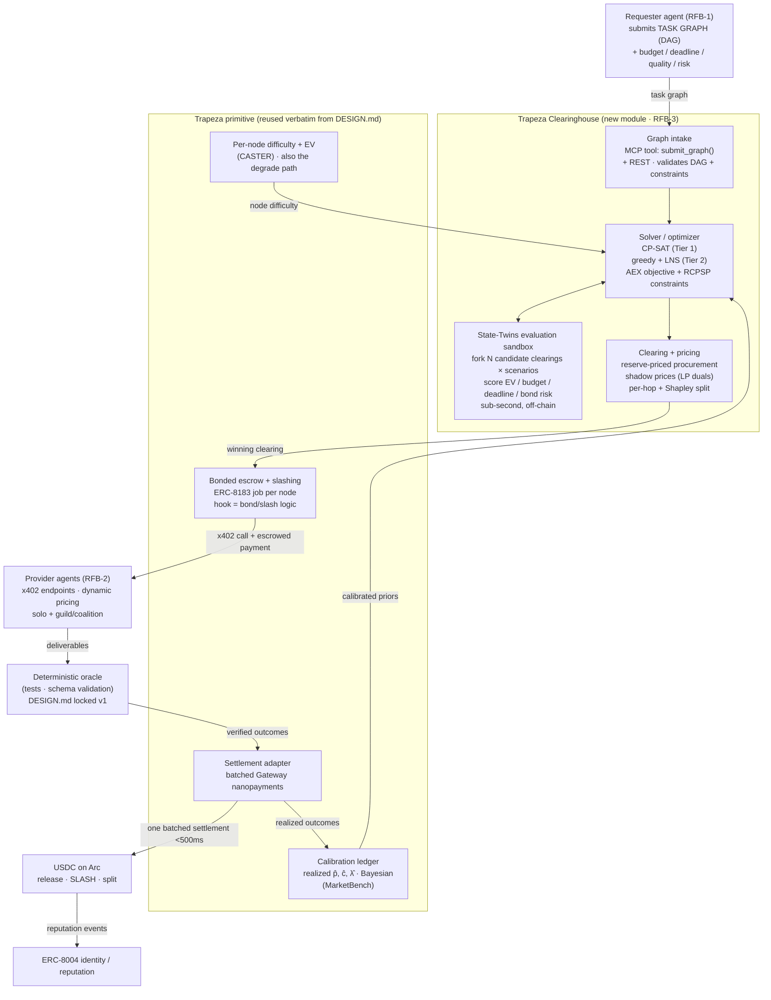

# Trapeza Clearinghouse — Graph-Level Constrained Allocation & Price-Clearing for MAS Networks

> This extends [Trapeza core design](DESIGN.md). **Same primitive, elevated one level.** The core doc
> defines Trapeza as a *calibration-first, bond-backed, per-task pairwise broker* — it routes one task to
> one provider by calibrated expected value and slashes a USDC bond on underdelivery. This document keeps
> every one of those mechanisms unchanged and adds a layer above them: a **clearinghouse engine** that
> accepts a whole **multi-agent task graph** and solves a single global constrained allocation + price-clearing
> problem across all of its nodes at once, then settles the winning clearing in one batch on Arc. The
> calibration ledger, the bonded escrow, the deterministic oracle, and the settlement adapter are all reused
> verbatim; the clearinghouse is a new solver module that sits on top of them.

---

## 0. TL;DR — what changes and what doesn't

1. **Doesn't change:** the thesis (bids are not the allocation signal; calibrated realized outcomes are),
  the bond-slash credibility mechanism, the deterministic-verifiable v1 capability, the Trapeza name, the
   MCP surface, the layered primitive/app split.
2. **Changes:** the *unit of decision* moves from a single edge (one task → one provider) to a whole **DAG**
  (a workflow of interdependent subtasks under one global budget, deadline, and quality floor). Trapeza
   stops being a router that makes N independent myopic choices and becomes a **solver** that makes one
   jointly-optimal choice.
3. **Why it's defensible against DESIGN.md's own rejection of combinatorial auctions:** the clearinghouse is
  **not an auction over self-reported bundle bids.** It is a constrained optimization the clearinghouse runs
   *itself* over *calibrated* estimates, evaluated *off-chain* via State-Twins-style fork-and-evaluate, and
   settled on-chain in one cleared batch. The thing DESIGN.md rejected (eliciting bundle bids agents can't
   calibrate) never occurs. See §3 — this is the intellectual core.

---

## 1. Problem statement — why graph-level clearing beats per-task brokering

Real multi-agent workloads are not streams of independent one-off tasks. They are **workflows**: a DAG of
subtasks where outputs feed inputs, with a single budget, a single deadline, and a single quality bar that
apply to the *whole job*, not to any one node. Examples the judges will recognize: "research → draft →
fact-check → format" content pipelines; "scrape → extract → reconcile → summarize" data pipelines;
CASTER's own software-engineering MAS (PM → Architect → Engineer → Reviewer, cyclic). The defining feature
is **coupling**: nodes share a budget, sit on shared critical paths, and a failure upstream poisons everything
downstream.

A **per-task broker** (Trapeza core, and the obvious naive baseline) routes each node independently by local
calibrated EV. That is provably suboptimal the moment constraints are global, for three concrete reasons:

- **Budget myopia.** A greedy per-node router spends the requester's money in topological order. It can
exhaust the budget on early, *easy* nodes (because a slightly-better provider looked locally worth it),
leaving nothing for the one **bottleneck node** that actually determines whether the workflow succeeds.
The right global move is to buy *cheap-but-adequate* on easy nodes precisely to *afford premium on the
bottleneck* — a tradeoff no independent per-node decision can see. This is CASTER's "easy→weak,
hard→strong" insight, but enforced under a hard global budget rather than as a per-step preference.
- **Deadline / critical-path coupling.** Latency adds along the **longest path**, not per node. Shaving
latency on a node that isn't on the critical path is wasted spend; paying a latency premium on a node that
*is* on the critical path can save the whole deadline. Only a scheduler that sees the graph topology can
tell the difference.
- **Failure-propagation risk.** In a DAG, `p_success` compounds *multiplicatively* along dependency chains.
A per-node router optimizing each node's local `p·v − c` systematically under-weights early-node reliability,
because it doesn't price the downstream value that an early failure destroys. The bottleneck for *reliability*
is usually the deepest shared ancestor, not the most expensive node.

**Claim (high confidence):** for any workload with a shared budget *or* a shared deadline *or* multiplicative
success coupling, the globally-cleared allocation weakly dominates independent per-task routing, and strictly
dominates it on the instances that matter (tight budget, tight deadline, one bottleneck node). The per-task
broker is the special case of the clearinghouse where the graph is a single node and all constraints are
trivial. That makes the clearinghouse a strict generalization, not a competing design — which is exactly why
it can layer onto the same primitive without contradicting it.

---

## 2. The reframe — clearinghouse, not broker


|                | **Trapeza core (DESIGN.md)**                   | **Trapeza Clearinghouse (this doc)**                                                  |
| -------------- | ---------------------------------------------- | ------------------------------------------------------------------------------------- |
| Input          | one task spec + budget                         | a **task DAG** + global budget/deadline/quality/risk constraints + provider set       |
| Decision       | pick 1 provider for 1 task                     | **assign every node to a provider, ordered, priced** — jointly                        |
| Math           | calibrated EV ranking (CASTER)                 | **constrained optimization** over the whole graph (AEX objective + RCPSP constraints) |
| Pricing        | posted-price / score-adjusted Vickrey per task | **batch clearing** with shadow-price interpretation + per-hop / Shapley split         |
| Settlement     | one escrow release/slash per task              | **one batched settlement** of the whole cleared allocation                            |
| Eval substrate | (stretch) fork-and-simulate                    | **fork-and-evaluate is core** — the solver scores candidate clearings on State Twins  |


The clearinghouse is the literal instantiation of RFB-3's three named builds at once: it *is* the
**AgentBroker** (matchmaking, takes a fee, posts its own bond), it orchestrates **AgentMesh** (multi-hop
chained services with automatic payment splitting), and it runs **NanoEscrow** (sub-cent escrow for every
task handoff) — but unified under one solve instead of three separate components.

---

## 3. Reconciliation — why this is NOT the combinatorial auction DESIGN.md rejected

This is the load-bearing argument. DESIGN.md §1 rejects combinatorial auctions on three grounds. The
clearinghouse defeats all three because it is a **solver, not an auction**. The distinction is not cosmetic:
an *auction* is a mechanism for *eliciting and aggregating self-reported valuations*; a *solver* is an
*optimizer that computes an allocation from estimates it owns*. They fail and succeed for completely
different reasons.

**Objection 1 — "Combinatorial auctions require bundle bids, and MarketBench shows agents calibrate bundles
even worse than single tasks."**
*Dissolved.* There are **no bundle bids** anywhere in the clearinghouse. The clearinghouse never asks a
provider "what will you charge for this bundle of nodes, and how likely are you to succeed at all of them
together?" Instead, it *synthesizes* bundle-level success and cost from its **own per-capability calibration
posteriors** (the realized-outcome ledger — MarketBench's prescription). A provider's self-reported price
surface, if it submits one at all, enters only as a **prior** that gets shrunk toward the empirical posterior;
it is never the allocation signal. This is the *identical* move DESIGN.md §1 makes for the single-task case
("the bid is not the allocation signal") — the clearinghouse simply applies it to a set of nodes instead of
one. The capability that MarketBench proves agents *lack* (calibrated self-assessment, worse on bundles) is
never on the critical path, because the clearinghouse supplies that estimate itself.

**Objection 2 — "Combinatorial clearing is NP-hard."**
*Conceded, then defanged.* Three reasons it doesn't bite here:

- **It is not arbitrary set-packing over 2ⁿ bundles.** The combinatorial auction's hardness comes from
optimizing over an exponential lattice of *bids on arbitrary subsets*. The clearinghouse problem is an
**assignment of providers to fixed DAG nodes with side constraints** — structurally a Resource-Constrained
Project Scheduling Problem with a generalized-assignment overlay (§5). The graph *gives* you the structure
that a combinatorial auction lacks; you optimize over `|nodes| × |providers|` binary assignments under
precedence, not over `2^|nodes|` bundles.
- **We do not need the optimum.** We need a *good feasible clearing found fast*. A greedy seed + local search
reliably captures the large majority of the gap to optimal on instances this size, and on demo-scale graphs
(≤ ~30 nodes, ≤ ~10 providers) a constraint solver returns the true optimum in milliseconds (§6).
- **Off-chain evaluation is cheap.** Scoring a candidate clearing is a State-Twins fork-and-evaluate, not an
on-chain transaction (§7). The solver can examine thousands of candidates per second.

**Objection 3 — "Mechanism overhead must be smaller than trade value; running a heavy auction for a $0.001
task is absurd."**
*Inverted into an advantage.* This was DESIGN.md's sharpest point against combinatorial clearing, and
graph-level clearing actually **improves** the unit economics rather than worsening them:

- **Amortization.** You solve **once per graph**, not once per node. A 30-node workflow worth $5 carries one
solve, not thirty auctions. Per-node mechanism overhead → (solve cost)/(node count), which *falls* as graphs
grow.
- **Batched settlement.** Circle Gateway's entire premise is batching many signed authorizations into one
on-chain settlement. The cleared allocation is *exactly* such a batch — one settlement commits all per-node
releases, slashes, and splits. Per-node settlement overhead → (one batch)/(node count). The nano-economics
constraint that killed per-task combinatorial auctions is the very thing graph-level clearing exploits.
- **The compute is off-chain and free.** The expensive object in a VCG/combinatorial auction is the *on-chain*
clearing and the *strategic* elicitation. The clearinghouse does its optimization off-chain on a State Twin
and touches the chain once.

**The synthesis:** DESIGN.md correctly rejected combinatorial *auctions* — mechanisms that try to elicit
calibrated bundle valuations from agents that cannot produce them, priced and cleared on-chain per trade. The
clearinghouse is a combinatorial *optimizer* — it computes an allocation from calibration data it owns,
off-chain, and settles the result in one batch. DESIGN.md even gestures at this in its "decisive point" (the
bid is a prior, the ledger is the signal) and in its stretch "simulate before you settle." The clearinghouse
is the natural completion of those two moves, not a reversal of the doc's contrarian stance. Confidence: high.

> One concession to keep honest: DESIGN.md §1 says "multi-hop workflows should be decomposed and priced per
> hop, not cleared as one combinatorial lot." The clearinghouse keeps **per-hop pricing and per-hop settlement**
> intact (§4.3) — what it changes is **allocation**, which it lifts from independent-per-hop to joint-under-
> global-constraints. "Price per hop" survives; "route each hop in isolation" is what the solver replaces.

---

## 4. What "clearing" means here, precisely

### 4.1 Clearing cadence — per-graph, batched, event-driven

- **Default (demo and v1):** *per-graph clearing.* One submitted DAG → one solve → one batched settlement.
This is the cleanest story and maps one-to-one onto Gateway batching.
- **Generalization (multi-tenant):** *windowed batch clearing.* Multiple graphs submitted within a clearing
window (e.g., every N ms, or every K graphs) are cleared together so the solver can share scarce provider
capacity across requesters and exploit cross-graph synergies. This is the path to a real market; it is *not*
required for v1 and is explicitly a stretch.
- **Not continuous.** A continuous double auction is the wrong model: it re-introduces per-trade mechanism
cost and loses the global-constraint coupling that is the entire point. Clearing is discrete and batched.

### 4.2 How prices clear

Three coexisting notions of "price," each grounded:

1. **Reserve-priced procurement (the floor).** Each node carries a requester **reserve** = max willingness to
  pay for that node (derived from the global budget + the node's marginal value). A provider's price surface
   (dynamic, surge-on-load, complexity-tiered — RFB-2) gives an **ask**. The clearinghouse admits an
   assignment only if `ask ≤ reserve` and the assignment is feasible. This is MarketBench's recommended
   *scoring auction* (Che 1993): the cleared score is `calibrated_p_success · value − ask − risk_premium`,
   **not** the ask alone.
2. **Shadow prices (the economically meaningful clearing prices).** Solve the LP relaxation of the allocation
  problem; the **dual variables** are the clearing prices. The dual on the **budget** constraint is the
   marginal value of one more USDC of budget; the dual on a **provider-capacity** constraint is the congestion
   premium that a scarce, in-demand provider commands; the dual on the **deadline** constraint is the value of
   one more second. This is what makes "bottleneck nodes clear at a premium" a *computed* fact rather than a
   slogan — the bottleneck node is precisely the one whose constraints have the largest duals, and its provider
   is paid the premium those duals justify, capped by the reserve.
3. **Settlement price.** What actually moves on-chain per node: `min(ask, reserve)` adjusted by the realized
  outcome (full release on verified success; slash redirect on failure — §4.4).

### 4.3 Multi-hop payment splitting

- **Default — per-hop.** Each provider is paid for the node it executed, settled in the batch. For a DAG of
independent single-provider nodes this is the correct and complete split.
- **Synergistic coalitions — Shapley.** When providers form a **guild/coalition** (AEX "Agent Hub") that
produces *superadditive* value `V(coalition) > Σ V(solo)`, the surplus `ΔV` is divided by **Shapley value**
over the coalition members, computed **off-chain** (NP-hard in general; sampled/approximated for >~8 members)
and **settled on-chain** as part of the batch. Guilds inherit AEX/DESIGN.md's **joint-and-several bond
slashing** as the cartel check. This reuses DESIGN.md §2's guild model unchanged.

### 4.4 How bonded escrow + deterministic oracle plug into batch settlement

The full lifecycle, reusing the Trapeza primitive end-to-end:

1. **At clearing time:** for each assigned node, the clearinghouse opens an escrow position (a node of the
  batch) and requires the assigned provider to post a USDC **bond** ≥ `β · node_value`. On Arc this maps
   cleanly to an **ERC-8183 job** per node (`createJob → setBudget → fund`), with the `**hook` parameter**
   carrying the bond-and-slash logic — the standard's built-in extension point (verified against the Arc
   ERC-8183 reference contract `0x0747…4583`).
2. **At execution:** providers run their nodes in dependency order; each deliverable is checked by the
  **deterministic oracle** (DESIGN.md's locked v1 decision — unit tests, schema validation, etc.). Determinism
   is what makes the slash *credible*: there is no judge to bribe or contest.
3. **At settlement (one batch):** verified nodes `complete` and release payment to the provider; failed nodes
  slash the bond → make the requester (and any downstream provider whose input was poisoned) whole; the whole
   set of releases + slashes + Shapley splits is committed as **one batched Gateway settlement** in USDC on Arc.
   Reputation events (`ERC-8004`) and ledger updates fire from the realized outcomes, feeding next clearing's
   calibration.

The key property: **the bond and the deterministic oracle from DESIGN.md are unchanged**; the clearinghouse
just opens many of them at once and settles them as a batch.

---

## 5. Formal-ish problem definition

**Task graph.** `G = (V, E)`, a DAG. Each node `n ∈ V` carries `⟨cap_n, v_n, q_n, λ_n^max, bondρ_n⟩`:
required capability, marginal value contributed to the deliverable, quality floor, latency cap, and required
bond ratio. Edge `(m, n) ∈ E` means `n` depends on `m`'s output (precedence + data dependency).

**Provider set.** `P`, each `p` with: capability set `caps_p`; a **calibrated** posterior over success
probability `p̂_{n,p}` and cost `ĉ_{n,p}` for node `n` (drawn from the realized-outcome ledger — Beta/Normal
posteriors with uncertainty, MarketBench-style; provider self-reports enter only as priors); latency estimate
`λ̂_{n,p}`; concurrency cap `k_p`; bond capacity `B_p`.

**Decision variables.** `x_{n,p} ∈ {0,1}` (provider `p` executes node `n`); start times `s_n ≥ 0`.

**Objective — maximize calibrated expected net value.** Building directly on AEX's
`max Σ_S [p_success(S)·v(S) − c(S)]`, but with *calibrated* `p̂` (not self-reported) and graph/constraint terms:

```
maximize   Σ_{n∈V} Σ_{p∈P}  x_{n,p} · [ p̂_{n,p} · v_n  −  ĉ_{n,p}  −  ρ · risk_{n,p} ]   −   fee
```

where `risk_{n,p}` captures bond-at-risk × failure variance and `ρ` is the requester's risk aversion. The
*honest* objective couples success multiplicatively along the DAG — the probability the terminal deliverable
is produced is `Π_{n on path} p̂_{n,a(n)}`, which is non-linear. The pragmatic v1 treatment (§6) keeps the
**additive per-node surrogate above** as the objective and enforces the multiplicative reliability requirement
as a **log-linearized chance constraint** (next), which is what keeps the whole thing MILP/CP-solvable.

**Constraints (all first-class).**


| Constraint type            | Encoding                                                                                              |
| -------------------------- | ----------------------------------------------------------------------------------------------------- |
| **Capability match**       | `x_{n,p} = 0` unless `cap_n ∈ caps_p` (hard mask, prunes the search space first)                      |
| **Assignment**             | `Σ_p x_{n,p} = 1` for every node (each node gets exactly one provider)                                |
| **Budget cap**             | `Σ_n Σ_p x_{n,p} · ĉ_{n,p} + Σ bonds ≤ B_total` (expected-payment form; or chance-constrained)        |
| **Deadline / latency**     | critical-path: `s_n + Σ_p x_{n,p} λ̂_{n,p} ≤ s_{succ}` and `makespan ≤ T_deadline`                    |
| **Quality floor**          | per-node `Σ_p x_{n,p} p̂_{n,p} ≥ q_n`; global `Σ_n log p̂ ≥ log q_min` (log-linear chance constraint) |
| **Risk / bond**            | assigned provider must have `B_p ≥ β·v_n`; `Σ_n x_{n,p} · bond_{n} ≤ B_p` (bond capacity)             |
| **Dependency ordering**    | `s_n ≥ s_m + dur_m` for every edge `(m,n) ∈ E` (precedence)                                           |
| **Capacity / concurrency** | at any time, `#{nodes p is running} ≤ k_p` (cumulative-resource constraint)                           |


This is an RCPSP + generalized assignment + chance constraint. NP-hard in general; trivial at demo scale; the
point of §6 is that we never need to solve the general case to ship.

---

## 6. Solver approach for a 9-day sprint

**Recommendation — a three-tier ladder, ship tier 1, demo tier 2, claim tier 3 as future work.** Explicitly
trade optimality for demoability.

**Tier 1 — Constraint solver (primary, ship this).** Encode §5 directly in **Google OR-Tools CP-SAT**.
CP-SAT is purpose-built for exactly this shape: boolean assignment vars, precedence constraints, cumulative
resource (concurrency) constraints, and linear budget/quality constraints are all first-class, it is mature,
Python-native, and free. On demo-scale graphs (≤ ~30 nodes, ≤ ~10 providers) it returns a **provably optimal**
clearing in milliseconds-to-low-seconds. Provable optimality on the demo instance is itself a selling point:
you can show the solver found the allocation a naive router *couldn't*. Multiplicative reliability handled via
the log-linearized chance constraint; non-linear residual handled by Tier 2.

**Tier 2 — Greedy seed + Large-Neighborhood Search (scale fallback + scenario scoring).** When graphs or the
provider pool grow past CP-SAT's comfortable range, or when you want to optimize the *true* multiplicative
objective rather than the surrogate: (a) **greedy topological seed** — assign nodes in topological order by
calibrated EV subject to a running budget/deadline reservation for un-assigned descendants; (b) **LNS / simulated
annealing** — repeatedly destroy-and-repair a subset of node assignments, **scoring each candidate clearing on
a State Twin** (§7) against the *exact* (non-linearized) objective and constraints under sampled outcomes. This
is anytime: stop when the clearing budget (wall-clock or USDC) is hit and return the best feasible clearing so
far.

**Tier 3 — Windowed multi-graph clearing (future work, don't build for v1).** Generalize Tier 1/2 across
graphs in a clearing window for cross-requester capacity sharing. Note it; don't ship it.

**Ultimate fallback — degrade to the per-task broker.** If the solver proves too heavy *during the event*,
the clearinghouse degrades gracefully to **independent per-node CASTER routing** (the DESIGN.md broker) — which
is just Tier-2's greedy seed with no local search. This is the risk valve in §9: the layered architecture means
the worst case is "we shipped the original broker," not "we shipped nothing."

**Heuristic for which tier runs:** mirror DESIGN.md's `value × liquidity` mechanism selector — small graph or
tight clearing-latency budget → CP-SAT to optimality; large graph or loose latency budget → greedy+LNS;
solver over budget → per-task degrade.

---

## 7. State Twins as the solver substrate (the novel angle)

The solver's inner loop must answer, for each candidate clearing: *"if I commit this allocation, what is the
expected net value, and what is the probability it busts the budget / blows the deadline / depletes a bond —
given that providers succeed and fail according to their calibration posteriors, and given the actual current
on-chain escrow/Gateway/USDC state?"* Answering that **reactively** (against live Arc) is impossible: every
"what if" would be a real transaction or an RPC read at a block that doesn't exist. This is precisely the
**Forced-Factorization** limit State Twins formalizes (Remark 1): counterfactual settlement transitions don't
correspond to any chain-read, *at any speed*.

State Twins is the fix, and it slots in as the clearinghouse's evaluation sandbox:

1. **Read once.** Pull the relevant on-chain state (escrow balances, Gateway balances, provider bond positions,
  USDC) **once** into a typed, in-memory **twin** of the settlement state — the deterministic state-transition
   map here is the escrow/slash/release/split logic, which (like an AMM invariant) is a pure function of state +
   inputs, so the twin is mathematically faithful (T1–T3).
2. **Fork N ways (T4 — the operation chains cannot provide).** For each *candidate clearing* × each *outcome
  scenario* (a Monte Carlo draw from the per-node calibration posteriors: which providers succeed, which slash),
   `clone()` an independent twin and simulate the **exact batch settlement** on it: releases, slashes,
   redirections, Shapley splits.
3. **Aggregate and choose.** Over the fork family, compute expected net value, budget-overrun probability,
  deadline-violation probability, and bond-depletion risk for each candidate, pick the winner, and **commit
   exactly one** real batched settlement on Arc. State Twins' headline result — **N=50 forks in well under a
   second after a single chain read** — is exactly the budget the LNS inner loop needs.

Two distinct, both valuable, uses:

- **Robustness scoring (Monte Carlo over calibration uncertainty):** which clearing is best *in expectation and
in the tail*, not just at the posterior mean. This is where calibrated `p̂` with *uncertainty* (Beta posteriors)
earns its keep — the twin propagates that uncertainty through the settlement math.
- **Settlement preflight (correctness):** simulate the chosen batch on the twin to verify it won't revert,
overdraw escrow, or violate a bond invariant *before* spending real USDC. "Think before you pay," promoted
from DESIGN.md's stretch goal to the clearinghouse's core loop.

This is the strongest innovation claim in the project: a research-grounded (State Twins, 2026) off-chain
substrate used not as a backtester but as the *optimizer's evaluation oracle* for on-chain economic clearing.
Confidence that it's novel relative to the cited work and the Arc samples: moderate-to-high.

---

## 8. Architecture




### Circle / Arc component mapping (judging: 20%)


| Component                | Role in the clearinghouse                                                                                                                                            |
| ------------------------ | -------------------------------------------------------------------------------------------------------------------------------------------------------------------- |
| **x402**                 | Provider node execution = pay-per-call 402 services (unchanged from core)                                                                                            |
| **Gateway nanopayments** | **The batch-settlement primitive itself** — the cleared allocation *is* a batch of authorizations settled in one on-chain commit. Strongest fit in the whole design. |
| **Wallets**              | One programmable wallet per requester, provider, guild, and the clearinghouse                                                                                        |
| **Contracts / escrow**   | **ERC-8183 job per cleared node** (`createJob→setBudget→fund→submit→complete`), `hook` carries bond+slash; fork `arc-escrow` for the validation/refund path          |
| **USDC on Arc**          | Settlement + bond currency; sub-cent, sub-500ms finality makes per-node clearing economical                                                                          |
| **ERC-8004**             | On-chain identity + reputation for providers/guilds; calibration ledger mirrors realized outcomes here                                                               |


### Paper → module mapping


| Paper           | Module it grounds                                                                                                                               |
| --------------- | ----------------------------------------------------------------------------------------------------------------------------------------------- |
| **CASTER**      | The graph backbone (DAG MAS, LangGraph-style), per-node difficulty estimation, and the per-task degrade path                                    |
| **AEX**         | The objective `max Σ[p̂·v − c]`, Shapley attribution for coalitions, adaptive mechanism selection, Agent-Hubs = guilds                          |
| **MarketBench** | The calibration ledger feeding `p̂`, `ĉ`; the empirical proof that self-reported bids ≠ allocation signal (the §3 reconciliation rests on this) |
| **State Twins** | The off-chain fork-and-evaluate solver substrate + settlement preflight (§7)                                                                    |


---

## 9. Consistency with the locked decisions

1. **Deterministically verifiable v1 capability →** unchanged and *more* important. Slashing must be credible
  for the batch settlement to mean anything; the deterministic oracle is the per-node verifier inside the
   batch. Launch capability stays a deterministic-checkable one (code review w/ failing-test oracle, structured
   extraction w/ schema validation) and the demo graph is built from nodes of that type.
2. **Traction = MCP tool/server AND seeded closed loop →** the MCP surface gains a `submit_graph()` entrypoint
  *alongside* the existing `submit_task()`; the seeded closed loop now runs *workflows* (multi-node graphs)
   through the clearinghouse, generating real multi-hop testnet-USDC volume and the network-graph-density /
   payment-chain-depth metrics RFB-3 asks for (graphs produce depth and density *by construction*).
3. **Layered forkable primitive + demo app →** the clearinghouse is a **new service/module that imports the
  Trapeza primitive**; it does not modify it. The primitive (calibration ledger, bonded escrow, settlement
   adapter, per-node router) remains independently forkable; the clearinghouse and the demo app sit on top.
   This is also the §6 risk valve: removing the clearinghouse leaves a working broker.
4. **Name stays Trapeza →** this is "Trapeza Clearinghouse," a mode of the same agent. The *trapezitai*
  metaphor (a banker who stakes his own standing) is, if anything, a better fit for a clearinghouse than for a
   point broker.

---

## 10. Demo story (under 3 min)

The contrast is the pitch — same structure as DESIGN.md §6, lifted to the graph level:

1. **Submit a graph.** A Cursor/Claude agent calls the Trapeza MCP `submit_graph()` with a ~6–10 node workflow
  (e.g., scrape → extract×3 (parallel) → reconcile → fact-check → format), a **tight global budget**, a
   **tight deadline**, and a quality floor. Providers are 3–5 real x402 micro-services at different
   price/quality/latency tiers, plus one bottleneck capability that only a premium provider does well.
2. **Watch the solver pick the non-obvious allocation.** Show, side by side: (a) the **naive per-task router**
  spends early budget on marginally-better providers for the easy parallel extracts, then *can't afford* the
   premium provider for the bottleneck fact-check node → it busts the quality floor or the budget. (b) The
   **clearinghouse** deliberately buys *cheap-but-adequate* on the easy nodes to *reserve* budget for premium on
   the bottleneck → clears feasibly with higher expected net value. Display the **shadow price** on the budget
   constraint to explain *why* the bottleneck provider was worth the premium.
3. **Show fork-and-evaluate.** Visualize the State-Twins sandbox scoring N candidate clearings sub-second before
  committing — "it thought through N futures, then paid once."
4. **Settle the batch on Arc.** One batched Gateway settlement: per-node releases, one live **bond slash** on a
  node whose provider underdelivers (deterministic oracle catches it), requester made whole, calibration curve
   moves, ERC-8004 reputation event fires.
5. **Toggle calibration off → on (the DESIGN.md innovation hook, now at graph scale).** With calibration **off**,
  the clearing trusts self-reported bids → it picks overconfident-cheap providers on the bottleneck → workflow
   collapses (lemons, at the graph level the failure *propagates* and kills the whole deliverable). Toggle
   calibration **on** → the clearing quality visibly recovers. *That contrast is the whole pitch*, and graphs
   make it more dramatic than single tasks because failure compounds.
6. **Dashboard:** cumulative testnet-USDC volume, **payment-chain depth** and **network-graph density** (RFB-3's
  named metrics, which graph workloads produce natively), settlement latency <500ms, per-provider calibration
   curves, bond slashes.

---

## 11. Risks & open questions (clearing/solver-specific)


| #   | Risk / question                                                                                                                      | Mitigation / fallback                                                                                                                                                                   | Confidence             |
| --- | ------------------------------------------------------------------------------------------------------------------------------------ | --------------------------------------------------------------------------------------------------------------------------------------------------------------------------------------- | ---------------------- |
| 1   | **Solver too heavy for 9 days.** CP-SAT encoding + State-Twins integration is the riskiest net-new work.                             | Three-tier ladder (§6); ultimate **degrade to per-task CASTER broker**. Worst case = we shipped DESIGN.md.                                                                              | high it's survivable   |
| 2   | **State-Twins substrate is build-it-yourself.** DeFiPy v2 twins are AMM-shaped; our state machine is escrow/slash/split, not a pool. | The twin we need is *simpler* than an AMM (escrow accounting is linear). Build a minimal typed in-memory escrow twin; borrow only the fork-and-evaluate *pattern*, not the DeFiPy code. | moderate               |
| 3   | **Objective non-linearity** (multiplicative success along paths) breaks clean MILP.                                                  | Additive surrogate + log-linearized chance constraint for Tier 1; exact objective only in Tier-2 LNS scored on the twin.                                                                | high                   |
| 4   | **Calibration cold-start at the graph level.** Per-(node-capability, provider) posteriors are sparse early.                          | Seed from the closed loop; CASTER-style cold-start; share posteriors across similar capabilities; widen uncertainty when data is thin (the twin propagates it).                         | moderate               |
| 5   | **Shadow-price story may overpromise.** LP duals are only exact for the relaxation; the integer clearing's "prices" are approximate. | Present duals as *interpretive* clearing prices for the demo narrative, not as a settlement mechanism. Settlement uses `min(ask,reserve)`. Be precise in the repo.                      | moderate               |
| 6   | **Shapley is NP-hard for big coalitions.**                                                                                           | Off-chain, sampled/Monte-Carlo Shapley for >~8 members; cap demo guilds small. Already DESIGN.md's stance.                                                                              | high                   |
| 7   | **Does graph clearing actually beat per-task on *our* demo instance?** If we mis-tune the demo, the naive router might tie.          | Deliberately construct the demo graph with a budget-vs-bottleneck tension (§10.2) so the gap is real and visible; verify in the seeded loop before recording.                           | high it's controllable |
| 8   | **Mechanism-cost regression.** If we clear too frequently (per node), we lose the amortization argument.                             | Clear **per graph**, settle **per batch** (§4.1). Never clear per node.                                                                                                                 | high                   |


**The one-line fallback contract:** if the solver or the twin slips, strip the clearinghouse module and ship
the per-task broker from DESIGN.md — same primitive, same Circle stack, same demo minus the graph. The layering
is what makes that fallback free.

---

## 12. Source map (delta from DESIGN.md §8)

- **AEX** — supplies the objective `max Σ[p̂·v − c]` and Shapley splits; we replace its *auction* with a
*solver* and its self-reported valuations with calibrated posteriors (its stated limitation: "honest,
calibrated, static agents").
- **CASTER** — supplies the graph MAS model and per-node difficulty; we lift its per-step routing to a global
constrained solve.
- **MarketBench** — the empirical foundation of §3: agents can't calibrate bundles, so the clearinghouse must
own the estimate. Without this paper the reconciliation argument collapses.
- **State Twins** — the off-chain fork-and-evaluate substrate (§7); we use the *pattern* (Provider/Builder,
T4 forking, "N forks per one chain read"), build a minimal escrow-shaped twin, and apply it as the solver's
evaluation oracle rather than as a DeFi backtester.
- **Arc/Circle** — ERC-8183 (job-per-node, `hook` for bond/slash, ref contract `0x0747…4583`), Gateway batching
(= batch settlement), ERC-8004 (reputation), x402 (provider calls), USDC on Arc (settlement + bond).

