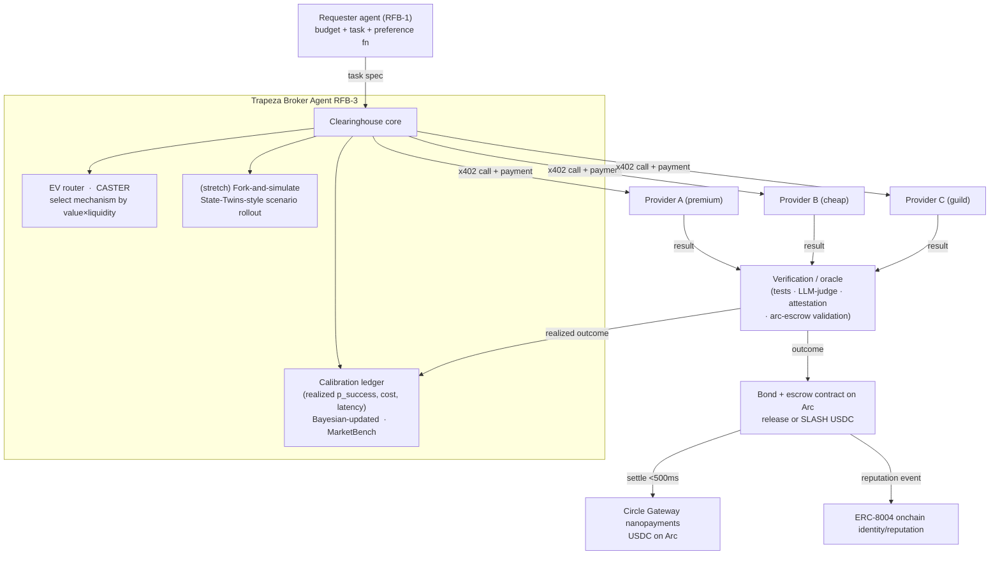

# EVTrapeza — A Calibration-Aware Broker for Agent-to-Agent Nanopayment Markets

> Working codename: **Trapeza** (τράπεζα, "the banker's table"). In antiquity the *trapezitai*
> were money-changers who staked their own standing on the coins they vouched for — the exact
> primitive in Prior-Art #08. Rename freely.

Lepton Agents Hackathon (Canteen × Circle). Settlement on Arc, USDC, x402, Circle Gateway nanopayments.
Targets the overlap of **RFB-1 (autonomous paying agents)**, **RFB-2 (selling agent services)**, and
**RFB-3 (agent-to-agent networks)**, with the broker as the load-bearing piece.

---

## 0. TL;DR — the thesis in three sentences

1. The rail is free (Arc + Circle + x402 give you sub-cent, sub-500ms USDC settlement out of the box), the
  auction mechanism is a solved paper (AEX), so neither is where the value or the difficulty lives.
2. The real, unsolved bottleneck — proven empirically by **MarketBench** — is that **agents cannot price
  themselves**: they are miscalibrated on their own success probability and cost, so any market that trusts
   self-reported bids produces garbage allocations.
3. **Trapeza is a broker/clearinghouse agent that refuses to trust bids.** It prices providers from *realized
  outcomes* (empirical calibration), routes by calibrated expected value (CASTER-style), forces providers to
   post a **USDC bond that slashes on underdelivery** (skin-in-the-game reputation, ERC-8004 + Prior-Art #08),
   and settles per-task in sub-cent USDC on Arc. The intelligence is in the *calibration and risk layer*, not
   the auction format.

---

## 1. The contrarian position (read this first)

The brief asks: "auctions are a great way to solve this — VCG, FCFS, Dutch, Combinatorial?" **Partially wrong,
and the way it's wrong is the whole insight.**

- **VCG is a trap at this scale.** VCG / Vickrey truthfulness is *dominant-strategy incentive compatible only
if bidders know their own valuations.* MarketBench shows agents demonstrably do **not** know their own
success probability or token cost. Truthfully revealing a number you can't estimate is worthless. VCG's
theoretical elegance buys you nothing here, while costing you computation and exposing you to collusion/shill
bids. **Confidence: high.**
- **Combinatorial auctions are doubly disqualified.** NP-hard *and* they require bids on bundles that agents
calibrate even worse than single tasks. Multi-hop workflows should be **decomposed and priced per hop**, not
cleared as one combinatorial lot.
- **Mechanism overhead must be smaller than trade value.** Running any heavy auction for a $0.001 task is
absurd — the compute to clear the auction exceeds the value of the trade. This is the nano-economics
constraint AEX never confronts (they reason about liquidity, not unit value). It forces cheap mechanisms at
the bottom of the market.
- **So the right mechanism is value-tiered, not one-size-fits-all:**

  | Task value / structure                          | Mechanism                                                                                       | Why                                                                                 |
  | ----------------------------------------------- | ----------------------------------------------------------------------------------------------- | ----------------------------------------------------------------------------------- |
  | Cheap, commoditized, abundant supply (≤ ~$0.01) | **Posted price + reputation routing (FCFS-on-quality)**                                         | Auction cost > task value; just route to best calibrated EV                         |
  | Mid-value single task, scarce supply            | **Sealed-bid second-price (Vickrey) procurement auction, score-adjusted by calibration + bond** | Cheap to run, reduces gaming, multi-attribute (price × reliability), not pure price |
  | Time-critical / need fast price discovery       | **Dutch (descending) procurement clock**                                                        | Low latency, single round, fits high-frequency nano flow                            |
  | Bundle / multi-hop workflow                     | **Per-hop decomposition + Shapley split**                                                       | Avoids uncalibratable bundle bids and NP-hardness                                   |

  The broker **adaptively selects** the mechanism by `(task_value × supply_liquidity)` — a reframing of AEX's
  adaptive selection that respects nano-scale economics.
- **The decisive point:** in every tier, the bid is **not** the allocation signal. The allocation signal is
`calibrated_p_success × value − price − risk_premium`, where `calibrated_p_success` comes from Trapeza's
realized-outcome ledger, **not** the provider's self-report. The auction is a thin shell around a calibration
engine. *That* is the moat and the research contribution.

---

## 2. How this answers the brief's exploratory questions

These are not just talking points — the system is **instrumented to observe each phenomenon emerge**, which
directly serves the judges' "emergent behavior / research insight" criterion and makes a killer demo
("watch a pricing war happen live").

- **Do pricing wars race to the bottom, or differentiate on quality?**
With a naive price-only broker → race to the bottom, then a lemons collapse (cheap unreliable providers win,
quality exits). With calibration + bonds → **quality differentiation**: the score is reliability-adjusted, so
a cheap-but-flaky provider is downranked and its bond slashes on failure, making cheapness self-correcting.
We can toggle the calibration layer on/off in the demo and *show both regimes happen*.
- **Can agents form guilds / co-ops for pricing power?**
Yes — model AEX "Agent Hubs" as coalitions that pool a shared bond and reputation and split payouts by
**Shapley value**. Guilds get pricing power (higher floor) but inherit *joint-and-several bond slashing*,
which is the natural check on cartel behavior. Observable: coalition formation vs. solo-provider margins.
- **Do specialized broker agents emerge?** This is the product. The broker earns a fee **and** posts its own
bond behind each match (Prior-Art #08): a broker with nothing to lose is worthless. Multiple competing
brokers with different calibration models is the endgame; the brokers themselves become a market.
- **Quality/price tradeoffs:** computed explicitly as expected value, with the requester supplying a
preference function over `{price, latency, quality, risk}` (AEX's multi-attribute scoring, but fed calibrated
inputs).
- **Dynamic pricing by demand/complexity/compute:** providers set their own price surface (surge on load,
complexity multipliers — RFB-2's exact ask); the broker's EV math decides whether the surge is worth it.

---

## 3. System architecture

### Components

1. **Requester agent (RFB-1).** Submits `task = ⟨objective, domain, constraints, quality_req⟩` (AEX's task
  tuple) + budget + a preference function over price/latency/quality/risk. Distributed as an **MCP server /
   tool** so any Cursor/Claude/LangChain agent can hire the market in one line → built-in distribution.
2. **Trapeza broker core (RFB-3).** Runs mechanism selection, scoring, settlement, bond posting.
3. **Calibration ledger (MarketBench — the moat).** Per-provider, per-capability realized success rate, cost,
  latency, with Bayesian updating and uncertainty (Beta/Normal posteriors). Bids are *priors*; outcomes are
   *evidence*. Cold-start handled CASTER-style.
4. **EV router (CASTER).** Maps task semantics + provider profiles → mechanism + winner by calibrated EV; routes
  easy tasks to cheap providers, hard tasks to premium, exactly like CASTER's strong/weak split.
5. **Providers (RFB-2).** x402-protected endpoints with dynamic pricing (load/complexity surge, quality tiers).
  We ship 3–5 *real, useful* micro-services at deliberately different price/quality points to make
   differentiation visible.
6. **Verification / oracle.** The genuinely hard research problem: "did the provider deliver?" Options ranked by
  robustness: deterministic checks (unit tests for code) > requester attestation w/ dispute > LLM-judge >
   arc-escrow's AI work validation. Start with deterministic + LLM-judge.
7. **Bond + escrow on Arc (Prior-Art #08 / Contracts).** Provider (and broker) post USDC bonds; failure slashes
  the bond and pays the requester; success releases. Reputation = capital at risk, not a number you're asked to
   believe.
8. **Settlement.** Circle Gateway nanopayments, USDC, sub-cent, gasless batching, <500ms on Arc.

---

## 4. Circle/Arc stack usage (judging: 20%)

Uses nearly the whole stack, which scores well:

- **x402** — provider endpoints are pay-per-call 402 services (RFB-2 core).
- **Gateway nanopayments** — per-task settlement at sub-cent, batched.
- **Wallets** — every agent (requesters, providers, broker, guilds) gets a programmable wallet → fleet mgmt.
- **Contracts** — bond/escrow + slashing logic (fork `circlefin/arc-escrow`).
- **USDC on Arc** — native settlement currency.
- **ERC-8004** — onchain identity/reputation for providers and brokers (the brief explicitly names it; the
prior-art notes this lane is "nearly empty").
- Reference forks to start from: `circlefin/arc-nanopayments` (x402 + LangChain paying agent + Gateway batching,
the canonical starting point) and `circlefin/arc-escrow` (work validation + USDC settlement).

---

## 5. Scope for the ~9 days remaining (deadline Jun 29)

Judging is **30% agentic sophistication, 30% traction, 20% Circle usage, 20% innovation**, and they explicitly
reward *real usage with payments actually flowing in testnet USDC*. So: ship something real, get it in front of
agents, make payments flow, and visualize emergent dynamics.

**MVP (must-have):**

- Broker service (FastAPI) + calibration ledger (SQLite/Postgres to start; ERC-8004 mirror later).
- 3–5 real x402 provider endpoints, same capability at different price/quality tiers (so differentiation is
visible). Candidate capability: summarize / translate / code-review / structured-extract — cheap to run,
easy to verify.
- Requester path as an **MCP tool** so Cursor/Claude can hire the market (distribution = traction).
- Arc bond/escrow contract with slash-on-failure (fork arc-escrow).
- Settlement through Circle Gateway nanopayments in testnet USDC.
- Live dashboard: transaction graph (network density, payment-chain depth), per-provider calibration curves,
bond slashes, and a "pricing-war / guild-formation" replay. This is the demo and the traction evidence.

**Stretch (innovation points):**

- State-Twins-style **fork-and-simulate**: before committing on-chain, fork N off-chain scenarios, score
candidate allocations sub-second, then settle the best — "think before you pay."
- Guild/co-op contracts with pooled bond + Shapley split + joint-and-several slashing.
- Competing brokers with different calibration models.

**Explicitly out of scope for the sprint:** full VCG/combinatorial clearing, sybil-proof identity at scale,
on-chain Shapley computation (do it off-chain, settle the result).

---

## 6. Demo narrative (under 3 min, judging is async on the repo + video)

1. A Cursor agent needs a sub-task done; it calls the Trapeza MCP tool with a $0.01 budget.
2. Broker shows three providers; picks not the cheapest but the best calibrated EV; explains why.
3. Cheap provider underdelivers on a later task → **bond slashes live on Arc**, requester made whole, provider
  downranked. Show the calibration curve move.
4. Toggle calibration **off** → watch the market race to the bottom and collapse (lemons). Toggle **on** →
  quality re-emerges. *That contrast is the whole pitch.*
5. Dashboard: cumulative testnet-USDC volume, tx graph density, settlement latency <500ms.

---

## 7. Open questions for the user (need decisions before build)

1. **Verification/oracle**: how hard do we go? Deterministic-checkable capability (code tests) makes slashing
  credible and is demoable in 9 days; open-ended capability (research/writing) needs an LLM-judge and is
   contestable. **Recommendation: launch with a deterministic-verifiable capability (e.g., code review with a
   failing-test oracle, or structured extraction with schema validation).**
2. **Traction source**: MCP distribution to coding agents, or seed a closed loop of our own requester/provider
  agents generating real volume? (Can do both; MCP is the scalable bet.)
3. **Single broker vs. broker-as-protocol**: ship one canonical broker, or make "be a broker" a deployable
  primitive others can run? The latter is more "primitive to mutate" per your goal but costs days.
4. **Codename/brand**: keep *Trapeza*, or something else.
5. The three 2026 papers (MarketBench, CASTER, State Twins) check out as real and recent given today's date; I
  relied on abstracts/intros, not full method sections. Flag if you want a deeper read of any one before build.

---

## 8. Source map (so we don't re-derive)

- **AEX** (arXiv 2507.03904): USP/ASP/Agent-Hub/DMP, multi-attribute GSP auctions, Shapley attribution, adaptive
mechanism selection. *Simulation only; assumes honest/calibrated/static agents — the gap we exploit.*
- **MarketBench** (arXiv 2604.23897): agents miscalibrated on success prob + cost; auctions from self-reports
diverge from full-info allocation; calibration is the bottleneck. *Our core justification.*
- **CASTER** (arXiv 2601.19793): dual-signal cost-aware router for graph MAS; −72% cost at equal success.
*Our EV router design.*
- **State Twins** (arXiv 2605.11522): off-chain typed replica, fork-and-evaluate sub-second, read-only agentic
surface, math layer LLM-free. *Our stretch "simulate before you settle" layer.*
- **Hackathon**: $50k, Jun 15–29, async judging on repo+video, weights 30/30/20/20, leans creator but RFBs are
prompts not tracks, "best projects break the rules," long-run intent rewarded.

