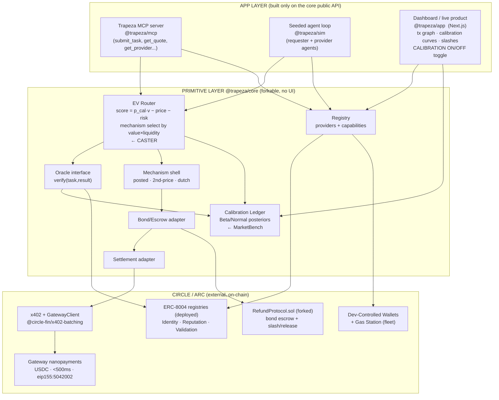

# Trapeza — A Calibration-Aware Broker for Agent-to-Agent Nanopayment Markets

> Codename: **Trapeza** (τράπεζα, "the banker's table"). The ancient *trapezitai* staked their own
> standing on the coins they vouched for — the exact primitive in Prior-Art #08. Name is **locked**.

Lepton Agents Hackathon (Canteen × Circle). Settlement on Arc, USDC, x402, Circle Gateway nanopayments.
Targets the overlap of **RFB-1 (autonomous paying agents)**, **RFB-2 (selling agent services)**, and
**RFB-3 (agent-to-agent networks)**, with the broker as the load-bearing piece.

Grounded against the local cache: spec at `context/hackathon/lepton-hackathon-spec.md`, papers under
`context/papers/`, reference repos under `context/samples/context-arc/samples/` (esp. `arc-nanopayments`,
`arc-escrow`), Circle/Arc docs/skills under `context/samples/context-arc/docs/`.

---

## 0. TL;DR — the thesis in three sentences

1. The rail is free (Arc + Circle + x402 give you sub-cent, sub-500ms USDC settlement out of the box), and the
  auction mechanism is a solved paper (AEX), so neither is where the value or the difficulty lives.
2. The real, unsolved bottleneck — proven empirically by **MarketBench** — is that **agents cannot price
  themselves**: they are miscalibrated on their own success probability and cost, so any market that trusts
   self-reported bids produces garbage allocations.
3. **Trapeza is a broker/clearinghouse that refuses to trust bids.** It prices providers from *realized
  outcomes* (empirical calibration), routes by calibrated expected value (CASTER-style), forces providers to
   post a **USDC bond that slashes on deterministically-verified underdelivery**, and settles per-task in
   sub-cent USDC on Arc. The intelligence is in the calibration + risk layer, not the auction format.

---

## 1. LOCKED DECISIONS


| #   | Decision                                | Locked choice                                                                                                                                                                                                                                                                                                                                                |
| --- | --------------------------------------- | ------------------------------------------------------------------------------------------------------------------------------------------------------------------------------------------------------------------------------------------------------------------------------------------------------------------------------------------------------------ |
| 1   | **Verification oracle / v1 capability** | **Structured data extraction**, output validated against a **JSON Schema + field-level ground-truth match** → deterministic, uncontestable pass/fail. Oracle is a **pluggable interface**; **capability #2 = code-fix validated by a failing-test oracle** (directly MarketBench/SWE-bench-comparable) plugs into the same interface.                        |
| 2   | **Traction**                            | **BOTH.** (a) Ship Trapeza as an **MCP server** so any Cursor/Claude/LangChain agent hires the market in one line; (b) run a **seeded closed loop** of requester+provider agents transacting continuously to generate real testnet-USDC volume and populate the calibration ledger from day one. Both must produce pointable volume in the Jun 15–29 window. |
| 3   | **Scope**                               | **Layered.** A clean, reusable, forkable **primitive** (`@trapeza/core`: registry, calibration ledger, EV router, mechanism shell, bonded-escrow adapter, settlement adapter, oracle interface) with an explicit public API, **and** a non-throwaway **app** (MCP server + seeded loop + dashboard) built strictly on that API.                              |
| 4   | **Name**                                | **Trapeza.**                                                                                                                                                                                                                                                                                                                                                 |


### 1.1 Why structured extraction is the right v1 oracle (justification)

The whole innovation story depends on **credible, uncontestable slashing** and on **enough task volume to make
market dynamics visible in 9 days**. Structured extraction wins on both versus a code-test oracle:

- **Determinism (slashing must be unarguable).** A schema-valid JSON whose fields match ground truth is a
binary, machine-checkable verdict — no LLM-judge subjectivity, so a bond slash is defensible on-chain.
- **Throughput (calibration needs data).** A Beta/Normal posterior per provider only becomes informative after
tens–hundreds of observations. Extraction tasks verify in milliseconds and can be auto-generated with ground
truth at scale, so the seeded loop populates the ledger fast and the "lemons collapse / quality re-emerge"
contrast actually has statistical teeth on day one.
- **Tunable quality (the demo needs differentiation).** Because we author the providers, we can ship a
deliberately flaky cheap provider (drops fields / wrong types X% of the time) and a reliable premium one,
making differentiation legible.
- **Research alignment.** MarketBench's domain is SWE-bench; our **capability #2 (code-fix + failing-test
oracle)** lands us in exactly that domain so our calibration ledger is directly comparable to the paper —
but we ship it *after* the primitive is proven on the cheaper extraction oracle, de-risking the sprint.

**Oracle contract (capability-agnostic):** `verify(task, result) -> { passed: bool, score: 0..100, evidenceURI }`.
Extraction oracle = schema + ground-truth diff. Code oracle = run hidden test suite. Both emit the same verdict,
which drives (a) escrow release/slash and (b) the ERC-8004 `validationResponse` + `giveFeedback` writes.

---

## 2. The contrarian position on auctions (unchanged, still load-bearing)

The brief assumes "auctions are a great way to solve this." **At nanopayment scale that is mostly wrong, and the
way it's wrong is the insight.**

- **VCG is a trap.** Its truthfulness guarantee holds only if bidders know their own valuations. MarketBench
shows agents do **not** know their own success probability or cost, so VCG buys nothing while costing compute
and inviting collusion. **Confidence: high.**
- **Combinatorial is doubly out:** NP-hard *and* needs bundle bids agents calibrate even worse. Multi-hop →
decompose and price per hop + Shapley split.
- **Mechanism overhead must be < trade value.** Running a heavy auction for a $0.001 task is incoherent — the
clearing compute exceeds the trade. AEX reasons about liquidity but never about *unit value*.
- **Mechanism is value-tiered, selected by `task_value × supply_liquidity`:**

  | Tier                           | Mechanism                                                         | Why                                             |
  | ------------------------------ | ----------------------------------------------------------------- | ----------------------------------------------- |
  | Cheap, commoditized (≤ ~$0.01) | **Posted price + reputation routing**                             | Auction cost > task value                       |
  | Mid-value, scarce supply       | **Sealed-bid second-price, score-adjusted by calibration + bond** | Cheap, less gameable, multi-attribute           |
  | Time-critical                  | **Dutch (descending) clock**                                      | Low-latency single-round price discovery        |
  | Bundle / multi-hop             | **Per-hop decomposition + Shapley split**                         | Avoids uncalibratable bundle bids / NP-hardness |

- **In every tier the bid is not the allocation signal.** The signal is
`score = calibrated_p_success × value − price − risk_premium(bond, variance)`, where `calibrated_p_success`
comes from Trapeza's realized-outcome ledger, **not** the self-report. The auction is a thin shell around the
calibration engine.

**Emergent-dynamics answers (and we instrument the system to observe each — serves the "emergent behavior"
judging criterion):** price-only broker → race-to-bottom + lemons collapse; calibration+bonds → quality
differentiation. Guilds = AEX "Agent Hubs" pooling a shared bond with Shapley split and *joint-and-several*
slashing (the natural cartel check). Brokers emerge because a broker that posts its own bond behind a match is
the only kind worth using.

---

## 3. Architecture — primitive layer vs. app layer




**Mapping research + Circle stack onto modules:**

- **MarketBench → `cal` (Calibration Ledger):** per-provider, per-capability realized success/cost/latency posteriors. The moat.
- **CASTER → `route` (EV Router):** dual-signal (task semantics + provider profile) cost-aware routing; easy→cheap, hard→premium.
- **AEX → `mech` + Shapley in guild payouts:** multi-attribute scoring, adaptive mechanism selection.
- **State Twins → (stretch) a `simulate()` call in `route`:** fork N off-chain scenarios, score, then settle the best.
- **x402 + Gateway → `pay` (Settlement adapter):** wraps `GatewayClient.pay()` (client) and `withGateway`/`BatchFacilitatorClient` (provider side).
- **RefundProtocol.sol + ERC-8004 Validation/Reputation → `esc` + `orc`:** bond escrow, slash/release, on-chain verdict + reputation.
- **Dev-Controlled Wallets + Gas Station → `reg`:** mint a sponsored wallet + ERC-8004 identity per agent.

---

## 4. The primitive's public API surface (`@trapeza/core`)

TypeScript-flavored; this is the contract the app and all future forks build against. Storage- and
chain-agnostic via injected adapters (`Store`, `SettlementAdapter`, `ChainAdapter`, `Oracle`).

### 4.1 Data models

```typescript
type Capability = string; // e.g. "extract.invoice.v1", "code.fix.v1"

interface ProviderProfile {
  id: string;
  agentId: bigint | null;            // ERC-8004 IdentityRegistry tokenId
  wallet: `0x${string}`;
  capabilities: Capability[];
  endpoint: string;                  // x402-protected URL
  priceSurface: PriceSurface;        // fn(load, complexity) -> USDC (RFB-2 dynamic pricing)
  bondBalanceUsdc: string;
  status: "active" | "suspended";
}

interface TaskSpec {
  id: string;
  capability: Capability;
  input: unknown;
  oracleSpec: unknown;               // JSON Schema + ground-truth ref (v1) | hidden test ref (v2)
  budgetUsdc: string;
  preference: { price: number; latency: number; quality: number; risk: number }; // weights, Σ=1
  deadlineMs: number;
}

interface Quote {                    // provider self-report — treated as PRIOR, never trusted directly
  providerId: string;
  priceUsdc: string;
  claimedSuccessProb: number;
  claimedLatencyMs: number;
  bondOfferedUsdc: string;
}

interface CalibrationRecord {        // MarketBench core object
  providerId: string; capability: Capability;
  successAlpha: number; successBeta: number;     // Beta posterior on p_success
  costMean: number; costVar: number;             // realized USDC cost
  latencyMean: number; latencyVar: number;
  nObservations: number; lastUpdate: number;
}

interface Bond {
  id: string; providerId: string; taskId: string; amountUsdc: string;
  state: "posted" | "released" | "slashed"; escrowTxHash?: string;
}

interface Outcome {
  taskId: string; providerId: string;
  passed: boolean; score: number;    // 0..100
  evidenceURI: string;
  realizedCostUsdc: string; realizedLatencyMs: number;
}

interface Allocation { taskId: string; providerId: string; mechanism: MechanismId; score: number; }
type MechanismId = "posted" | "second_price" | "dutch";
```

### 4.2 Interfaces / methods

```typescript
interface TrapezaCore {
  // discovery & registration
  registerProvider(p: Omit<ProviderProfile, "id" | "agentId">): Promise<ProviderProfile>; // mints ERC-8004 id
  listProviders(capability: Capability): Promise<ProviderProfile[]>;
  getCalibration(providerId: string, capability: Capability): Promise<CalibrationRecord>;

  // the core clearing loop
  submitTask(spec: TaskSpec): Promise<string>;                       // -> taskId
  collectQuotes(taskId: string): Promise<Quote[]>;                   // providers price dynamically
  route(taskId: string, quotes: Quote[]): Promise<Allocation>;       // calibrated EV + mechanism select
  postBond(allocation: Allocation): Promise<Bond>;                   // escrow on Arc (RefundProtocol)
  execute(allocation: Allocation): Promise<unknown>;                 // x402 pay provider endpoint
  settle(taskId: string, outcome: Outcome): Promise<{ action: "release" | "slash"; txHash: string }>;
  recordOutcome(outcome: Outcome): Promise<void>;                    // updates ledger + ERC-8004 reputation
}

// pluggable boundaries
interface Oracle { verify(spec: TaskSpec, result: unknown): Promise<Outcome>; }
interface SettlementAdapter { pay(endpoint: string, body?: unknown): Promise<{ amountUsdc: string; txHash: string }>; }
interface ChainAdapter {                                             // Arc / ERC-8004 / escrow
  mintIdentity(meta: object): Promise<bigint>;
  giveFeedback(agentId: bigint, score: number, tag: string, evidenceURI: string): Promise<string>;
  openEscrow(taskId: string, providerWallet: `0x${string}`, amountUsdc: string): Promise<string>;
  resolveEscrow(taskId: string, action: "release" | "slash"): Promise<string>;
}
interface Store { /* providers, calibration, bonds, outcomes, events */ }
```

`submitTask → collectQuotes → route → postBond → execute → verify(Oracle) → settle → recordOutcome` is the one
canonical pipeline; the app never re-implements it, it only calls it. The **CALIBRATION ON/OFF** demo toggle is a
single flag on `route()` (use calibrated `p_success` vs. trust the quote), which is what makes the lemons-collapse
contrast a one-line switch.

### 4.3 Module boundary (hard rule)

- `@trapeza/core` has **no UI, no MCP, no demo data, no chain SDK calls inline** — only the interfaces above plus
injected adapters. It is the forkable primitive.
- Everything Circle/Arc-specific lives in adapter implementations (`@trapeza/adapter-arc`,
`@trapeza/adapter-gateway`) so a fork can swap chains.
- The **app layer imports `@trapeza/core` and nothing below it.**

---

## 5. Tech stack (justified for a 9-day sprint, maximizing reuse of `arc-nanopayments`)

**Language/runtime: TypeScript + Node 22, monorepo (pnpm/npm workspaces).** The entire reference stack is TS;
matching it means we reuse `arc-nanopayments` and `arc-escrow` almost verbatim instead of reimplementing the
x402/Gateway plumbing in another language.

- **Settlement / x402:** `@circle-fin/x402-batching` — provider side `withGateway(handler, price, endpoint)` +
`BatchFacilitatorClient.verify/settle` (copy `arc-nanopayments/lib/x402.ts`); client side `GatewayClient.pay()`
(copy the loop in `arc-nanopayments/agent.mts`). Arc testnet network `eip155:5042002`, USDC
`0x3600000000000000000000000000000000000000`, Gateway Wallet `0x0077777d7EBA4688BDeF3E311b846F25870A19B9`,
RPC `https://rpc.testnet.arc.network`, explorer `testnet.arcscan.app`.
- **Chain access:** `viem` + `viem/chains arcTestnet` (already used by both reference repos).
- **Wallets (agent fleet):** `@circle-fin/developer-controlled-wallets` + **Gas Station** (sponsored gas ~0.006
USDC/tx) — strictly better than the demo's manual ephemeral-wallet funding when spinning up many agents for the
seeded loop. Mint wallet + ERC-8004 identity per agent in one bootstrap script.
- **Reputation/identity/validation:** **call the already-deployed ERC-8004 registries on Arc testnet**
(Identity `0x8004A818BFB912233c491871b3d84c89A494BD9e`, Reputation `0x8004B663056A597Dffe9eCcC1965A193B7388713`,
Validation `0x8004Cb1BF31DAf7788923b405b754f57acEB4272`) via `createContractExecutionTransaction`. **No
reputation contract to write.**
- **Bonded escrow contract:** fork `arc-escrow/contracts/escrow_smart_contract/RefundProtocol.sol` (deposit /
release / refund → release / slash). Deploy via Circle Smart Contract Platform (`developers.circle.com/contracts`)
or Foundry against Arc testnet. This is the only Solidity we touch.
- **Store:** Supabase/Postgres (both reference repos already wire Supabase; reuse the `payment_events` pattern,
add `providers`, `calibration`, `bonds`, `outcomes`, `market_events`).
- **MCP server:** standard MCP TS server exposing `submit_task`, `get_quote`, `get_providers`, `get_receipt` as
tools (ref `docs.arc.network/ai/mcp.md`, `developers.circle.com/ai/mcp.md`). One-line install → distribution.
- **Seeded loop:** Node script orchestrating N requester + M provider agents (LangChain optional, mock fallback
like `arc-nanopayments` when no `OPENAI_API_KEY`) hitting `submitTask` on a timer to manufacture continuous,
pointable volume.
- **Dashboard / app:** **Next.js 16 App Router + Tailwind 4 + shadcn/ui** (identical to `arc-nanopayments`), so we
extend its dashboard rather than start fresh. Adds: live tx graph (density, chain depth), per-provider
calibration curves, bond-slash feed, and the CALIBRATION ON/OFF toggle.

**Calibration math (start simple, defensible):** Beta(α,β) posterior on `p_success` per (provider, capability),
Normal-ish posteriors on cost/latency; cold-start prior seeded from the provider's self-report (MarketBench's
finding: priors are weak, so they wash out fast as observations arrive). No ML training needed for v1.

---

## 6. Phased build plan to Jun 29 (today = Jun 20, ~9 days), primitive-first

Each phase ends with a **pointable artifact**. Single **highest-risk item** flagged per phase.


| Phase                          | Day(s)                 | Goal                                                                                                                                              | Pointable artifact                                                 | Highest risk                                                                    |
| ------------------------------ | ---------------------- | ------------------------------------------------------------------------------------------------------------------------------------------------- | ------------------------------------------------------------------ | ------------------------------------------------------------------------------- |
| **P0 Spike**                   | Jun 20–21              | Monorepo; fork `arc-nanopayments` + `arc-escrow`; one real x402 nanopayment on Arc; register one ERC-8004 identity                                | A settled testnet-USDC tx + an identity NFT, both on arcscan       | **Circle/Gateway testnet creds + `x402-batching` actually settling** end-to-end |
| **P1 Core skeleton**           | Jun 22                 | `@trapeza/core` data models + `Store` + registry + calibration ledger + settlement adapter; `submitTask` happy path with 1 provider, posted-price | `submitTask()` settles on Arc and writes a calibration record      | A storage schema clean enough to survive P2–P3 unchanged                        |
| **P2 Router + mechanism**      | Jun 23                 | EV router (calibrated scoring) + mechanism shell (posted + sealed second-price); 3 providers w/ different price/quality                           | Broker picks by calibrated EV over 3 providers; routing log        | Cold-start calibration producing sane (not degenerate) routing                  |
| **P3 Bond + slash + oracle**   | Jun 24                 | v1 extraction Oracle; fork `RefundProtocol.sol`; bond escrow + slash/release; ERC-8004 `giveFeedback`/`validationResponse`                        | A failed task **slashes a bond on-chain** + drops reputation       | Escrow contract fork + slash path deploying/working on Arc                      |
| **P4 App pt1: MCP + loop**     | Jun 25                 | MCP server (`submit_task` etc.); seeded requester/provider loop generating continuous volume                                                      | Cursor calls the MCP tool; volume counter climbing in testnet USDC | MCP wiring + sustained loop stability (wallet nonce/funding)                    |
| **P5 App pt2: dashboard**      | Jun 26                 | Dashboard: tx graph, calibration curves, slash feed, **CALIBRATION ON/OFF toggle**                                                                | The full demo visual incl. lemons-collapse vs quality-re-emerge    | Making the emergent dynamics legible in the time available                      |
| **P6 Harden + external usage** | Jun 27                 | Publish MCP; get a few real external agents/users to transact; guild/co-op + State-Twins `simulate()` as stretch                                  | At least some **non-self** transactions; stretch features if green | Real external traction inside the window                                        |
| **P7 Record + submit**         | Jun 28 (+29 AM buffer) | <3-min video; README as forkable primitive (API §4); submit form                                                                                  | Submission + live link                                             | Time; keep P6 stretch from eating the buffer                                    |


De-risking principle: the on-chain-hard items (P0 settlement, P3 slash) are pulled **early**; UI/traction polish
is late and compressible.

---

## 7. Demo script (<3 min, async judging on repo + video)

1. **(0:00–0:25) Problem.** One line: "agents can't price themselves" (MarketBench). A Cursor agent calls the
  Trapeza MCP tool with a $0.01 budget for an extraction task.
2. **(0:25–1:00) Calibrated routing.** Broker shows 3 providers; picks **not the cheapest** but the best
  calibrated EV; explains the score; settles **<500ms on Arc** (show the arcscan tx).
3. **(1:00–1:40) Skin in the game.** The cheap provider underdelivers (bad schema) → **bond slashes live on
  Arc**, requester is made whole, ERC-8004 reputation drops, the provider's calibration curve bends down.
4. **(1:40–2:30) THE money shot.** Toggle **CALIBRATION OFF** → dashboard shows a race-to-the-bottom and a
  **lemons collapse** (reliable providers starve). Toggle **ON** → quality **re-emerges**. Same market, one flag.
5. **(2:30–3:00) Traction + primitive.** Dashboard totals: cumulative testnet-USDC volume, tx-graph density,
  settlement latency. Close on "forkable primitive + one-line MCP install."

---

## 8. Source map (so we don't re-derive)

- **AEX** (`context/papers/agent-exchange-aex.md`): USP/ASP/Hub/DMP, multi-attribute GSP, Shapley, adaptive
mechanism selection. *Simulation only; assumes honest/calibrated/static agents — the gap we exploit.*
- **MarketBench** (`context/papers/marketbench.md`): agents miscalibrated on success prob + cost; auctions from
self-reports diverge from full-info allocation. *Our core justification + the calibration ledger.*
- **CASTER** (`context/papers/caster.md`): dual-signal cost-aware router; −72% cost at equal success. *EV router.*
- **State Twins** (`context/papers/state-twins.md`): off-chain fork-and-evaluate, sub-second. *Stretch
`simulate()` before settle.*
- **Reference repos** (`context/samples/context-arc/samples/`): `arc-nanopayments` (x402 + Gateway + Next.js
dashboard — copy `lib/x402.ts`, `agent.mts`), `arc-escrow` (`RefundProtocol.sol` + AI work validation).
- **Docs/skills** (`context/samples/context-arc/docs/`): `circlefin-skills/use-gateway.md`,
`docs.arc.network/arc/tutorials/register-your-first-ai-agent.md` (ERC-8004 addresses + ABI),
`developers.circle.com/ai/mcp.md`, `developers.circle.com/contracts/`*.
- **Hackathon** (`context/hackathon/lepton-hackathon-spec.md`): $50k, Jun 15–29, async judging, weights
30 agentic / 30 traction / 20 Circle / 20 innovation; "best projects break the rules"; long-run intent rewarded.

```

```

