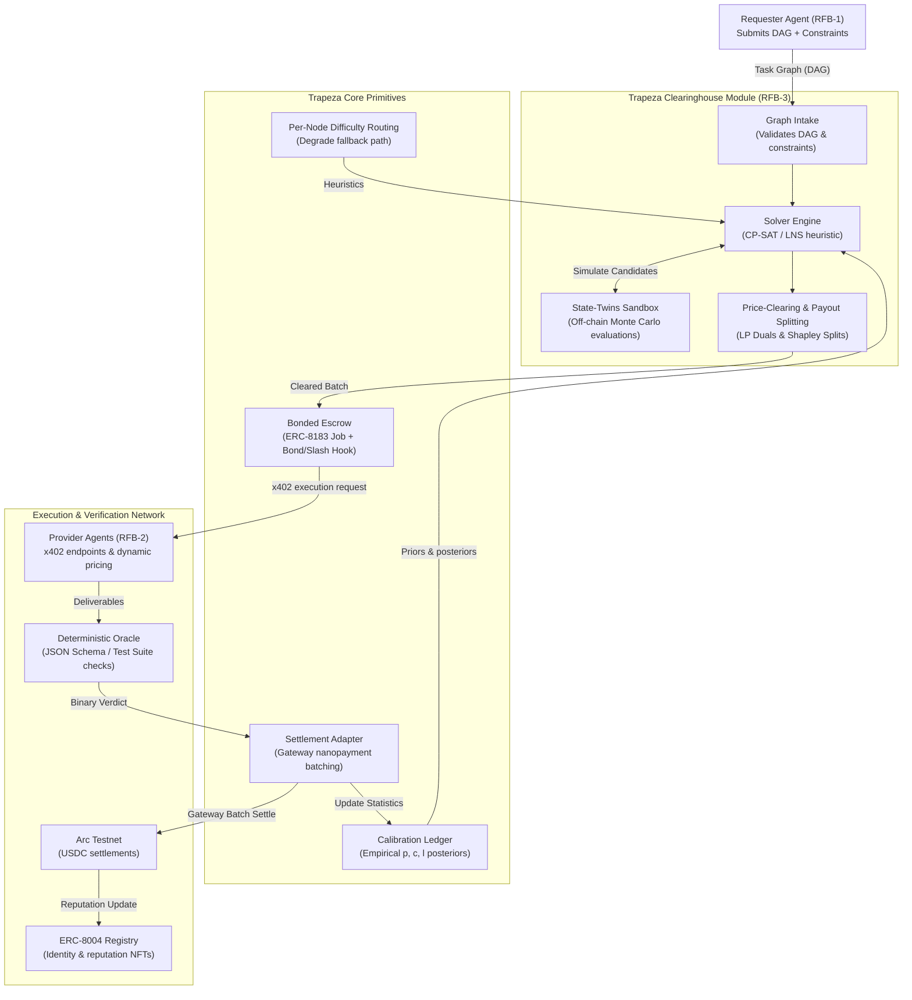
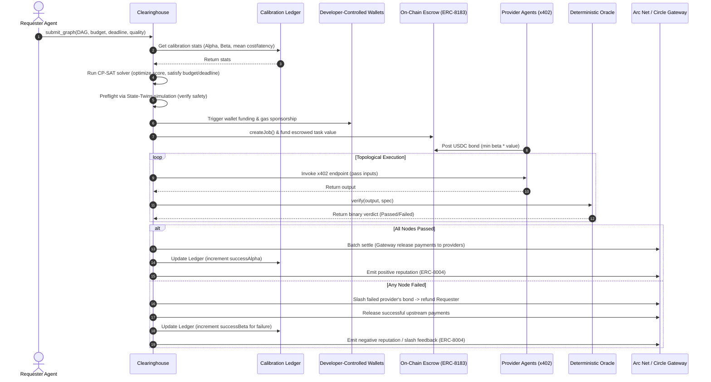
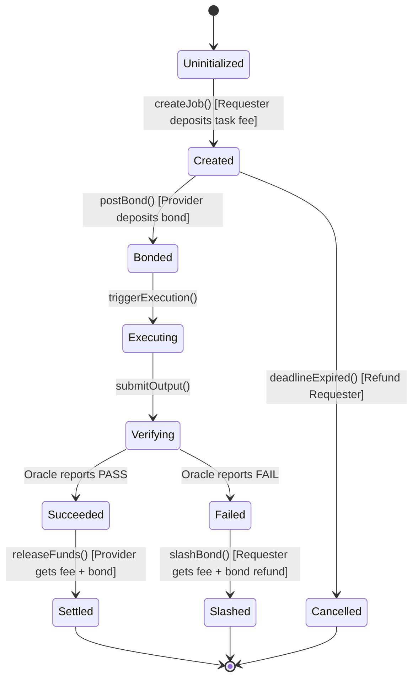
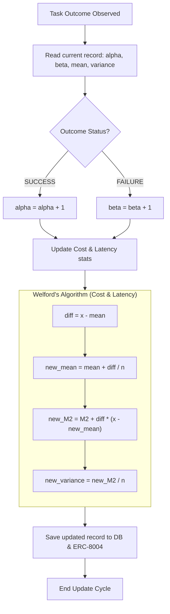

# Trapeza Project Diagrams & Algorithmic Specifications

This document consolidates the technical architecture diagrams in Mermaid format and details the core algorithms governing the **Trapeza Clearinghouse** and its underlying calibration-aware pairwise broker primitives.

---

## 1. Architectural Diagrams

### 1.1 Global System Architecture & Boundaries
The diagram below illustrates the monorepo layout, module boundaries, and separation between the stateless primitive layer (`@trapeza/core`), the application layer (MCP/simulation/dashboard), and external on-chain services on Arc/Circle.

```mermaid
flowchart TB
    %% Nodes
    subgraph AppLayer ["APP LAYER (@trapeza/mcp, @trapeza/sim, @trapeza/app)"]
        mcp["Trapeza MCP Server\n(submit_task, get_quote, submit_graph)"]
        sim["Seeded Agent Loop\n(Continuous transaction volume)"]
        dash["Next.js Dashboard\n(Real-time charts & calibration toggle)"]
    end

    subgraph CoreLayer ["PRIMITIVE LAYER (@trapeza/core - stateless, forkable)"]
        reg["Registry\n(Providers & Capabilities)"]
        cal["Calibration Ledger\n(Beta/Normal posteriors)"]
        route["EV Router\n(CASTER Expected Value scoring)"]
        mech["Mechanism Shell\n(Posted price · 2nd-Price · Dutch)"]
        esc["Bond/Escrow Adapter\n(ERC-8183 abstraction)"]
        pay["Settlement Adapter\n(Gateway nanopayments wrapper)"]
        orc["Oracle Interface\n(verify)"]
    end

    subgraph External ["ON-CHAIN / CIRCLE / ARC NETWORK"]
        x402["x402 / GatewayClient\n(Pay-per-call client verification)"]
        gw["Circle Gateway\n(USDC nanopayments, <500ms finality)"]
        wal["Developer-Controlled Wallets\n(Gas Station sponsorship)"]
        refund["RefundProtocol.sol\n(Escrow and slash handler)"]
        erc8004["ERC-8004 Registries\n(On-chain identity & reputation)"]
    end

    %% Flows
    mcp --> reg & route
    sim --> reg & route
    dash --> cal & reg
    
    route --> cal
    route --> mech
    mech --> esc
    esc --> refund
    esc --> pay
    pay --> x402 --> gw
    reg --> wal & erc8004
    orc --> erc8004 & cal
    route --> orc
```



---

### 1.2 Graph Clearinghouse Module Architecture
The clearinghouse layer sits on top of the pairwise primitives, taking a multi-agent task graph (DAG) and solving a global constrained optimization problem.



---

### 1.3 End-to-End Graph Execution & Settlement Timeline
The sequence diagram below details the operational sequence from graph submission through optimization, execution, validation, and batch settlement.



---

### 1.4 Escrow and Slashing State Machine (ERC-8183 Job + Hook)
Transitions for individual node payments, wrapping RefundProtocol.sol rules on-chain.



---

## 2. Core Algorithms & Mathematical Specifications

### 2.1 Bayesian Calibration Updates
Instead of trusting self-reported provider bids, Trapeza dynamically computes posteriors for success probability, cost, and latency.

#### Success Probability ($p_{\text{success}}$)
Represented as a conjugate Beta-Binomial distribution:
$$p \sim \text{Beta}(\alpha, \beta)$$

*   **Priors:** Uniform **Beta(1, 1)** cold start — intentionally **not** seeded from provider claims $p_{\text{claim}}$ (bids are priors for RFQ only; the allocation signal comes from realized outcomes per `packages/core/src/calibration.ts`).
*   **Posterior Update:** For a task outcome $y \in \{0, 1\}$ (where $1 = \text{success}$, $0 = \text{failure}$):
    $$\alpha \leftarrow \alpha + y$$
    $$\beta \leftarrow \beta + (1 - y)$$
*   **Expected Success Probability ($\mathbb{E}[p]$):**
    $$\mathbb{E}[p] = \frac{\alpha}{\alpha + \beta}$$
*   **Uncertainty Variance ($\text{Var}(p)$):**
    $$\text{Var}(p) = \frac{\alpha \beta}{(\alpha + \beta)^2(\alpha + \beta + 1)}$$

#### Latency ($l$) and Cost ($c$)
Updated online using Welford's algorithm to ensure numerical stability when tracking running mean and variance:
For the $n$-th observation $x$:
$$\Delta = x - \mu_{n-1}$$
$$\mu_n = \mu_{n-1} + \frac{\Delta}{n}$$
$$M_{2,n} = M_{2,n-1} + \Delta \cdot (x - \mu_n)$$
$$\sigma^2_n = \frac{M_{2,n}}{n}$$



---

### 2.2 Expected Value Routing Score (CASTER-style)
For a single task, provider selection optimizes the expected net utility.

$$\text{Score}(p) = \mathbb{E}[p_{\text{success}}] \cdot V - \mathbb{E}[c_{\text{cost}}] - \rho \cdot \text{Risk Premium}$$

Where:
*   $V$ is the marginal task value.
*   $\rho \ge 0$ is the requester's risk aversion coefficient.
*   $\text{Risk Premium}$ penalizes uncertainty in the provider's capability and the unhedged exposure:
    $$\text{Risk Premium} = \text{Var}(p_{\text{success}}) \cdot B_{\text{bond}} + (1 - \mathbb{E}[p_{\text{success}}]) \cdot \max(0, V - B_{\text{bond}})$$

---

### 2.3 Graph Clearing Optimization (MILP/CP-SAT)
For a task graph $G = (V, E)$, the clearinghouse solves the following Mixed-Integer Linear Program.

#### Constants & Parameters
*   $v_n$: Marginal value of node $n$.
*   $\hat{p}_{n,p}, \hat{c}_{n,p}, \hat{\lambda}_{n,p}$: Calibrated success probability, cost, and latency parameters for provider $p$ on node $n$.
*   $B_{\text{total}}, T_{\text{deadline}}, q_{\text{min}}$: Global budget, makespan deadline, and minimum end-to-end success chance.

#### Variables
*   $x_{n, p} \in \{0, 1\}$: Binary assignment variable ($1$ if provider $p$ is assigned to node $n$).
*   $s_n \ge 0$: Scheduled start time for node $n$.

#### Mathematical Formulation
$$\text{maximize} \quad \sum_{n \in V} \sum_{p \in P} x_{n, p} \left( \hat{p}_{n,p} \cdot v_n - \hat{c}_{n,p} - \rho \cdot \text{risk}_{n,p} \right)$$

$$\text{subject to:}$$
1.  **Assignment Constraint:**
    $$\sum_{p \in P} x_{n, p} = 1 \quad \forall n \in V$$
2.  **Precedence Constraint:**
    $$s_n \ge s_m + \sum_{p \in P} x_{m, p} \cdot \hat{\lambda}_{m, p} \quad \forall (m, n) \in E$$
3.  **Global Deadline Constraint:**
    $$s_n + \sum_{p \in P} x_{n, p} \cdot \hat{\lambda}_{n, p} \le T_{\text{deadline}} \quad \forall n \in \text{Sinks}(G)$$
4.  **Global Budget Constraint:**
    $$\sum_{n \in V} \sum_{p \in P} x_{n, p} \cdot \hat{c}_{n, p} \le B_{\text{total}}$$
5.  **Global Reliability (Log-Linearized Chance Constraint):**
    $$\sum_{n \in V} \sum_{p \in P} x_{n, p} \cdot \log(\hat{p}_{n, p}) \ge \log(q_{\text{min}})$$
6.  **Concurrency / Resource Capacity:**
    $$\sum_{n \in V_t} x_{n, p} \cdot \text{bond}_n \le B_p \quad \forall p \in P, \forall t$$
    *(where $V_t$ is the set of active nodes executing at time $t$ and $B_p$ is provider $p$'s locked bond capacity)*

---

### 2.4 State Twins Monte Carlo Simulation
Before submitting the cleared batch on-chain, the clearinghouse runs Monte Carlo iterations on an in-memory settlement twin to evaluate risk metrics.

```
Algorithm: State-Twins Preflight Evaluation
Input: Candidate assignment X = {x_{n,p}}, Iterations N
Output: E[Utility], P(Failure), P(Budget Overrun), P(Deadline Breach)

Initialize TwinState (Clone balances, escrows, and bonds)

For k = 1 to N:
    Clone ForkTwin = TwinState
    Time_Elapsed = 0
    Total_Cost = 0
    Workflow_Failed = False
    
    Sort nodes in topological order
    For each node n in DAG:
        Retrieve assigned provider p = a(n)
        Draw success y_n ~ Bernoulli(p_hat_{n,p})
        Draw latency l_n ~ Normal(l_mean, l_var)
        Draw cost c_n ~ Normal(c_mean, c_var)
        
        Total_Cost += c_n
        Time_Elapsed += l_n
        
        If y_n == 0 (Failure):
            Trigger ForkTwin.slash(p, n.bond)
            Trigger ForkTwin.refund(n.value)
            Workflow_Failed = True
            Halt downstream execution (poisoned inputs)
            Break
        Else:
            Trigger ForkTwin.release(p, n.value)
            
    Utility_k = ComputeNetUtility(ForkTwin, Workflow_Failed)
    U_accum += Utility_k
    If Workflow_Failed: Fail_count++
    If Total_Cost > B_total: Overrun_count++
    If Time_Elapsed > T_deadline: Breach_count++

Return:
    E[Utility] = U_accum / N
    P(Failure) = Fail_count / N
    P(Budget Overrun) = Overrun_count / N
    P(Deadline Breach) = Breach_count / N
```

---

### 2.5 Shapley Value Split for Coalitions
When a group of providers $S \subseteq P$ forms a coalition to execute a sub-graph, the clearinghouse computes payout splits using the Shapley value:

$$\phi_i(v) = \sum_{R \subseteq S \setminus \{i\}} \frac{|R|! (|S| - |R| - 1)!}{|S|!} \left( v(R \cup \{i\}) - v(R) \right)$$

Where:
*   $v(R)$ is the calibrated expected utility of the sub-graph executed exclusively by coalition subset $R$.
*   $v(R)$ is computed off-chain on the State Twin by zeroing out assignments ($x_{n, p} = 0$) for any provider $p \notin R$.
