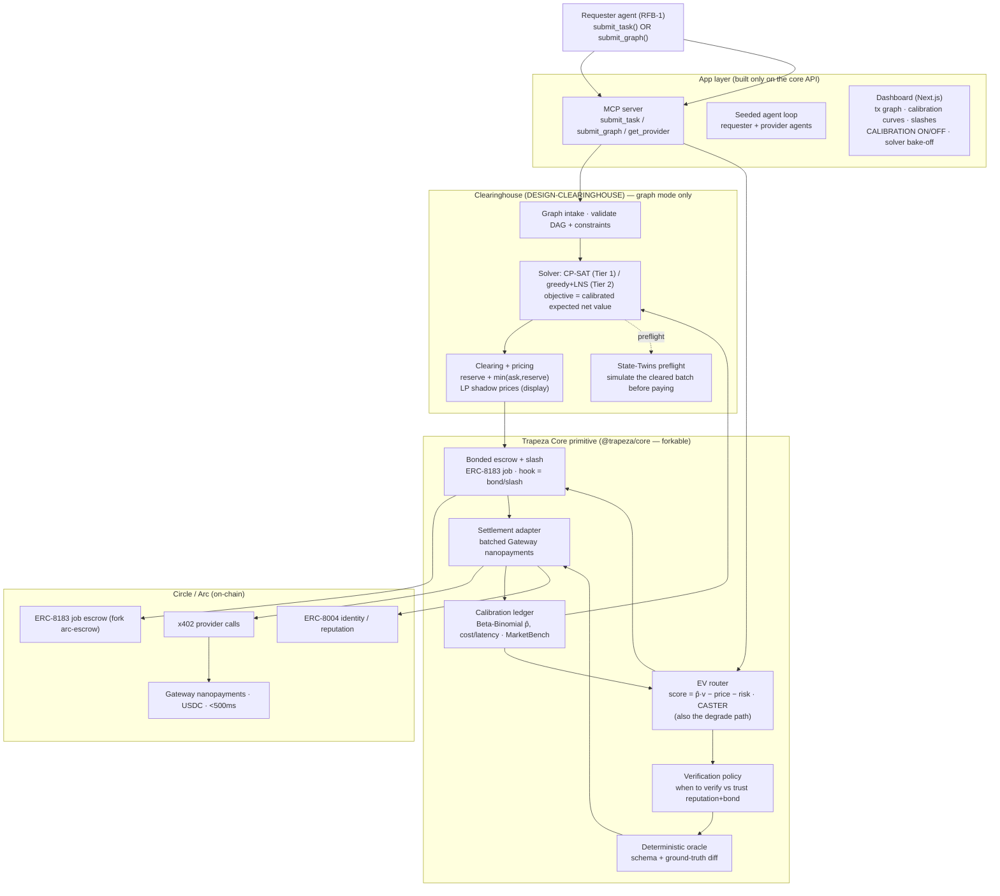

# Trapeza — Source of Truth

> **This is the canonical document.** It consolidates the thesis, decisions, research, and build plan,
> and it is the authoritative reference where it disagrees with the older docs. The deep detail still lives
> in the companion docs; this doc references them by section rather than duplicating them:
>
> - **[DESIGN.md](DESIGN.md)** — the core primitive (`@trapeza/core`): calibration-aware, bond-backed,
> per-task pairwise broker. API surface, data models, module boundary.
> - **[DESIGN-CLEARINGHOUSE.md](DESIGN-CLEARINGHOUSE.md)** — the graph-level clearinghouse layer that sits on
> the same primitive (DAG intake, constrained solve, batch settlement).
> - **[IMPLEMENTATION-LOG.md](IMPLEMENTATION-LOG.md)** — chronological build record and current status.
>
> **Supersedes (deltas this doc locks in over the companions):**
>
> 1. **Deadline is Jul 6** (extended from Jun 29). Sprint plan in §8 is the live one; DESIGN.md §6 dates are stale.
> 2. **UCP (uniform clearing price) is display-only for v1**, not the settlement rule (§4). Settlement stays
>   discriminatory `min(ask, reserve)` per hop. Quality-adjusted UCP is post-hackathon.
> 3. **The off-chain evaluation substrate is scoped down** (§6 + §7): the solver does **not** attempt general
>   open-ended quality evaluation. Quality is decided by a **deterministic verification oracle**, governed by an
>    explicit **verification policy**, backed by **reputation + bond**. State Twins is scoped to **settlement
>    preflight + bounded scenario scoring**, not an NP-hard general evaluator.
> 4. **CoW Protocol's off-chain-solver / on-chain-batch pattern is adopted** as prior-art validation; a cheap
>   **2-solver bake-off** is added to the demo (§4, §10). Cycles netting is post-hackathon (§9).

---

## 1. Why this exists — the problem, stated precisely

The motivating reality: **an agent that delegates badly burns budget and wall-clock and still misses the
result.** Picking the wrong sub-agent, paying a confident-but-unreliable provider, or spending the whole
budget on easy steps and starving the hard one — these are the daily failure modes of multi-agent work. The
discipline of avoiding them is what people now call *harness engineering*, *context engineering*, and
*recursive self-improvement*: getting the most result per token and per second.

**Trapeza turns that discipline into a market.** Today "use your tokens well" is a craft practiced by hand.
Trapeza makes it a price: a clearinghouse that routes each unit of work to whoever **actually converts
budget into verified results most efficiently** — measured from realized outcomes, not from what the provider
claims — and that makes a provider **lose money (a slashed bond)** when it wastes the requester's budget on a
failure. That is the economic reason agent-to-agent markets will matter: not "agents can pay each other"
(the rail is free on Arc), but "agents need a referee that prices competence so delegation stops being a
gamble."

**The bottleneck the market must overcome is calibration.** *MarketBench* (arXiv 2604.23897) proves
empirically that agents are miscalibrated about their own success probability and cost. So any market that
trusts self-reported bids produces garbage allocations. **Trapeza refuses to trust bids.** It prices
providers from realized outcomes (a Bayesian calibration ledger), routes by calibrated expected value, forces
a USDC bond that slashes on deterministically-verified underdelivery, and settles per-task in sub-cent USDC on
Arc. The intelligence is in the *calibration + risk + clearing* layer; the auction format is a thin shell.

This sits across **RFB-1** (autonomous paying agents), **RFB-2** (selling agent services), and **RFB-3**
(agent-to-agent networks), with RFB-3 as the spine. Judging weights: **30% agentic sophistication / 30%
traction / 20% Circle tooling / 20% innovation** (`context/hackathon/lepton-hackathon-spec.md`).

---

## 2. What Trapeza is — two layers, one primitive


| Layer                                    | What it does                                                                                                                                                                                                                                                  | Canonical doc                                      |
| ---------------------------------------- | ------------------------------------------------------------------------------------------------------------------------------------------------------------------------------------------------------------------------------------------------------------- | -------------------------------------------------- |
| **Trapeza Core (the primitive)**         | Per-task pairwise broker: register providers, price them from the calibration ledger, route one task by calibrated EV, post + slash a bond, settle in USDC. Forkable, chain-agnostic via injected adapters. **Built and green against mocks (13/13 tests).**  | [DESIGN.md](DESIGN.md)                             |
| **Trapeza Clearinghouse (the headline)** | Accepts a whole **task DAG** + global budget/deadline/quality/risk, solves one jointly-optimal allocation across all nodes, prices via reserve + shadow prices, settles the whole clearing as one batch. The per-task broker is its single-node special case. | [DESIGN-CLEARINGHOUSE.md](DESIGN-CLEARINGHOUSE.md) |


The clearinghouse is a strict generalization of the broker, not a competitor, which is why it layers on the
same primitive without contradiction (DESIGN-CLEARINGHOUSE §1, §3). The fallback contract is therefore free:
**if the solver slips, strip the clearinghouse and ship the broker** — same primitive, same Circle stack.

### 2.1 Locked decisions (unchanged from DESIGN.md §1, restated as canonical)

1. **v1 capability + oracle:** structured data extraction, validated by **JSON Schema + field-level
  ground-truth match** → deterministic, uncontestable pass/fail. Oracle is a pluggable interface;
   capability #2 = code-fix + failing-test oracle (MarketBench/SWE-bench-comparable) plugs into the same interface.
2. **Traction = BOTH:** an **MCP server** (any Cursor/Claude/LangChain agent hires the market in one line) **and**
  a **seeded closed loop** of requester/provider agents generating continuous testnet-USDC volume + ledger data.
3. **Scope = layered:** forkable `@trapeza/core` primitive + a non-throwaway app (MCP + loop + dashboard) on top.
4. **Name = Trapeza** (the *trapezitai* banker who staked his own standing — Prior-Art #08).

---

## 3. Architecture (consolidated)




Module ↔ research ↔ Circle mappings are in DESIGN.md §3 and DESIGN-CLEARINGHOUSE §8; not repeated here.

---

## 4. Mechanism design — pricing & clearing (with the new research folded in)

The contrarian auction stance is unchanged and load-bearing (DESIGN.md §2): **VCG is a trap** (truthfulness
needs valuations agents don't have), **combinatorial auctions are out** (NP-hard + uncalibratable bundle bids),
**mechanism overhead must be < trade value**. The mechanism is **value-tiered**, and **in every tier the bid is
not the allocation signal** — `score = calibrated_p_success × value − price − risk_premium` is.

### 4.1 How prices clear (canonical, resolves DESIGN-CLEARINGHOUSE §4.2)

Three notions of price, with the v1 vs post-hackathon line now drawn explicitly:

1. **Settlement price — discriminatory, per hop (v1).** Each node settles at `min(ask, reserve)` adjusted by
  the realized outcome (full release on verified success; slash redirect on failure). This keeps surplus with
   the requester — which is exactly the budget the demo is built to conserve.
2. **Shadow prices — display only (v1).** Solve the LP relaxation; the **dual variables** are the economically
  meaningful clearing prices (dual on budget = marginal value of a USDC; dual on a provider-capacity constraint
   = congestion premium of a scarce provider; dual on deadline = value of a second). We **show** these as "the
   clearing price / why the bottleneck node clears at a premium," but we do **not** settle on them.
3. **Unified Clearing Price (UCP) — post-hackathon.** A single uniform price per capability-class is the textbook
  electricity/treasury mechanism, but it assumes a **homogeneous good**, which fights Trapeza's entire thesis
   (a node done by a 0.95-calibrated provider is not the same good as the same node by a 0.6 one). The honest fix
   is **quality-adjusted UCP**: define the unit as *one unit of calibrated expected quality* (`p̂`), clear a
   single price per q-unit within a capability-class, pay a provider `clearing_price × p̂`. This only earns its
   keep with **thick per-capability competition** (≥ ~3 real competitors), which exists only under windowed
   multi-graph clearing. **Verdict: display the shadow-price story now; adopt quality-adjusted UCP only if/when
   the market is thick.** Until then, uniform pricing would just pay inframarginal rent and leak the requester's
   budget. (Research: ISO-NE / Cramton / NYISO-Tierney; see §12.)

### 4.2 Multi-hop payment splitting (unchanged)

Per-hop by default; **Shapley split** (off-chain, sampled for >~8 members) for synergistic guild/coalition
surplus, with joint-and-several bond slashing as the cartel check (DESIGN-CLEARINGHOUSE §4.3).

### 4.3 CoW Protocol — what we adopt and what we don't

CoW Swap is independent confirmation that the right shape is **off-chain solve → on-chain batch settle**, which
*is already* our architecture. Concretely:

- **Adopt now (validation + framing):** off-chain solver, single batched on-chain settlement, surplus-maximization
objective. Cite CoW as prior art in the repo.
- **Adopt now (cheap demo win):** a **2-solver bake-off** — run CP-SAT (Tier 1) and greedy+LNS (Tier 2) on the same
DAG, score both, show "solver A vs solver B, best clearing wins." Near-zero extra code since we build both anyway,
and it makes the "solver competition" story concrete.
- **Skip for v1:** real bonded third-party solver competition + token rewards (overkill); UDCP/MEV protection (no  
public mempool, non-problem); Coincidence-of-Wants matching (our single-job flows are one-directional — that only appears with cross-requester mutual obligations, i.e. the Cycles regime in §9).

---

## 5. Formal problem definition — elaborated, every symbol in plain English

This is the optimization the **clearinghouse** solves once per submitted graph. (The per-task broker is the
one-node case: no precedence, no shared budget, the objective collapses to a single ranking.)

### 5.1 The inputs

**The task graph `G = (V, E)`** is the workflow, drawn as a DAG (arrows never form a loop). Plain reading:

- `V` = the set of **nodes**, one per subtask (e.g. "extract invoice fields," "fact-check the draft").
- `E` = the set of **edges**; an edge `(m, n)` means *node `n` needs node `m`'s output first* — both an ordering
("do `m` before `n`") and a data dependency ("`n` eats what `m` produced").

**Each node `n` carries `⟨cap_n, v_n, q_n, λ_n^max, ρ_n⟩`:**

- `cap_n` — the **capability** the node needs (e.g. `extract.invoice.v1`). A provider must possess it to be eligible.
- `v_n` — the **value** this node contributes to the final deliverable, in USDC-equivalent terms. "How much is
getting this step right worth to the requester?" The bottleneck node has a high `v_n`.
- `q_n` — the **quality floor**: the minimum success probability the requester will accept for this node.
- `λ_n^max` — the **latency cap**: the slowest this node may be and still be useful.
- `ρ_n` — the **required bond ratio**: how much skin-in-the-game (bond as a fraction of node value) a provider must post.

**The provider set `P`.** Each provider `p` has:

- `caps_p` — the capabilities it can do.
- `p̂_{n,p}` — the **calibrated success probability** that `p` succeeds at node `n`. The hat (`^`) means *estimated
from realized outcomes* (the Beta-Binomial ledger), **not** self-reported. This is the whole game: the number the
market trusts is earned, not claimed. It comes with **uncertainty** (a Beta posterior, wide when data is thin).
- `ĉ_{n,p}` — the **calibrated cost** `p` will charge/consume on node `n` (again estimated, with variance).
- `λ̂_{n,p}` — the calibrated **latency** estimate.
- `k_p` — **concurrency cap**: how many nodes `p` can run at once.
- `B_p` — **bond capacity**: how much USDC `p` can lock across all its assigned nodes at once.

### 5.2 The decision variables (what the solver chooses)

- `x_{n,p} ∈ {0,1}` — **the assignment**: `1` if provider `p` is chosen to execute node `n`, else `0`. This is the
core output: a complete who-does-what.
- `s_n ≥ 0` — the **start time** of node `n`, used to respect ordering and the deadline.

### 5.3 The objective (what "best" means)

```
maximize   Σ_{n∈V} Σ_{p∈P}  x_{n,p} · [ p̂_{n,p} · v_n  −  ĉ_{n,p}  −  ρ · risk_{n,p} ]   −   fee
```

Read it term by term, for each node `n` and the provider `p` actually chosen for it (`x_{n,p}=1`):

- `p̂_{n,p} · v_n` — **expected value delivered**: the chance it works times what working is worth. This is the
benefit.
- `− ĉ_{n,p}` — minus the **cost** of hiring `p` for it.
- `− ρ · risk_{n,p}` — minus a **risk penalty**. `risk_{n,p}` ≈ bond-at-risk × failure variance (how much money is
exposed and how uncertain the outcome is); `ρ` is the requester's **risk aversion** (a dial: 0 = risk-neutral,
higher = pay more to avoid variance).
- `− fee` — the broker's cut.

So the objective is **calibrated expected net value**: pick the assignment that maximizes (expected results −
cost − risk). It is built directly on AEX's `max Σ[p_success·v − c]` but with **calibrated `p̂` instead of
self-reported** and with graph/constraint terms added.

**One honest subtlety (the multiplicative coupling).** The true probability the *final* deliverable is produced is  
the product of the success probabilities along each dependency path: `Π_{n on path} p̂`. Products are non-linear and  
break clean solvers. The pragmatic v1 trick: keep the **additive per-node objective above**, and enforce the
multiplicative reliability requirement as a **log-linearized chance constraint** — because `log(Π p̂) = Σ log p̂`,
turning a product into a sum the solver can handle (see the quality-floor row below). The exact multiplicative
objective is only used inside the Tier-2 search (§8), scored on the twin.

### 5.3.1 The risk term, unpacked — beyond failure variance

`risk_{n,p}` in §5.3 is a placeholder for a weighted sum of risk axes, not just bond-at-risk ×
variance. The axes: (1) **failure variance** (v1); (2) **data sensitivity/confidentiality**
(signals, transactions, PII) — also a hard eligibility gate at high sensitivity; (3) **time/deadline
risk** — convex tardiness near the deadline on top of the hard makespan; (4) **verifiability** —
low deterministic-checkability raises residual risk (couples to the §6 verification policy);
(5) **provider correlation/systemic** — anti-concentration; (6) **DAG cascade criticality** — scale
a node's risk by the downstream value it poisons on failure; (7) **counterparty/settlement** —
handled as hard feasibility by the State-Twins preflight (§7). v1 activates (1), (3), (7); the rest
are specified for forward-compatibility of the objective/constraints.

### 5.4 The constraints (the rules a valid clearing must obey)


| Constraint              | Formal form                                                            | Plain English                                                                                                                        |
| ----------------------- | ---------------------------------------------------------------------- | ------------------------------------------------------------------------------------------------------------------------------------ |
| **Capability match**    | `x_{n,p}=0` unless `cap_n ∈ caps_p`                                    | You can't assign a node to a provider that can't do it. (Applied first — it prunes the search.)                                      |
| **Assignment**          | `Σ_p x_{n,p} = 1` ∀ `n`                                                | Every node gets exactly one provider.                                                                                                |
| **Budget cap**          | `Σ_n Σ_p x_{n,p} ĉ_{n,p} + Σ bonds ≤ B_total`                          | Total expected spend (plus bonds locked) can't exceed the requester's budget.                                                        |
| **Deadline / latency**  | `s_n + x_{n,p} λ̂_{n,p} ≤ s_succ`; `makespan ≤ T_deadline`             | A node finishes before its successors start; the whole job fits the deadline. Latency adds along the **longest path**, not per node. |
| **Quality floor**       | per-node `Σ_p x_{n,p} p̂_{n,p} ≥ q_n`; global `Σ_n log p̂ ≥ log q_min` | Each node clears its own quality bar; the whole-job reliability (the log-sum = the product) clears the global bar.                   |
| **Risk / bond**         | assigned `p` needs `B_p ≥ ρ_n·v_n`; `Σ_n x_{n,p} bond_n ≤ B_p`         | A provider must be able to post the required bond per node and not over-commit its bond capacity.                                    |
| **Dependency ordering** | `s_n ≥ s_m + dur_m` ∀ `(m,n)∈E`                                        | Respect the arrows: a node can't start before its inputs are done.                                                                   |
| **Concurrency**         | at any time, `#{nodes p runs} ≤ k_p`                                   | A provider can't run more nodes at once than its capacity.                                                                           |


Mathematically this is a **Resource-Constrained Project Scheduling Problem (RCPSP) + generalized assignment +
a chance constraint.** NP-hard in general; trivial at demo scale (§8 explains why we never need the general case).

### 5.5 Why this beats per-task routing (the one-line intuition)

A greedy per-node router spends money in topological order and can blow the budget on early easy nodes, leaving
nothing for the **bottleneck** that decides success. The global solve *sees* the whole graph, so it deliberately
buys *cheap-but-adequate* on easy nodes to *afford premium on the bottleneck*. That tradeoff is invisible to any
independent per-node decision (DESIGN-CLEARINGHOUSE §1).

---

## 6. Verification & evaluation — scoped down (deterministic oracle + reputation + verification policy)

**The change.** The original design gestured at a general off-chain "evaluation substrate" that could score
arbitrary agent output quality. That is the open-ended, effectively NP-hard verification problem, and it is
**out of scope.** We replace it with three bounded pieces, and we now have direct research backing for doing so.

### 6.1 The three pieces

1. **Deterministic verification oracle.** The v1 capability (structured extraction) is checked by *schema validity
  - field-level ground-truth diff* → a binary, machine-checkable verdict. There is no LLM-judge to bribe or
   contest, which is what makes the **bond slash credible on-chain**. Contract: `verify(task, result) →  { passed, score, evidenceURI }` (DESIGN.md §1.1). Capability #2 (code-fix + hidden tests) plugs into the same
   interface.
2. **Reputation.** Realized outcomes update the calibration ledger and write ERC-8004 reputation. Track record,
  not claims, is what carries trust forward when verification is expensive or impossible.
3. **Verification policy.** An explicit rule for **when to spend on verification vs. when to lean on
  reputation + bond.** v1 policy: *always verify* (extraction is deterministic and costs milliseconds). The
   general policy (post-hackathon): verify with probability that **rises with the node's value and falls with the
   provider's reputation/posted bond** — i.e. cheap, low-stakes, high-reputation work can be trusted-with-bond and
   spot-checked; high-stakes or low-reputation work is always verified. This is a first-class, tunable object, not
   an afterthought.

### 6.1.1 Schema-valid ≠ correct — the dispute ladder

Schema validity + ground-truth diff is a **deterministic gate, not a correctness proof**: AJV confirms
shape/types and the diff confirms *known* fields, but neither proves a well-typed answer is *right*
where no ground truth exists. When an unsatisfied requester faces a schema-valid output with no ground
truth, this is a **dispute, not an oracle failure**, and it enters an escalation ladder: reputation
soft-fail (log into the ledger) → partial slash per pre-agreed policy → re-run with a different
provider → escrow arbitration for high-value nodes (the §6.2 multi-tiered oversight). Design guardrail
(DeepMind "Intelligent AI Delegation"): only delegate what you can verify; decompose high-residual-risk
nodes until oracle-checkable, else escalate to bond + arbitration.

### 6.2 Research grounding (why this is principled, not just convenient)

- **DeepMind, "Intelligent AI Delegation"** (arXiv 2602.11865, 2026): proposes **contract-first task
decomposition** — *a delegator only assigns a task if its outcome can be precisely verified; tasks too
subjective/complex must be recursively decomposed until sub-tasks match available verification tools (unit tests,
formal proofs)*; accountability via cryptographically signed attestations + Delegation Capability Tokens; and
**economic incentives (bonds) to de-risk incorrect/malicious results.** This is almost exactly Trapeza's design,
and it justifies the scope-down directly: *don't build a universal evaluator — only route work you can verify,
decompose until you can, and use bond + reputation for the residual.* It also notes MCP "lacks a policy layer …
quality-blind payments" — which is precisely the gap our verification policy + calibration fills.
- **DeepMind, "Virtual Agent Economies"** (arXiv 2509.10147, Tomašev et al., 2025): argues sandbox agent economies
need **reputation mechanisms + verification protocols + verifiable credentials** and a **multi-tiered oversight**
(automated → adjudication → human for high-stakes). Our verification policy is the machine-speed first tier;
reputation + bond is the credential.

### 6.3 What State Twins does and does NOT do (resolves the over-reach)

State Twins (§7) is **not** the quality evaluator and **not** an NP-hard scenario explorer in v1. It is scoped to
**settlement preflight** (simulate the chosen batch once before paying, to ensure it won't revert / overdraw /
violate a bond invariant) plus an optional **small fixed number of scenario forks for the demo visual.** The
heavy Monte-Carlo-over-posteriors robustness scoring is explicitly **post-hackathon.** Quality is the oracle's job;
the twin's job is *settlement correctness and a "think before you pay" beat.*

---

## 7. State Twins as the solver substrate — elaborated, plain English (the novel angle, scoped)

**The question the twin answers.** Before the clearinghouse spends real USDC committing a cleared allocation, it
wants to ask: *"If I run this exact batch of releases / slashes / splits against the current on-chain escrow and
Gateway balances, does it settle cleanly — or does it overdraw an escrow, revert, or deplete a bond?"* Asking that
against the live chain is impossible: every "what if" would be a real transaction or a read at a block that
doesn't exist yet. State Twins (arXiv 2605.11522) formalizes exactly this gap.

**How it works, step by step:**

1. **Read once.** Pull the relevant on-chain state (escrow balances, Gateway balances, provider bond positions,
  USDC) **one time** into a typed, in-memory **twin** — a faithful replica of the settlement state. The settlement
   logic (escrow release/slash/split) is a *pure function of state + inputs* (no hidden randomness), so the twin is
   mathematically faithful, just like an AMM invariant is.
2. **Fork.** `clone()` the twin and **simulate the chosen batch settlement on the copy**: apply every per-node
  release, every slash redirect, every Shapley split, in order. Because it's a copy, nothing touches the chain.
3. **Check, then commit once.** If the simulated batch is valid (no overdraw, no revert, all invariants hold),
  **commit exactly one real batched settlement on Arc.** If it isn't, the clearinghouse fixes the clearing before
   spending a cent. "Think before you pay," promoted from a stretch goal to the core loop.

**Two uses, clearly bounded for v1:**

- **Settlement preflight simulation (correctness) — v1, core.** The single deterministic forward simulation above. Cheap, bounded, and genuinely novel: an off-chain substrate used not as a backtester but as the *optimizer's settlement check* for on-chain economic clearing.
- **Robustness scoring (Monte Carlo over calibration uncertainty) — post-hackathon.** Fork *N* twins under sampled
success/failure draws from the Beta posteriors to score a clearing *in the tail*, not just at the mean. Valuable,
but this is the part that risks the over-reach the user flagged, so it is explicitly deferred. (For the demo we may
show a *small fixed* N as a visual, not as the solver's inner loop.)

**Why the twin is cheaper than it sounds.** Our state machine is escrow accounting — *linear*, far simpler than the
AMM math DeFiPy's twins handle. We borrow only the **fork-and-evaluate pattern** (provider → snapshot → builder →
twin), not the DeFi code, and build a minimal escrow-shaped twin.

---

## 8. Build status & sprint plan to Jul 6

### 8.1 Where we are (from [IMPLEMENTATION-LOG.md](IMPLEMENTATION-LOG.md))

- **Done:** research/context cache; both design docs; `**@trapeza/core` fully implemented and tested against
mocks — 13/13 vitest green** (pipeline, Beta-Binomial calibration ledger, EV router with the CALIBRATION ON/OFF
flag, mock adapters, bond/slash flow); monorepo scaffold with `adapter-arc` / `adapter-gateway` spike scripts.
- **Blocked on the user:** the two on-chain spikes (one x402 nanopayment, one ERC-8004 identity) are written and
ready but need **funded Arc-testnet wallets** (`OWNER_PRIVATE_KEY`, `BUYER_PRIVATE_KEY` + faucet USDC, both native for gas and ERC-20 at `0x3600…`). See [SETUP.md](SETUP.md). **This is the critical-path unblock.**

### 8.2 Plan (today = Jun 26, deadline Jul 6 ≈ 10 days). Each phase ends in a pointable, testable artifact.


| Phase                                 | Days         | Goal                                                                                                                                            | Pointable artifact                                              | Test                                                                         | Highest risk                                                           |
| ------------------------------------- | ------------ | ----------------------------------------------------------------------------------------------------------------------------------------------- | --------------------------------------------------------------- | ---------------------------------------------------------------------------- | ---------------------------------------------------------------------- |
| **P0′ Unblock on-chain**              | Jun 26–27    | Fund wallets; run the two spikes; wire real `adapter-arc` + `adapter-gateway` behind the existing core interfaces                               | A settled testnet-USDC tx + an ERC-8004 identity on arcscan     | the two spike scripts exit 0 with real tx hashes                             | **Gateway settling end-to-end + funded wallets**                       |
| **P1 Core on-chain**                  | Jun 28       | Swap mocks → real adapters; `submitTask` happy path settles on Arc and writes a calibration record                                              | one real per-task settlement, end to end                        | existing core tests pass against a live-adapter integration test             | storage schema surviving unchanged                                     |
| **P2 Bond + slash + oracle on-chain** | Jun 29       | Deterministic extraction oracle live; fork `RefundProtocol.sol`; a failed task **slashes a bond on Arc** + drops ERC-8004 reputation            | a live on-chain slash                                           | scripted-failure integration test slashes on testnet                         | escrow fork deploying on Arc                                           |
| **P3 MCP + seeded loop**              | Jun 30–Jul 1 | MCP server (`submit_task`, `get_provider`, …); seeded requester/provider loop manufacturing continuous volume + ledger data                     | Cursor calls the MCP tool; volume counter climbing              | loop runs unattended for an hour without wallet-nonce failures               | sustained loop stability                                               |
| **P4 Clearinghouse `submit_graph`**   | Jul 2–3      | CP-SAT (Tier 1) graph solve + State-Twins **settlement preflight**; `submit_graph()` clears a 6–10 node DAG and batch-settles                   | a graph cleared + batch-settled on Arc                          | unit test: solver beats greedy per-task on the budget-vs-bottleneck instance | **CP-SAT encoding + batch settlement** (degrade path: per-task broker) |
| **P5 Dashboard + the contrast**       | Jul 4        | Dashboard: tx graph (density, chain depth), calibration curves, slash feed, **CALIBRATION ON/OFF**, **2-solver bake-off**, shadow-price readout | the full demo visual incl. lemons-collapse vs quality-re-emerge | manual demo dry-run captured                                                 | making emergent dynamics legible                                       |
| **P6 Traction + harden**              | Jul 5        | Publish MCP; get a few real external agents to transact; optionally point providers at real **AgentCash/x402** services (§9)                    | some **non-self** transactions; visible on x402scan             | external user completes a paid task                                          | real external usage in window                                          |
| **P7 Record + submit**                | Jul 6        | <3-min video; README as forkable primitive; submit                                                                                              | submission + live link                                          | —                                                                            | time; keep P6 from eating the buffer                                   |


**Sequencing principle (unchanged):** on-chain-hard items (settlement, slash) pulled early; the clearinghouse is
P4 because the broker (P1–P3) is the safety floor. **Token/cost/speed framing for the demo:** instrument and show
**result-per-USDC** and **result-per-second** per provider, so the dashboard literally visualizes "the market
routes budget to whoever wastes the least" — the §1 thesis made measurable.

### 8.3 What is testable, and how

- **Core logic:** vitest unit tests (already green) — calibration posterior updates, EV routing, calibration
on/off divergence, bond slash, happy-path settle.
- **On-chain:** integration tests that hit Arc testnet via the real adapters (gated on funded wallets), asserting
real tx hashes and on-chain state (escrow released/slashed, reputation written).
- **Clearinghouse:** a fixed **benchmark instance** with a deliberate budget-vs-bottleneck tension where the solver
provably beats greedy per-task routing — run it in the seeded loop before recording so the demo gap is real, not
staged (DESIGN-CLEARINGHOUSE §11, risk #7).
- **Demo dynamics:** the seeded loop is the test harness for the lemons-collapse / quality-re-emerge contrast —
flip the calibration flag and measure the allocation divergence statistically, not anecdotally.

---

## 9. Ecosystem & integrations (the agentic-commerce landscape)

These are real, live players in exactly our lane. The strategic read: **discovery + payment rails are getting
commoditized; the unsolved layer is "which provider, at what price, with what quality guarantee" — which is
Trapeza.** We sit *on top of* the rails, not against them.


| Player                            | What it is (verified)                                                                                                                                                                                                                                                                                           | Fit with Trapeza                                                                                                                                                                                                                                                                                                                      | Verdict                                                                                           |
| --------------------------------- | --------------------------------------------------------------------------------------------------------------------------------------------------------------------------------------------------------------------------------------------------------------------------------------------------------------- | ------------------------------------------------------------------------------------------------------------------------------------------------------------------------------------------------------------------------------------------------------------------------------------------------------------------------------------- | ------------------------------------------------------------------------------------------------- |
| **AgentCash** (agentcash.dev)     | "One balance, every API." A live x402/MPP **discovery + payment** layer: agents (Claude/Cursor/Codex/Gemini CLI…) find and pay for paywalled APIs through one wallet. **962k+ paid tool calls.** A catalog of real x402 services (enrichment, image/video, social, email, travel…). **Built by Merit Systems.** | AgentCash is **discovery + pay**; Trapeza is **which to pay, how much, with quality bonding + calibration**. Their catalog is a ready **source of real provider endpoints** to point the seeded loop and demo at — instant real traction against live paid APIs. Complementary, not competing.                                        | **Integrate in demo / partner.** Use their x402 service catalog as real providers in P6.          |
| **Merit Systems** (merit.systems) | $10M seed (a16z crypto + Blockchain Capital). Building "Open Agentic Commerce": **Terminal** (pay GitHub contributors by impact/attribution), **Echo** (per-user LLM billing/metering), **x402scan / MPPscan** (ecosystem explorers), **AgentCash**, **Poncho**. Stablecoin payouts.                            | Their **attribution-by-value** thesis rhymes with our Shapley/value-attribution. **x402scan** is a public traction surface — our testnet volume can show up there. **Echo** is relevant to provider-side cost metering. They own rails; we own the calibration/clearing brain on top.                                                 | **Partner / distribution; not a competitor.** Surface volume on x402scan (P6); cite as ecosystem. |
| **Emergence AI** (emergence.ai)   | Enterprise agentic infra, $400M funding, ex-IBM/Google Brain founders. Core bet: a **deterministic, formally-verified control layer** over probabilistic agents (natural language → Lean lemmas → theorem-prover-checked), plan/execute/**verify**/memory loop; CRAFT platform; "bounded autonomy by design."   | This is the **enterprise-grade, formally-verified** version of our verification thesis. Validates that "deterministic verification layer over probabilistic agents" is the frontier. Our deterministic oracle is the lightweight cousin; their Lean approach is an aspirational post-hackathon direction for the verification policy. | **Inspiration / cite / post-hackathon.** Too heavy to integrate in 10 days.                       |


**Net for the build:** the only *integration* worth doing inside the window is **AgentCash's x402 service catalog as
real providers** (turns the seeded loop into real paid API traffic and gives us a partner story); Merit's **x402scan**
as a free traction/visibility surface; Emergence as a cited north-star for the verification roadmap. **Cycles**
(multilateral netting) stays post-hackathon — our single-job payment flows are acyclic, so there's nothing to net
until recurring cross-agent mutual obligations exist.

---

## 10. Demo story (<3 min) — the contrast is the pitch

Lifted from DESIGN.md §7 / DESIGN-CLEARINGHOUSE §10, with the new beats:

1. **Submit a graph.** A Cursor/Claude agent calls the Trapeza MCP `submit_graph()` with a ~6–10 node workflow
  (scrape → extract×3 → reconcile → fact-check → format), a **tight budget + deadline + quality floor**.
   Providers are real x402 services (some from **AgentCash**) at different price/quality/latency tiers, plus one
   **bottleneck** capability only a premium provider does well.
2. **Solver picks the non-obvious allocation.** Side-by-side: the **naive per-task router** burns early budget and
  can't afford the bottleneck → busts quality/budget. The **clearinghouse** buys cheap-but-adequate on easy nodes
   to *reserve* budget for the bottleneck → clears feasibly with higher expected net value. Show the **shadow price**
   on the budget constraint to explain *why* the bottleneck was worth the premium.
3. **Solver bake-off (CoW-style).** Show CP-SAT vs greedy+LNS on the same DAG; best clearing wins.
4. **Preflight, then pay once.** Visualize the **State-Twins settlement preflight** — "it simulated the batch, then
  paid once" — then commit **one batched Gateway settlement** on Arc, with one live **bond slash** (deterministic
   oracle catches an underdelivery), requester made whole, ERC-8004 reputation drops, calibration curve bends.
5. **Toggle calibration off → on.** Off → trusts self-reported bids → picks overconfident-cheap on the bottleneck →
  workflow **collapses** (lemons, and at graph scale the failure *propagates*). On → quality re-emerges. *Same
   market, one flag.*
6. **Dashboard close:** cumulative testnet-USDC volume, **result-per-USDC / result-per-second** per provider,
  payment-chain depth + graph density (RFB-3's named metrics), <500ms settlement, calibration curves, slashes —
   and "forkable primitive + one-line MCP install."

---

## 11. Risks (consolidated)

The full clearing/solver risk table is DESIGN-CLEARINGHOUSE §11. The top live risks now:

1. **On-chain unblock (P0′).** Everything downstream needs funded wallets + Gateway settling end-to-end. Mitigation:
  it's the very first phase; the core already works against mocks so only the adapter seam is unproven.
2. **Solver/twin slip.** Mitigation: the layered fallback — strip the clearinghouse, ship the per-task broker. The
  worst case is "we shipped DESIGN.md," which is a complete submission.
3. **Demo gap not real.** Mitigation: a fixed benchmark instance with engineered budget-vs-bottleneck tension,
  verified in the seeded loop before recording.
4. **Verification over-reach creeping back.** Mitigation: the §6 scope is a hard line — deterministic oracle +
  reputation + verification policy; State Twins = settlement preflight only; everything else post-hackathon.

---

## 12. References / source map

- **Papers (local: `context/papers/`):** AEX (2507.03904, objective + Shapley + adaptive mechanism), MarketBench
(2604.23897, calibration is the bottleneck — the thesis), CASTER (2601.19793, cost-aware graph routing + degrade
path), State Twins (2605.11522, off-chain fork-and-evaluate).
- **New research (this consolidation):**
  - DeepMind, *Intelligent AI Delegation* — arXiv 2602.11865 (contract-first decomposition: only delegate verifiable
  tasks; bonds; signed attestations; DCTs). Grounds §6.
  - DeepMind, *Virtual Agent Economies* — arXiv 2509.10147 (reputation + verification protocols + tiered oversight).
  Grounds §6.
  - Emergence AI — formally-verified (Lean) control layer over agents; emergence.ai. §9.
  - AgentCash — agentcash.dev (x402/MPP discovery + payment; built by Merit). §9.
  - Merit Systems — merit.systems (Terminal, Echo, x402scan, AgentCash; "Open Agentic Commerce"). §9.
  - Market clearing: ISO-NE pricing; Kahn–Cramton (uniform vs pay-as-bid); NYISO/Tierney; CoW Protocol docs
  (solvers, auctions, fair combinatorial auction); Cycles whitepaper + MTCS (arXiv 2507.22309). §4, §9.
- **Companion docs:** [DESIGN.md](DESIGN.md), [DESIGN-CLEARINGHOUSE.md](DESIGN-CLEARINGHOUSE.md),
[IMPLEMENTATION-LOG.md](IMPLEMENTATION-LOG.md), [SETUP.md](SETUP.md).
- **Hackathon:** `context/hackathon/lepton-hackathon-spec.md` ($50k; **deadline Jul 6**; async judging;  
30 agentic / 30 traction / 20 Circle / 20 innovation).

