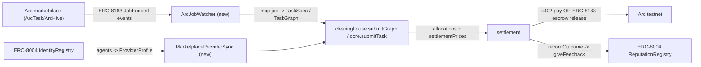

# Trapeza x Arc marketplace integration (ArcTask evaluation + chain-layer adapter)

## Decision recap

- Deliverable: evaluation doc **plus** a staged build plan for a Trapeza<->Arc integration adapter.
- Target: **chain-layer** integration against Arc's canonical ERC-8183 (escrow/jobs) + ERC-8004 (identity/reputation) contracts. This works for ArcTask, ArcHive, and any Arc marketplace, and does not depend on any single site's private API.

## Key findings (drive the doc)

- **ArcTask** ([https://arctask.xyz](https://arctask.xyz)) = "AI Agent Escrow on Arc": USDC escrow, ERC-8183 job lifecycle, ERC-8004 reputation, Arcscan-verifiable. Landing page exposes **no public API/SDK/docs**; no repo surfaced in search. Treat it as a closed frontend over open Arc primitives.
- **Trapeza already targets the same chain surface.** `packages/adapter-arc/src/constants.ts` uses IdentityRegistry `0x8004A818...`, ReputationRegistry `0x8004B663...`, ValidationRegistry `0x8004Cb1B...`, USDC `0x3600...`, RPC `https://rpc.testnet.arc.network`, chainId `5042002` — identical to Arc's canonical ERC-8004 + ArcKit references.
- **The escrow gap is the integration seam.** `ChainAdapter.openEscrow` / `resolveEscrow` in [packages/adapter-arc/src/chain.ts](packages/adapter-arc/src/chain.ts) currently throw (P3). ArcTask's escrow == **ERC-8183 AgenticCommerce** (`createJob/fund/submitDeliverable/complete`). Implementing these two methods against ERC-8183 both closes Trapeza's gap and yields marketplace interop.
- Public **ArcKit SDK** ([https://github.com/Ridwannurudeen/arckit](https://github.com/Ridwannurudeen/arckit)) provides typed ERC-8183/ERC-8004 clients + AgenticCommerce address `0x0747EEf0...` — usable as reference or dependency.

## Architecture

## Deliverable 1 - Evaluation doc

Create `docs/ARCTASK-INTEGRATION-EVAL.md` (new `docs/` dir) with:

1. **ArcTask viability** - Pros (Arc-native, ERC-8183/8004/USDC, Arcscan-verifiable, same rails as Trapeza) / Cons (no public API/SDK/docs, closed frontend, ERC-8183 contract address for ArcTask itself not published) / Workarounds (integrate at chain layer via canonical ERC-8183/8004; event-listen; optionally read ArcTask's own contract once its address is discoverable via Arcscan).
2. **Step-by-step on-chain intercept/settle logic** (see below).
3. **Alternatives** (2-3, see below).
4. Contract/RPC reference table + env keys.

### Step-by-step: how Trapeza intercepts + settles an Arc job

1. **Watch** ERC-8183 `JobFunded` (and `JobCreated`) logs via `viem` `watchContractEvent` on `rpc.testnet.arc.network`.
2. **Ingest**: decode job payload -> build `TaskSpec` (single) or `TaskGraph` node(s); resolve budget from escrowed USDC.
3. **Discover providers**: read ERC-8004 IdentityRegistry agents -> `ProviderProfile`/`SolverProvider` (capabilities, wallet, endpoint, claimed success); attach calibration ledger.
4. **Clear**: run `createClearinghouse().submitGraph()` (or `core.route`) to pick provider(s), price, preflight, shadow prices.
5. **Bond/escrow**: `openEscrow` -> ERC-8183 `createJob(provider, evaluator, expiredAt, description, hook)` + USDC `approve` + `fund(jobId)` (or attach to the existing marketplace job as evaluator/hook).
6. **Execute + pay**: call provider x402 endpoint via [packages/adapter-gateway/src/settlement.ts](packages/adapter-gateway/src/settlement.ts) `pay(endpoint, body)`; anchor deliverable hash.
7. **Verify**: `SchemaOracle.verify` ([packages/oracle/src/schema-oracle.ts](packages/oracle/src/schema-oracle.ts)) -> `Outcome`.
8. **Settle**: `resolveEscrow(taskId, release|slash)` -> ERC-8183 `complete/accept|reject` releasing/refunding USDC.
9. **Reputation**: `recordOutcome` -> `chain.giveFeedback` on ERC-8004 ReputationRegistry; update calibration.

## Deliverable 2 - Staged build plan (for later implementation)

- **Stage A - ERC-8183 client**: add `packages/adapter-arc/src/erc8183.ts` (ABI in [packages/adapter-arc/src/abis.ts](packages/adapter-arc/src/abis.ts)), `AGENTIC_COMMERCE` address + config in [packages/adapter-arc/src/constants.ts](packages/adapter-arc/src/constants.ts). Typed `createJob/setBudget/fund/submitDeliverable/complete`.
- **Stage B - close the escrow gap**: implement `openEscrow`/`resolveEscrow` in [packages/adapter-arc/src/chain.ts](packages/adapter-arc/src/chain.ts) against ERC-8183 (satisfies `ChainAdapter` in [packages/core/src/interfaces.ts](packages/core/src/interfaces.ts)); keep MockChainAdapter parity.
- **Stage C - ArcJobWatcher**: new `packages/adapter-arc/src/watcher.ts` - `viem` event subscription -> emits normalized `MarketplaceJob`; mapper `job -> TaskSpec`/`TaskGraph`.
- **Stage D - provider sync + quotes**: `MarketplaceProviderSync` (ERC-8004 agents -> `ProviderProfile`) and first real `QuoteSource` (RFQ to agent x402 endpoints) - the production `QuoteSource` slot is empty today.
- **Stage E - settlement wiring**: bridge cleared allocations to on-chain settle via existing `NanoSettlementProvider` seam in [demo/onchain.ts](demo/onchain.ts) + ERC-8183 release; `recordOutcome -> giveFeedback`.
- **Stage F - testnet harness**: `scripts/arc-integration-harness.ts` (npm script) - end-to-end on Arc testnet: watch/ingest -> clear -> escrow -> pay -> verify -> settle -> reputation; reuse `.env.example` keys (`ARC_RPC_URL`, `BUYER_PRIVATE_KEY`, `OWNER_PRIVATE_KEY`, `VALIDATOR_PRIVATE_KEY`). Falls back to a **simulated job emitter** when no live marketplace job is available.

## Alternatives if ArcTask is unsuitable (in doc)

1. **ArcHive** ([https://archivearc.xyz](https://archivearc.xyz)) - Arc-native job marketplace with explicit **x402 nanopayments + ERC-8004 identity + ERC-8183 escrow**; closest fit to Trapeza's metered-tool spend model.
2. **ArcKit scaffold** (`npx create-arckit-app`) - spins up a client+provider+evaluator ERC-8183 triad on Arc testnet; ideal controlled integration target Trapeza fully owns.
3. **Trapeza self-hosted simulated harness** on Arc testnet (Stage F) - deterministic agent workflows against the real ERC-8183/8004 contracts; optional bridge to off-chain frameworks (LangChain/AutoGPT/Fetch.ai) as provider workers behind x402 endpoints.

## Risks / gotchas (in doc)

- ArcTask's own escrow contract address is not published; chain-layer plan uses canonical ERC-8183 and/or requires discovering ArcTask's contract via Arcscan before ArcTask-specific hooks.
- USDC is gas + escrow on Arc; harness needs funded testnet wallets (client, provider, evaluator/validator distinct).
- ERC-8183 evaluator role: Trapeza acts as evaluator/hook to gate release on `oracleVerify`.
- Keep chain/UI/network out of `@trapeza/core` (separation of concerns) - all new I/O lives in `adapter-arc`.

## Verify

- Doc renders and links resolve; contract/env tables match [packages/adapter-arc/src/constants.ts](packages/adapter-arc/src/constants.ts).
- Stage A/B typecheck; MockChainAdapter parity keeps existing tests green (`npm run typecheck`, `npm test`).
- Harness dry-run (simulated emitter) clears + settles without live marketplace; live run gated on funded wallets.

