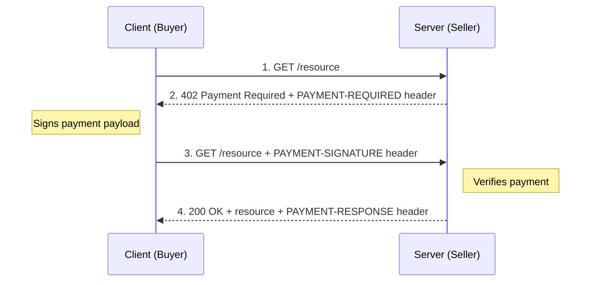

> ## Documentation Index
> Fetch the complete documentation index at: https://developers.circle.com/llms.txt
> Use this file to discover all available pages before exploring further.

# What is x402?

> An overview of the x402 open payment standard and how Nanopayments provides a gasless payment method for x402-protected resources

x402 is an open, neutral standard for internet-native payments built on the HTTP
`402 Payment Required` status code. It defines how a server communicates that
payment is required to access a resource, and how a client can provide proof of
payment. x402 is not a payment system itself—it is a negotiation protocol that
is agnostic to how payments are constructed, verified, or settled.

This document explains the x402 protocol, its core concepts, and how
Nanopayments provides a gasless payment method that works with x402.

## The problem with internet payments

Traditional payment systems were not designed for programmatic, high-frequency
transactions. Credit cards carry high fixed fees, require account creation, and
involve slow settlement. Standard onchain payments require gas for every
transaction, making sub-cent payments uneconomical. Neither approach works well
for AI agents, per-request billing, or machine-to-machine commerce.

x402 addresses this by making payment negotiation a native part of HTTP. A
server declares that payment is required, a client provides a payment payload,
and the exchange happens in a single request-response cycle. The actual payment
method is flexible—any scheme that can produce a verifiable payment payload can
work with x402.

## How x402 works

The x402 protocol uses three HTTP headers to negotiate payment between a client
and a server:

| Header              | Direction        | Purpose                                                                |
| ------------------- | ---------------- | ---------------------------------------------------------------------- |
| `PAYMENT-REQUIRED`  | Server to client | Payment requirements (accepted schemes, price, network, destination)   |
| `PAYMENT-SIGNATURE` | Client to server | Signed payment payload proving the client has authorized payment       |
| `PAYMENT-RESPONSE`  | Server to client | Confirmation that the payment was verified, returned with the resource |

The typical flow is:

1. The client requests a paid resource.
2. The server responds with `402 Payment Required`, including payment details
   such as the accepted payment schemes, price, network, and destination
   address.
3. The client selects a payment option, constructs and signs a payment payload,
   and retries the request with the `PAYMENT-SIGNATURE` header.
4. The server verifies the payment (directly or through a facilitator) and
   returns the resource along with a confirmation in the `PAYMENT-RESPONSE`
   header.

x402 defines this negotiation flow. How the payment payload is constructed, how
it is verified, and how funds ultimately move are determined by the payment
method and facilitator, not by x402 itself.

## Core concepts

### Buyers and sellers

* **Buyer (client)**: The entity requesting a paid resource. This can be a
  human-operated application, an AI agent, or any programmatic HTTP client.
  Buyers construct payment payloads using whatever payment method the server
  accepts.
* **Seller (server)**: The resource provider that requires payment. Sellers
  declare their accepted payment methods in the `402` response, verify incoming
  payment payloads, and serve the resource when payment is valid. Any
  HTTP-accessible API or service can act as a seller.

### Facilitators

A facilitator is an optional service that handles payment verification and
settlement on behalf of sellers. By using a facilitator, sellers avoid needing
to verify payment payloads or interact with blockchain infrastructure
themselves.

Different facilitators can support different payment methods. A seller connects
to a facilitator and automatically gains access to the payment methods that
facilitator supports.

### Payment schemes

x402 is designed to support multiple payment schemes. A payment scheme defines
how payment payloads are constructed, signed, and verified. The `402` response
from a server lists the schemes it accepts, and the client picks one it can
fulfill.

Nanopayments uses the `exact` scheme with a custom EIP-3009
`TransferWithAuthorization` signature against the `GatewayWalletBatched` domain,
enabling gasless payments from the buyer's Gateway balance.

## How Nanopayments fits in

x402 defines the negotiation—a server says "pay me" and a client responds with a
payment payload. But x402 does not prescribe how those payments are funded,
verified, or settled. That is where Nanopayments comes in.

Nanopayments is a payment method for x402 that uses Circle Gateway's
[batched settlement](/gateway/nanopayments/concepts/batched-settlement)
infrastructure:

* Buyers fund their payments from a Gateway Wallet balance (deposited once
  onchain).
* When a server requests payment via `402`, the buyer signs an offchain EIP-3009
  authorization (zero gas) and includes it in the `PAYMENT-SIGNATURE` header.
* The server (or its facilitator) submits the authorization to Gateway for
  verification and settlement.
* Gateway collects authorizations and settles net positions in bulk onchain,
  paying gas once per batch instead of once per payment.

From x402's perspective, Nanopayments is just another payment method. Clients
and servers use the same `402` negotiation flow—the difference is that the
underlying payment is gasless and settled through batching.

## Learn more

* [How batched settlement works](/gateway/nanopayments/concepts/batched-settlement):
  the mechanics of Gateway's batching system
* [x402.org](https://www.x402.org/): the official x402 website
* [x402 documentation](https://docs.x402.org/): the full protocol specification
* [x402 GitHub repository](https://github.com/coinbase/x402): the open source
  reference implementation
