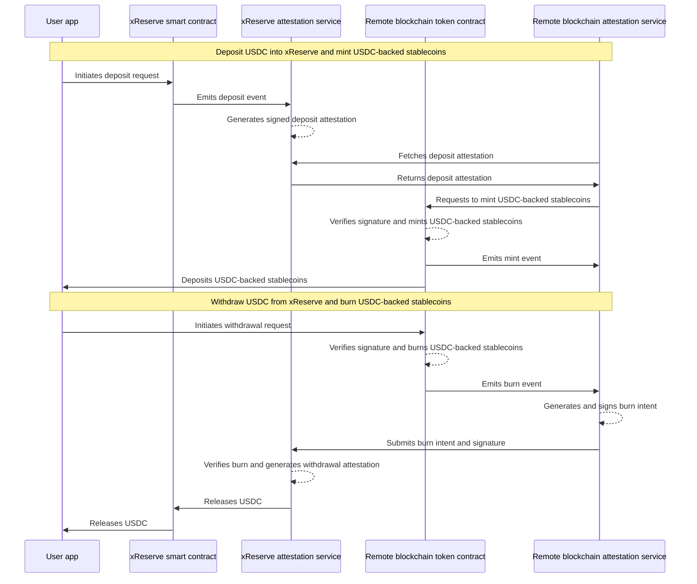

> ## Documentation Index
> Fetch the complete documentation index at: https://developers.circle.com/llms.txt
> Use this file to discover all available pages before exploring further.

# How xReserve Works

xReserve consists of two main services: an onchain smart contract and an
offchain attestation system. Together, these services and related services on
the remote blockchain let users deposit USDC on the source blockchain to receive
USDC-backed stablecoins on the remote blockchain. Subsequently, users can burn
their USDC-backed stablecoins to withdraw the USDC held in xReserve.

The following diagram shows how xReserve handles deposits and withdrawals.

## xReserve deposits

These steps occur when a user deposits USDC into xReserve:

1. A user deposits USDC from their wallet app into xReserve smart contract on
   the source blockchain.
2. The xReserve contract emits a deposit event and locks the funds, holding them
   in reserve.
3. The xReserve attestation service generates and signs a deposit attestation.
4. The remote blockchain attestation service fetches the signed deposit
   attestation.
5. The remote blockchain mints USDC-backed stablecoins on their blockchain and
   emits a mint event.
6. The remote blockchain token contract deposits the newly minted USDC-backed
   tokens into the user's wallet app on the remote blockchain.

After completing the deposit process, the user receives an equivalent amount of
USDC-backed stablecoins on the remote blockchain.

## xReserve withdrawals

Subsequently, these steps occur when a user withdraws USDC from xReserve:

1. A user requests to burn USDC-backed stablecoins on the remote blockchain and
   withdraw USDC on the destination blockchain.
2. The remote blockchain token contract burns their USDC-backed stablecoins on
   the remote blockchain and emits a burn event.
3. The remote blockchain attestation service generates and signs a burn intent
   offchain.
4. The remote blockchain attestation service passes the burn intent and
   signature to xReserve.
5. xReserve verifies the burn and issues a withdrawal attestation.
6. xReserve releases USDC to the user's wallet on the destination blockchain.

After completing the withdrawal process, the user receives USDC on the source
blockchain.

<Note>
  **Note:** As part of the same withdrawal, xReserve can
  [forward funds](/xreserve/concepts/technical-guide#withdrawal-forwarding) to
  another blockchain. This lets users withdraw funds on a blockchain other than
  the source blockchain without performing an additional crosschain transfer.
</Note>
