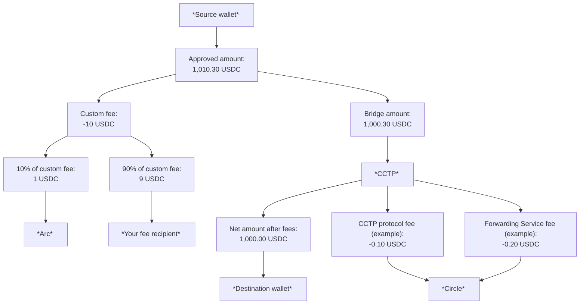

> ## Documentation Index
> Fetch the complete documentation index at: https://docs.arc.network/llms.txt
> Use this file to discover all available pages before exploring further.

# How bridge fees work

> How custom fees, CCTP protocol fees, and Forwarding Service fees apply when bridging USDC with App Kit

This guide explains which fees apply when bridging, how funds move through a
transaction, and the best practices to follow when
[implementing custom fees](/app-kit/tutorials/bridge/collect-bridge-fee).

## Fee breakdown

The following fees can apply:

| Fee                                      | When it applies                                                                                                                           | Amount                                                                                                                                               | Recipient                                                                   |
| ---------------------------------------- | ----------------------------------------------------------------------------------------------------------------------------------------- | ---------------------------------------------------------------------------------------------------------------------------------------------------- | --------------------------------------------------------------------------- |
| Custom fee                               | Conditionally. When you [implement custom bridge fees](/app-kit/tutorials/bridge/collect-bridge-fee).                                     | You define (on top of the bridge amount).                                                                                                            | 90% to your fee recipient; 10% to Arc                                       |
| Cross-Chain Transfer Protocol (CCTP) fee | Conditionally. On [`FAST`](/app-kit/tutorials/bridge/configure-transfer-speed) transfers only; `SLOW` (Standard) transfers skip this fee. | Varies by source blockchain. See [CCTP fees](https://developers.circle.com/cctp/technical-guide#fees).                                               | [Circle CCTP](https://developers.circle.com/cctp) (the underlying protocol) |
| Forwarding Service fee                   | Conditionally. When you enable the [Forwarding Service](/app-kit/tutorials/bridge/use-forwarding-service).                                | Per [Forwarding Service fees](https://developers.circle.com/cctp/concepts/forwarding-service#fees-and-execution). Deducted from mint on destination. | [Circle CCTP](https://developers.circle.com/cctp)                           |

## How funds flow through a transfer

The following example shows what happens when a user wants 1,000 USDC to arrive
at the destination after a Fast Transfer, with a 10 USDC custom fee on that
transfer, and the
[Forwarding Service](/app-kit/tutorials/bridge/use-forwarding-service) enabled.
The bridge amount is 1,000.30 USDC so that after the example CCTP protocol fee
(0.10 USDC) and Forwarding Service fee (0.20 USDC), 1,000 USDC is credited to
the recipient:

<Steps>
  <Step title="User initiates the bridge transfer on the source chain">
    The user initiates a 1,000.30 USDC bridge transfer on the source blockchain
    (sized for 1,000 USDC net to the destination after the example fees).
  </Step>

  <Step title="You add the custom fee">
    You add a 10 USDC (about 1%) custom fee.
  </Step>

  <Step title="Source wallet signs the total debit">
    The source wallet signs a transaction for 1,010.30 USDC (bridge amount + custom
    fee).
  </Step>

  <Step title="Source chain splits the custom fee">
    The 10 USDC custom fee is split on the source blockchain:

    * Arc receives 1 USDC (10%).
    * Your fee recipient receives 9 USDC (remaining 90%).
  </Step>

  <Step title="Bridge amount is forwarded to CCTP">
    The 1,000.30 USDC bridge amount is forwarded to CCTP.
  </Step>

  <Step title="CCTP applies the Fast Transfer protocol fee">
    CCTP takes a protocol fee (0.10 USDC in this example) for a Fast Transfer.
  </Step>

  <Step title="Forwarding Service applies the destination mint fee">
    The Forwarding Service deducts its fee (0.20 USDC in this example) from the
    amount to be minted on the destination blockchain.
  </Step>

  <Step title="Destination wallet receives the net amount">
    The destination wallet receives 1,000.00 USDC on the destination blockchain.
  </Step>
</Steps>

This flow is illustrated in the following diagram:



## Best practices for custom fees

Follow these best practices when implementing custom fees:

* Treat the custom fee as an amount added on top of the bridge transfer. Do not
  subtract it from the bridge amount.
* Validate that the user's wallet balance covers both the bridge amount and the
  custom fee. The following code shows an example balance check:

```typescript TypeScript theme={null}
const requiredBalance = parseFloat(amount) + parseFloat(customFee);
if (userBalance < requiredBalance) {
  throw new Error(`Insufficient balance. Need ${requiredBalance} USDC`);
}
```

* Use a fee recipient address on the source blockchain. Do not use an address on
  the destination.
* In your UI, display the following to the user before they confirm the
  transaction:
  * The total source wallet debit: bridge amount + custom fee
  * The full fee breakdown: bridge amount, custom fee, CCTP Fast Transfer fee
    (if applicable), and Forwarding Service fee (if using the
    [Forwarding Service](/app-kit/tutorials/bridge/use-forwarding-service))
* Return human-readable decimal strings. For example, `10` rather than
  `10000000` for 10 USDC. App Kit handles base-unit conversion internally.
