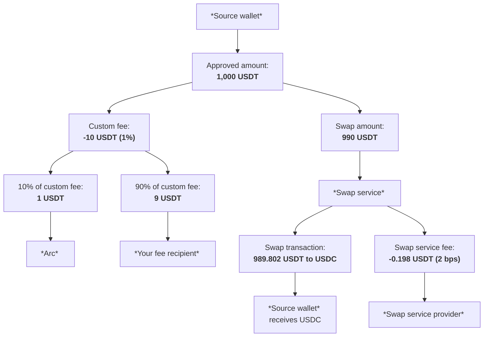

> ## Documentation Index
> Fetch the complete documentation index at: https://docs.arc.network/llms.txt
> Use this file to discover all available pages before exploring further.

# How swap fees work

> How custom fees and provider fees apply when swapping tokens with App Kit

This guide explains which fees apply when performing a swap, how funds move
through a swap transaction, and best practices for
[implementing custom swap fees](/app-kit/tutorials/swap/collect-swap-fee).

## Fee breakdown

Two fees can apply to a swap:

| Fee          | When it applies                                                                                 | Amount                                                                         | Recipient                                                                    |
| ------------ | ----------------------------------------------------------------------------------------------- | ------------------------------------------------------------------------------ | ---------------------------------------------------------------------------- |
| Custom fee   | Conditionally. When you [configure custom swap fees](/app-kit/tutorials/swap/collect-swap-fee). | Percentage you define on the swap amount; collected before the swap executes.  | 90% to your fee recipient; 10% to Arc                                        |
| Provider fee | Always. On every swap.                                                                          | 2 basis points (0.02%) of the swap amount after any custom fee (1 bp = 0.01%). | Swap service provider (third-party liquidity service that executes the swap) |

Your end user pays the swap amount plus all applicable fees.

## How funds flow through a swap

This example traces a 1,000 USDT-to-USDC swap with a 1% custom fee:

<Steps>
  <Step title="User requests the swap">
    The user requests a swap of 1,000 USDT to USDC.
  </Step>

  <Step title="You add the custom fee">
    You add a 1% custom fee. On 1,000 USDT, this equals 10 USDT.
  </Step>

  <Step title="Source wallet signs">
    The source wallet signs a transaction authorizing 1,000 USDT.
  </Step>

  <Step title="App Kit collects and splits the custom fee">
    App Kit collects the 10 USDT custom fee and splits it:

    * Arc receives 1 USDT (10% of the custom fee).
    * Your fee recipient receives 9 USDT (90% of the custom fee).
  </Step>

  <Step title="Swap service provider applies the provider fee">
    The swap service provider deducts a provider fee of 2 basis points (0.02%) from
    the remaining 990 USDT. This equals 0.198 USDT.
  </Step>

  <Step title="Provider executes the swap">
    The provider executes the swap with 989.802 USDT and the user receives the
    equivalent output in USDC.
  </Step>
</Steps>

**Net result:** Of the original 1,000 USDT, 10 USDT goes to custom fee
recipients, 0.198 USDT goes to the swap service provider, and the remaining
989.802 USDT is swapped for USDC.

This flow is illustrated in the following diagram:

## Best practices for custom fees

Follow these best practices when implementing custom fees for swaps:

* Use a fee recipient address in the same network context where the swap
  originates.
* Return fee amounts in human-readable decimal format (for example, `0.20`
  instead of `200000` for 0.20 USDC). App Kit handles base-unit conversion
  internally.
