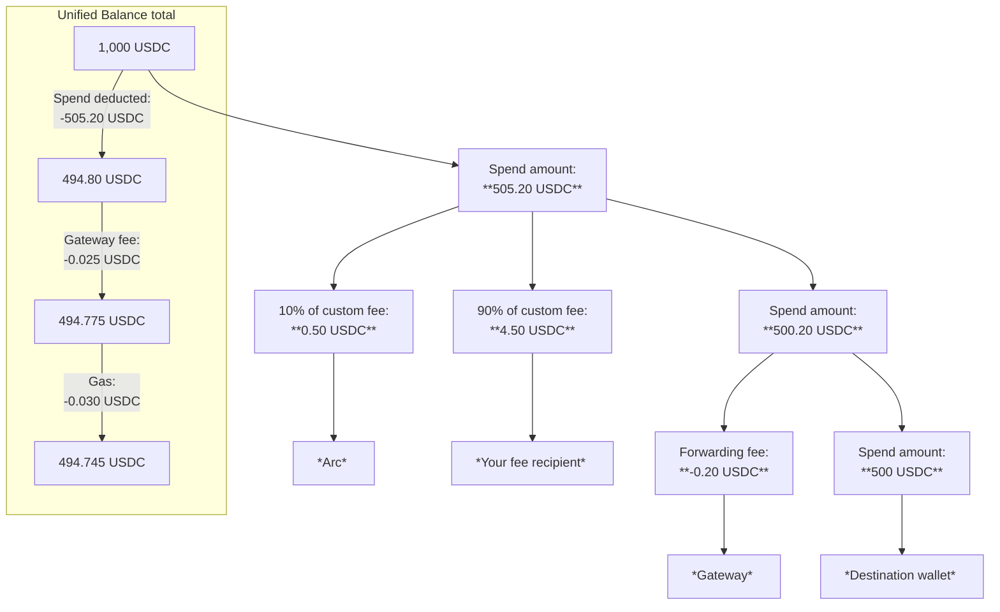

> ## Documentation Index
> Fetch the complete documentation index at: https://docs.arc.network/llms.txt
> Use this file to discover all available pages before exploring further.

# How Unified Balance fees work

> How fees apply when spending from a Unified Balance and how funds move through a spend transaction

Several fees can apply when you spend from a Unified Balance, including a
[custom fee](/app-kit/tutorials/unified-balance/collect-custom-spend-fees) you
can implement. This page explains which fees apply, how funds move through a
spend and how that changes the Unified Balance total, and best practices for
custom fees. Fees apply only on spends, not deposits.

## Fees breakdown

Each spend can include the following fees:

| Fee                    | When it applies                                                                                                                           | Amount                                                                                                                                                        | Recipient                                                                                     |
| ---------------------- | ----------------------------------------------------------------------------------------------------------------------------------------- | ------------------------------------------------------------------------------------------------------------------------------------------------------------- | --------------------------------------------------------------------------------------------- |
| Custom spend fee       | Conditionally. When you [implement custom spend fees](/app-kit/tutorials/unified-balance/collect-custom-spend-fees).                      | You define (carved from the spend amount).                                                                                                                    | 90% to your fee recipient; 10% to Arc                                                         |
| Gateway protocol fee   | Conditionally. On spends where the source and destination differ (crosschain).                                                            | 0.5 basis points (0.005%) of the spend amount from the Unified Balance at spend time; 0 if same blockchain.                                                   | [Circle Gateway](https://developers.circle.com/gateway) (protocol underlying Unified Balance) |
| Gas                    | Always. On spends that execute burn intents on source blockchains.                                                                        | Varies by source blockchain and network conditions; incurred per burn intent on source.                                                                       | Source blockchain                                                                             |
| Forwarding Service fee | Conditionally. When you [use the Forwarding Service](/app-kit/tutorials/unified-balance/use-forwarding-service) for the destination mint. | Per [Forwarding Service fees](https://developers.circle.com/cctp/concepts/forwarding-service#fees-and-execution). Deducted from amount minted on destination. | Circle                                                                                        |

## Total balance and funds flow

The following example shows what happens when a user wants 500 USDC to arrive at
the destination from a Unified Balance of 1,000 USDC (previously deposited), you
collect a 5 USDC custom fee on that spend, and the
[Forwarding Service](/app-kit/tutorials/unified-balance/use-forwarding-service)
is enabled:

<Steps>
  <Step title="User deposits into the Unified Balance">
    The user previously deposited 1,000 USDC from their wallet on the source
    blockchain into the Unified Balance.
  </Step>

  <Step title="User confirms a spend of 505.20 USDC">
    The user confirms a spend of 505.20 USDC from the Unified Balance. This is the
    amount needed to ensure exactly 500 USDC arrives at the destination after the
    custom fee and Forwarding Service fee are applied. See
    [best practices](#best-practices-for-custom-fees) for what to show the user
    before they confirm a spend.
  </Step>

  <Step title="You apply a custom spend fee">
    You deduct a 5 USDC custom fee from the spend amount.
  </Step>

  <Step title="User signs burn intents on the source chains">
    The user's source wallet signs three burn intents that move:

    * 500.20 USDC (the spend amount minus the 5 USDC custom fee) toward the
      destination mint.
    * 0.50 USDC (10% of the custom fee) to Arc.
    * 4.50 USDC (90% of the custom fee) to your fee recipient.
  </Step>

  <Step title="Circle Gateway applies the crosschain transfer fee">
    Circle Gateway deducts a 0.025 USDC transfer fee from the Unified Balance
    (0.005% of 505.20 USDC). For a same-chain spend, this fee is 0.
  </Step>

  <Step title="Source chains deduct gas for the burn intents">
    The source blockchains deduct 0.03 USDC from the Unified Balance as gas for the
    three burn intents.
  </Step>

  <Step title="Forwarding Service deducts the destination mint fee">
    The Forwarding Service deducts its fee (0.20 USDC in this example) from the
    amount to be minted on the destination blockchain.
  </Step>

  <Step title="Recipient receives funds on the destination blockchain">
    The recipient's destination wallet receives 500 USDC on the destination
    blockchain:

    * 500.20 USDC minted.
    * Deduct 0.20 USDC Forwarding Service fee.
    * Net received: 500 USDC.
  </Step>

  <Step title="Unified Balance shows the updated total">
    After the spend, the user's Unified Balance total is 494.745 USDC:

    * Started at 1,000 USDC.
    * Deduct 505.20 USDC spend amount.
    * Deduct 0.025 USDC Gateway transfer fee.
    * Deduct 0.03 USDC gas.
    * Remaining: 494.745 USDC.
  </Step>
</Steps>

This flow and Unified Balance running total is illustrated in the following
diagram.



## Best practices for custom fees

Follow these best practices when implementing custom fees:

* Use a fee recipient address on the source blockchain. Do not use an address on
  the destination.
* Calculate the spend amount from the amount the user wants to receive at the
  destination. To receive a specific amount, the user must spend more than that
  from the Unified Balance to cover fees.
* Before the user confirms a spend, show:
  * Spend summary: spend amount, fee breakdown (custom fee and Forwarding
    Service fee when applicable), and amount received at the destination.
  * Unified Balance summary: starting balance, each deduction (spend amount,
    Gateway transfer fee when applicable, gas), and remaining balance.

```text Example UI display theme={null}
Spend amount:                   505.20 USDC
Forwarding Service fee:        -  0.20 USDC
Custom fee:                    -  5.00 USDC
Amount received at destination: 500.00 USDC

Unified Balance:              1,000.00 USDC
Spend amount:                 -  505.20 USDC
Gateway fee:                  -   0.025 USDC
Gas (estimated):              -    0.03 USDC
Remaining balance:              494.745 USDC
```

* Return human-readable decimal strings. For example, return `"10"` rather than
  `"10000000"` for 10 USDC. App Kit handles base-unit conversion internally.
* Validate that the user's Unified Balance can cover the spend amount, the
  Gateway protocol fee, and gas. For gas and fee estimates, see
  [estimate spend fees](/app-kit/tutorials/unified-balance/estimate-spend-fees).
  Example check:

```typescript TypeScript theme={null}
// Example: calculate required spend from a target destination amount and validate balance
const targetDestinationAmount = 500; // USDC the user wants to arrive at the destination
const forwardingServiceFee = 0.2; // deducted from amount minted at destination
const customFee = 5; // your custom fee in USDC
const spendAmount = targetDestinationAmount + forwardingServiceFee + customFee; // 505.20 USDC
const sameChain = false; // true when source and destination blockchain are the same
const gatewayFee = sameChain ? 0 : spendAmount * 0.00005; // 0.005% when crosschain
const gasEstimate = 0.05; // replace with a blockchain-appropriate estimate; the walkthrough above uses 0.03 for illustration
const userBalance = 1000; // placeholder; in production parse totalConfirmedBalance from kit.unifiedBalance.getBalances
const requiredBalance = spendAmount + gatewayFee + gasEstimate;
if (userBalance < requiredBalance) {
  throw new Error(`Insufficient balance. Need ${requiredBalance} USDC`);
}
// requiredBalance is about 505.275 USDC here (505.20 spend + 0.025 gateway + 0.05 gas estimate)
```
