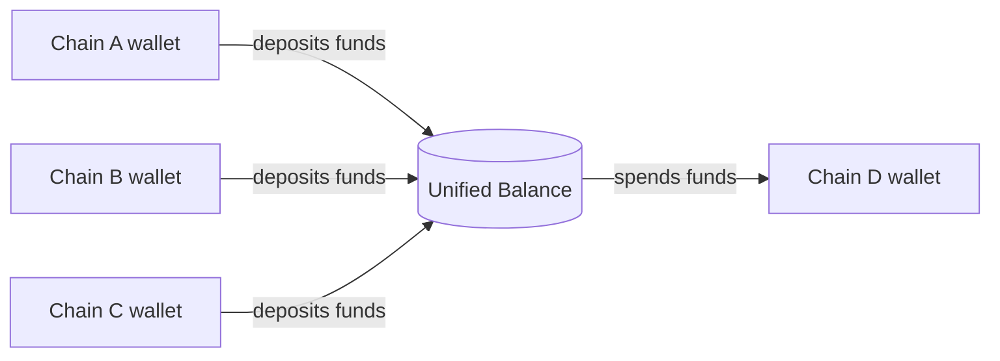

> ## Documentation Index
> Fetch the complete documentation index at: https://docs.arc.network/llms.txt
> Use this file to discover all available pages before exploring further.

# App Kit: Unified Balance

> Create a chain-agnostic USDC balance and spend it instantly on any blockchain with App Kit's Unified Balance capability.

App Kit's Unified Balance capability combines USDC from multiple blockchains
into a single, instantly spendable balance. It is built on top of
[Circle Gateway](https://developers.circle.com/gateway) and abstracts the
Gateway workflow so that cross-ecosystem spends (for example, EVM → non-EVM) are
as straightforward as same-ecosystem spends (for example, EVM chain → another
EVM chain).

## How it works

Unified Balance works by depositing funds held across multiple blockchains into
a single, chain-agnostic Unified Balance. Those funds are then available to
spend instantly on any blockchain.

The process is illustrated below:



## Quick look

This code snippet creates a Unified Balance by depositing funds from two
blockchains to spend on a third:

```typescript TypeScript theme={null}
// Deposit 1.00 USDC into the Unified Balance from Base
const depositBase = await kit.unifiedBalance.deposit({
  from: { adapter: viemAdapter, chain: "Base_Sepolia" },
  amount: "1.00",
  token: "USDC",
});
// Deposit 1.00 USDC into the Unified Balance from Arbitrum
const depositArb = await kit.unifiedBalance.deposit({
  from: { adapter: viemAdapter, chain: "Arbitrum_Sepolia" },
  amount: "1.00",
  token: "USDC",
});
// Spend 1.50 USDC from the Unified Balance on Arc
const spendResult = await kit.unifiedBalance.spend({
  amount: "1.50",
  from: { adapter: viemAdapter },
  to: {
    adapter: viemAdapter,
    chain: "Arc_Testnet",
    recipientAddress: "0xRecipientAddress",
  },
});
```

For a complete end-to-end flow, follow the quickstart for your scenario:

* [Deposit and Spend a Unified Balance](/app-kit/quickstarts/unified-balance-deposit-and-spend)
* [Use a Delegate to Deposit and Spend a Unified Balance](/app-kit/quickstarts/unified-balance-delegate-deposit-and-spend)

## Installation

App Kit comes with the Unified Balance capability installed by default. If
you've already installed App Kit, you can skip this section. If you only need to
use the Unified Balance capability and don't want the full App Kit, you can
install the standalone package.

Install the Unified Balance package and the adapters that match your
environment:

<Steps>
  <Step title="Install the Unified Balance package">
    <CodeGroup>
      ```bash npm theme={null}
      npm install @circle-fin/unified-balance-kit
      ```

      ```bash yarn theme={null}
      yarn add @circle-fin/unified-balance-kit
      ```
    </CodeGroup>
  </Step>

  <Step title="Install adapters">
    Install the [adapters](/app-kit/tutorials/adapter-setups) you need for the
    blockchains you plan to deposit from and spend on.

    <Tabs>
      <Tab title="Viem">
        <CodeGroup>
          ```bash npm theme={null}
          npm install @circle-fin/adapter-viem-v2 viem
          ```

          ```bash yarn theme={null}
          yarn add @circle-fin/adapter-viem-v2 viem
          ```
        </CodeGroup>
      </Tab>

      <Tab title="Ethers">
        <CodeGroup>
          ```bash npm theme={null}
          npm install @circle-fin/adapter-ethers-v6 ethers
          ```

          ```bash yarn theme={null}
          yarn add @circle-fin/adapter-ethers-v6 ethers
          ```
        </CodeGroup>
      </Tab>

      <Tab title="Solana">
        <CodeGroup>
          ```bash npm theme={null}
          npm install @circle-fin/adapter-solana-kit @solana/kit @solana/web3.js
          ```

          ```bash yarn theme={null}
          yarn add @circle-fin/adapter-solana-kit @solana/kit @solana/web3.js
          ```
        </CodeGroup>
      </Tab>

      <Tab title="Circle Wallets">
        <CodeGroup>
          ```bash npm theme={null}
          npm install @circle-fin/adapter-circle-wallets
          ```

          ```bash yarn theme={null}
          yarn add @circle-fin/adapter-circle-wallets
          ```
        </CodeGroup>
      </Tab>
    </Tabs>
  </Step>
</Steps>
