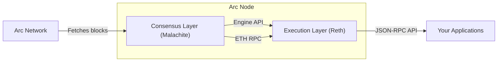

> ## Documentation Index
> Fetch the complete documentation index at: https://docs.arc.network/llms.txt
> Use this file to discover all available pages before exploring further.

# Running a node

> Arc node architecture and the role of full nodes in independently verifying the blockchain.

Anyone can run an Arc node without permission. A node gives you independent
verification of every block and transaction on the network, plus direct API
access through a local JSON-RPC endpoint. Before setting up a node, review the
[Node Requirements](/arc/references/node-requirements) for hardware and software
prerequisites, then follow [Run an Arc Node](/arc/tutorials/run-an-arc-node) for
step-by-step setup instructions.

## What your node does

An Arc node performs three functions:

* **Verifies every block.** Each block is cryptographically verified against the
  signatures of the validator set before it is accepted. Your node independently
  confirms that validators finalized each block.
* **Executes every transaction.** Every transaction is re-executed locally
  through the EVM. Your node maintains its own copy of the complete blockchain
  state.
* **Exposes a local RPC endpoint.** Your node provides a standard Ethereum
  JSON-RPC API (`http://localhost:8545`) for querying blocks, balances, and
  transactions, and for submitting calls directly against your own verified
  state.

## What your node does not do

An Arc node is a full node, not a validator:

* **Does not participate in consensus.** Your node does not propose or vote on
  blocks. Only permissioned
  [validators](/arc/concepts/consensus-layer#proof-of-authority-validator-set)
  participate in the consensus process.
* **Does not observe consensus messages.** Your node does not join the consensus
  gossip network. It verifies finalized decisions by checking the cryptographic
  signatures on each block.

## Node architecture

An Arc node runs two processes that work together:

* **Consensus Layer (CL):** Built on [Malachite](/arc/concepts/consensus-layer),
  a high-performance Tendermint BFT implementation. The CL fetches blocks from
  the network, verifies their cryptographic signatures, and passes them to the
  EL for execution.
* **Execution Layer (EL):** Built on [Reth](https://reth.rs/), a Rust
  implementation of the Ethereum execution client. The EL executes transactions,
  maintains blockchain state, and serves the JSON-RPC API.

The two processes communicate through either local IPC sockets (when running on
the same host) or RPC (when running on separate hosts):

* **IPC mode:** The EL and CL share two Unix sockets on the same machine. This
  is the default and simplest configuration.
* **RPC mode:** The CL connects to the EL over HTTP using the Engine API and a
  shared JWT secret. Use this when the EL and CL run on different hosts.

## Why run your own node

Running your own node instead of relying on a third-party
[node provider](/arc/tools/node-providers) gives you several advantages:

* **Independent verification.** You verify every block and transaction yourself,
  rather than trusting a third party's RPC responses.
* **Data sovereignty.** Your blockchain data stays on your own infrastructure.
  No third party observes your queries or transaction patterns.
* **No rate limits.** You control your own RPC endpoint without usage
  restrictions, request quotas, or throttling.
* **Lower latency.** A local RPC endpoint eliminates network round-trips to
  external providers, which matters for latency-sensitive applications.

If you prefer managed infrastructure, see
[Node Providers](/arc/tools/node-providers) for a list of third-party RPC
services.

To learn more about the layers that make up an Arc node, see
[System Overview](/arc/concepts/system-overview),
[Consensus Layer](/arc/concepts/consensus-layer), and
[Execution Layer](/arc/concepts/execution-layer).
