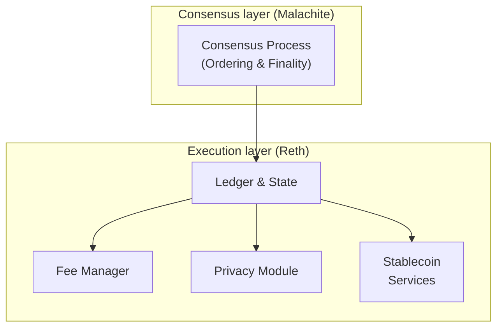

> ## Documentation Index
> Fetch the complete documentation index at: https://docs.arc.network/llms.txt
> Use this file to discover all available pages before exploring further.

# Architecture

> Arc's system architecture integrates the Malachite consensus layer with the Reth execution layer to process and finalize transactions.

Arc's architecture is composed of two core components: the **Consensus layer**
and the **Execution layer**. Together, they provide deterministic finality,
stable transaction fees, programmable privacy, and financial primitives
purpose-built for stablecoin-native applications.

## Consensus layer

Arc runs on **Malachite**, a high-performance implementation of the Tendermint
Byzantine Fault Tolerant (BFT) protocol. Malachite ensures:

* **Deterministic finality:** Blocks finalize in less than one second.
* **Irreversibility:** Transactions cannot be reorganized or rolled back once
  committed.
* **Resilience:** Validators commit blocks under a Proof-of-Authority model.

The Consensus layer orders and finalizes transactions securely, providing
institutional-grade guarantees for reliability and performance.

## Execution layer

Arc's Execution layer is built on **Reth**, a Rust implementation of the
Ethereum execution layer. It maintains the blockchain ledger and state, and
extends it with components optimized for stablecoin finance:

* **Ledger and State:** Stores accounts, balances, smart contracts, and
  transaction history.
* **Fee Manager:** Stabilizes and smooths fees using USDC as the unit of
  account.
* **Privacy Module:** Provides confidential transfers and selective disclosure
  via view keys.
* **Stablecoin Services:** Powers multi-currency payments, FX conversions, and
  programmatic settlement across supported stablecoins.

By combining these components, the Execution layer provides a familiar
EVM-compatible environment with stablecoin-native extensions built in.

## System architecture diagram

The diagram below shows Arc's architecture at a high level.

The **Consensus layer** determines the order of transactions and finalizes
blocks. The **Execution layer** applies those transactions to the ledger and
processes them through its internal modules.

## Developer benefits

By understanding Arc's system architecture, you can:

* Trust that your transactions finalize instantly and irreversibly.
* Build on a familiar EVM-compatible stack (Reth) with stablecoin-native
  extensions.
* Leverage built-in financial components like Fee Manager, Privacy,
  [FX](https://developers.circle.com/stablefx), and paying in other stablecoins
  without needing external workarounds.
