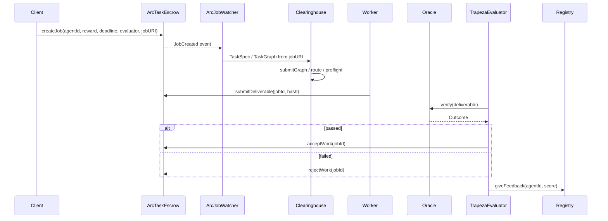

# ArcTask × Trapeza Integration Evaluation

Evaluation of integrating Trapeza's clearinghouse with [ArcTask](https://github.com/VadymManiuk/ArcTask) and related Arc agent marketplaces. Trapeza acts as **evaluator + clearing brain**; ArcTask supplies the marketplace, worker, and on-chain escrow.

## Executive summary

| Target | Role | Recommendation |
|--------|------|----------------|
| **ArcTask (fork/self-host)** | Primary integration | Fork, redeploy, plug Trapeza in as evaluator |
| **ArcKit canonical** | Control harness | ERC-20 USDC + `0x8004` registries match Trapeza constants exactly |
| **ArcHive** | Secondary interop | Closest to metered x402 spend; pursue after contract/API confirmation |

## 1. ArcTask viability

### Pros

- **Real, forkable contracts** in-repo: `ArcTaskEscrow.sol`, `ArcTaskAgentRegistry.sol`, committed ABIs, deploy script (`scripts/deploy-arc-testnet.mjs`).
- **Live Arc testnet deployment** with proof transactions (registry `0x4ab5791a689b15126fcc7a549f8e4c7e16c5e0b8`, escrow `0x58ca473df727301bce771d6087f883364c83a3b6`).
- **HTTP API**: `GET /api/network/jobs`, `GET/POST /api/deliverables/[jobId]`, `GET /api/worker/status`.
- **On-chain `jobURI`**: jobs carry `data:application/json,...` payloads decodable to task text.
- **Autonomous worker** (`scripts/agent-worker.mjs`) scans funded jobs and submits deliverable hashes.
- **Natural Trapeza seam**: evaluator accepts/rejects work; reputation updates on registry.

### Cons

- **Money-rail mismatch**: live ArcTask escrow uses **native USDC via `msg.value`**; Trapeza Gateway/x402 assumes **ERC-20 USDC `0x3600...`**.
- **Non-canonical contracts**: minimal ERC-8183/8004-style implementations, not the canonical `0x8004...` registries.
- **Single-author repo**: maintenance/stability risk; prefer pinned fork over depending on live deployment.
- **Deliverable access**: signed one-time-nonce `POST /api/deliverables/[jobId]` from creator wallet.

### Workarounds

1. **Fork + redeploy** your own ArcTask instance (Trapeza-owned addresses).
2. **ERC-20 escrow variant** (`ArcTaskEscrowErc20.sol` in fork) for Gateway/x402 alignment.
3. **Event + REST ingestion**: `JobCreated` logs and/or `GET /api/network/jobs`.
4. **Trapeza as evaluator**: register evaluator wallet on job creation; `acceptWork` / `rejectWork` after oracle verify.

## 2. Stage 0 — Money-rail decision

| Rail | ArcTask live | Trapeza default | Decision |
|------|--------------|-----------------|----------|
| Native USDC | `msg.value` in `createJob` | Not used by Gateway | **Variant B** — integrate with their live deployment only |
| ERC-20 USDC | Not in upstream | `0x3600000000000000000000000000000000000000` (6 dec) | **Default (Variant A)** — fork escrow, redeploy with ERC-20 |

**Default path (Variant A):** redeploy forked `ArcTaskEscrowErc20` using `transferFrom` against ERC-20 USDC so Trapeza's existing Gateway/x402 constants and `ArcChainAdapter` settlement path align.

**Variant B:** keep native-USDC escrow for compatibility with ArcTask's live deployment; settlement uses `value` on `createJob` and evaluator txs only (no ERC-20 approve path).

Configure via `ARCTASK_USDC_MODE=native|erc20` and `ARCTASK_ESCROW_ADDRESS` / `ARCTASK_REGISTRY_ADDRESS`.

## 3. Step-by-step: intercept + settle

1. **Discover jobs** — subscribe to `JobCreated` on `ARCTASK_ESCROW_ADDRESS` and/or poll `GET /api/network/jobs`.
2. **Ingest** — decode `jobURI` (`data:application/json,...`) → `TaskSpec`; budget from `rewardAmount`.
3. **Discover providers** — read `ArcTaskAgentRegistry` → `ProviderProfile` / `SolverProvider`.
4. **Clear** — `createClearinghouse().submitGraph()` or `core.route()`.
5. **Escrow** — `openEscrow` → `createJob` + fund (native `value` or ERC-20 `approve`+`transferFrom`).
6. **Execute** — ArcTask worker submits deliverable hash; fetch report via signed deliverables API.
7. **Verify** — `SchemaOracle.verify` → `Outcome`.
8. **Settle** — `resolveEscrow` → `acceptWork` (release) or `rejectWork` (slash/refund to client).
9. **Reputation** — `recordOutcome` → `giveFeedback` on registry; update calibration ledger.

## 4. Target comparison

### ArcTask (primary)

- Full marketplace loop on Arc testnet.
- Forkable contracts + worker + API.
- Trapeza fits naturally as evaluator.
- Requires rail decision (native vs ERC-20).

### ArcKit (control)

- Canonical ERC-8183 `0x0747EEf0...` + ERC-8004 `0x8004...` + ERC-20 USDC.
- Matches [packages/adapter-arc/src/constants.ts](../packages/adapter-arc/src/constants.ts) exactly.
- Use for CI-safe deterministic tests (`npx create-arckit-app`).

### ArcHive (secondary)

- x402 nanopayments + ERC-8004 + ERC-8183.
- Closest to Trapeza's metered-tool spend model.
- Pursue as interop target once public contracts/API are confirmed.

## 5. Reference tables

### Arc testnet

| Constant | Value |
|----------|-------|
| Chain ID | `5042002` |
| CAIP-2 | `eip155:5042002` |
| RPC | `https://rpc.testnet.arc.network` |
| Explorer | `https://testnet.arcscan.app` |
| ERC-20 USDC | `0x3600000000000000000000000000000000000000` (6 decimals) |
| Native USDC | 18-decimal gas asset (same balance as ERC-20 on Arc) |

### ArcTask live deployment

| Contract | Address |
|----------|---------|
| Agent registry | `0x4ab5791a689b15126fcc7a549f8e4c7e16c5e0b8` |
| Escrow | `0x58ca473df727301bce771d6087f883364c83a3b6` |
| USDC mode | `native` (`msg.value`) |

### Trapeza canonical registries (ArcKit-aligned)

| Contract | Address |
|----------|---------|
| Identity registry | `0x8004A818BFB912233c491871b3d84c89A494BD9e` |
| Reputation registry | `0x8004B663056A597Dffe9eCcC1965A193B7388713` |
| Validation registry | `0x8004Cb1BF31DAf7788923b405b754f57acEB4272` |

### Environment variables (Trapeza harness)

| Variable | Purpose |
|----------|---------|
| `ARC_RPC_URL` | Arc testnet RPC |
| `BUYER_PRIVATE_KEY` | Job creator / client wallet |
| `OWNER_PRIVATE_KEY` | Provider / agent owner |
| `VALIDATOR_PRIVATE_KEY` | Evaluator wallet (accept/reject) |
| `ARCTASK_ESCROW_ADDRESS` | Forked or live escrow |
| `ARCTASK_REGISTRY_ADDRESS` | Forked or live agent registry |
| `ARCTASK_USDC_MODE` | `native` or `erc20` (default `erc20`) |
| `ARCTASK_API_BASE` | ArcTask app base URL for REST fallback |
| `ARCTASK_SIMULATED` | `true` for dry-run without live chain |

### ArcTask worker LLM (fork)

| Variable | Purpose |
|----------|---------|
| `LLM_BASE_URL` | OpenAI-compatible API base (any provider) |
| `LLM_API_KEY` | API key (optional for Ollama) |
| `LLM_MODEL` | Model name |
| `LLM_ENDPOINT` | `chat` (default) or `responses` (OpenAI-only web search) |
| `OPENAI_*` | Back-compat aliases for `LLM_*` |

Example base URLs:

- OpenAI: `https://api.openai.com/v1`
- Groq: `https://api.groq.com/openai/v1`
- NVIDIA NIM: `https://integrate.api.nvidia.com/v1`
- Ollama: `http://localhost:11434/v1`

## 6. Alternatives

1. **ArcKit scaffold** — deterministic ERC-8183 triad; Trapeza-owned evaluator.
2. **ArcHive** — x402-native marketplace; secondary interop.
3. **Trapeza simulated harness** — `scripts/arc-integration-harness.ts` with `ARCTASK_SIMULATED=true`; optional bridge to LangChain/AutoGPT workers behind x402 endpoints.

## 7. Risks and gotchas

- Resolve **native vs ERC-20** before wiring settlement.
- LLM `/responses` + web search is OpenAI-only; default worker path is `/chat/completions`.
- Deliverables require creator-signed nonce for API access.
- Distinct funded wallets: client, worker, evaluator.
- Keep chain I/O in `@trapeza/adapter-arc`; never in `@trapeza/core`.
